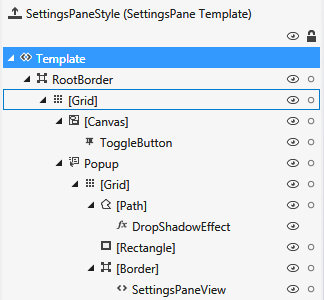
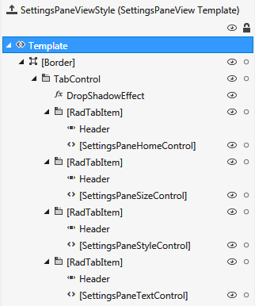

# SettingsPane

This article will get you familiar with the __SettingsPane__ control that is part of Telerik Diagramming Framework.	  

## SettingsPane Overview

The __SettingsPane__ control allows the users to examine and modify the settings of the diagramming items in run-time.

>In order to use the __SettingsPane__ control along with the __RadDiagram__ in your projects you have to add references to the following assemblies:
>	- Telerik.Windows.Controls.Diagrams
>	- Telerik.Windows.Diagrams.Core
>	- Telerik.Windows.Controls.Diagrams.Extensions
>	- Telerik.Windows.Controls
>	- Telerik.Windows.Controls.Navigation
>	- Telerik.Windows.Controls.Input

The __SettingsPane__ control is a standalone control that can be displayed as the content of any __ContentControl__. Its main purpose is to provide you with a ready-to-use view that contains the most common features and settings of a single __RadDiagramItem (Shape or Connection)__. 	  

In most __Diagramming__ examples you will find the __SettingsPane__ applied as an __AdditionalContent__ on the diagramming surface. This way the control is displayed next to a focused __RadDiagramItem__ thus allowing users to dynamically change the look and feel of the item.  In order to display the __SettingsPane__ this way in your application as well, you can add it through the __ItemInformationAdorner.AdditionalContent__ attached property in the following manner:		

#### __XAML__

{{region raddiagram-extensions-settingspane-0}}
	<telerik:RadDiagram x:Name="diagram">
	    <primitives:ItemInformationAdorner.AdditionalContent>
	        <telerik:SettingsPane Diagram="{Binding ElementName=diagram}" />
	    </primitives:ItemInformationAdorner.AdditionalContent>
	</telerik:RadDiagram>
	{{endregion}}
    
Where the primitives namespace is defined like this:
xmlns:primitives="clr-namespace:Telerik.Windows.Controls.Diagrams.Primitives;assembly=Telerik.Windows.Controls.Diagrams"

## Customization

The __SettingsPane__ has a default view that can be used out-of-the-box in scenarios where you only need to display the common settings of a __RadDiagramItem__. However you can also customize the content of the pane to represent more specific information. These are the basic tasks you might need to implement while customizing your __SettingsPane__ instance:		

* __Change the tab headers__ - in order to change the headers of the tabs in the default __SettingsPane__, you can change the value of their localization strings. Please take a look at the [Localization]() article to find the localization string of each tab displayed inside the __SettingsPane__.			

* __Add and remove tabs__ - in order to add or remove tabs from the default __SettingsPane__, you need to edit the __ControlTemplate__ of the __SettingsPaneView__ as this is the control that represents the content of the __SettingsPane__. Please take a look at the [SettingsPaneView ControlTemplate Structure](#settingspaneview-controltemplate-structure) section for more information.			

* __Edit the content of an existing tab__ - The content of each of the four default __SettingsPane__ tabs – Home, Size, Style, Text, is represented by a different control:			
	* __SettingsPaneHomeControl__ - representing the content of the __Home__ tab
	
	* __SettingsPaneSizeControl__ - representing the content of the __Size__ tab				

	* __SettingsPaneStyleControl__ - representing the content of the __Style__ tab

	* __SettingsPaneTextControl__ - representing the content of the __Text__ tab Furthermore, the content of each control is described in its __ControlTemplate__. This is why in order to change the existing content of a __SettingsPane__ tab, you need to edit the __ControlTemplate__ of the appropriate control.
			
Furthermore, the content of each control is described in its ControlTemplate. This is why in order to change the existing content of a SettingsPane tab, you need to edit the ControlTemplate of the appropriate control. 

## Events

__RadDiagram__ exposes two events that come in handy while working with the default __SettingsPane__:		

* __PreviewAdditionalContentActivated__ - this event is raised by a __RadDiagram__ to inform layouts that the additional content is going to be activated. The event handler receives two arguments:

	* The __sender__ argument contains the __RadDiagram__ This argument is of type __object__, but can be cast to the __RadDiagram__ type.				

	* An __AdditionalContentActivatedEventArgs__ object, that gives you access to a __ContextItems__ collection. This collection of __IDiagramItem__ objects represents the items that have activated the additional content. In most cases it contains a single item - the __RadDiagramItem__ that has activated the __SettingsPane__.				

	>tipPlease note that you can handle this event in order to disable the __SettingsPane__ from displaying on certain __RadDiagramItems__.			

* __AdditionalContentActivated__ - this event is raised by a __RadDiagram__ to inform layouts that the additional content has been activated. The event handler receives two arguments:			

	* The __sender__ argument contains the __RadDiagram__ This argument is of type __object__, but can be cast to the __RadDiagram__ type.				

	* An __AdditionalContentActivatedEventArgs__ object, that gives you access to a __ContextItems__ collection. This collection of __IDiagramItem__ objects represents the items that have activated the additional content. In most cases it contains a single item - the __RadDiagramItem__ that has activated the __SettingsPane__.				

## SettingsPane ControlTemplate Structure

The __SettingsPane ControlTemplate__ consists of the following elements:
		

* __RootBorder__ - a __Border__ that represents the main layout control in the __SettingsPane__

	* __[Grid]__ - a __Grid__ that hosts the __SettingsPane ControlTemplate__ elements					  

		* __[Canvas]__ - a __Canvas__ that hosts the __ToggleButton__ element						  

			* __ToggleButton__ - a __RadToggleButton__ control that represents an inactive __SettingsPane__. Once this button is clicked, the __SettingsPaneView__ gets activated and displayed.							  

		* __Popup__ - a __Popup__ control that represents the active __SettingsPane__
		
			* __[Grid]__ - a __Grid__ panel that hosts the elements of the active __SettingsPane__

				* __[Path]__ - a __Path__ that represents the callout element of the active __SettingsPane__

					* __DropShadowEffect__ - a __DropShadowEffect__

				* __[Rectangle]__ - a __Rectangle__ element								  

				* __[Border]__ - a __Border__ control wrapping the content of the active __SettingsPane__

					* __SettingsPaneView__ - a __SettingsPaneView__ control representing the content of the active __SettingsPane__

## SettingsPaneView ControlTemplate Structure

The __SettingsPaneView__ represents the default content of the __RadDiagram SettingsPane__. This means that if you need to add or remove any tabs from the __SettingsPane__, you'll have to add or remove them from the __SettingsPaneView__ control. You can examine the __SettingsPaneView ControlTemplate__ structure below:
		

* __[Border]__ - a __Border__ control that hosts the content of the __SettingsPaneView__
	
	* __TabControl__ - a __RadTabControl__ that represents the content of the __SettingsPaneView__

		* __DropShadowEffect__ - a __DropShadowEffect__

		* __[RadTabItem]__ - a __RadTabItem__ control that represents the __Home__ tab in the __SettingsPaneView__

			* __SettingsPaneHomeControl__ - a __SettingsPaneHomeControl__ that represents the content of the __Home__ tab in the __SettingsPaneView__

		* __[RadTabItem]__ - a __RadTabItem__ control that represents the __Size__ tab in the __SettingsPaneView__

			* __SettingsPaneSizeControl__ - a __SettingsPaneSizeControl__ that represents the content of the __Size__ tab in the __SettingsPaneView__

		* __[RadTabItem]__ - a __RadTabItem__ control that represents the __Style__ tab in the __SettingsPaneView__

			* __SettingsPaneStyleControl__ - a __SettingsPaneStyleControl__ that represents the content of the __Style__ tab in the __SettingsPaneView__

		* __[RadTabItem]__ - a __RadTabItem__ control that represents the __Text__ tab in the __SettingsPaneView__
	
			* __SettingsPaneTextControl__ - a __SettingsPaneTextControl__ that represents the content of the __Text__ tab in the __SettingsPaneView__</td></tr></table>

>Please note that the content of each tab is represented by a different control. And __Telerik Diagramming Framework__ comes with a predefined style for each of these controls. This means that in order to modify the content of each tab in a __SettingsPane__, you need to actually modify the default __ControlTemplate__ of the appropriate control:		  
>	- __SettingsPaneHomeControl__ - representing the content of the __Home__ tab
>	- __SettingsPaneSizeControl__ - representing the content of the __Size__ tab
>	- __SettingsPaneStyleControl__ - representing the content of the __Style__ tab
>	- __SettingsPaneTextControl__ - representing the content of the __Text__ tab