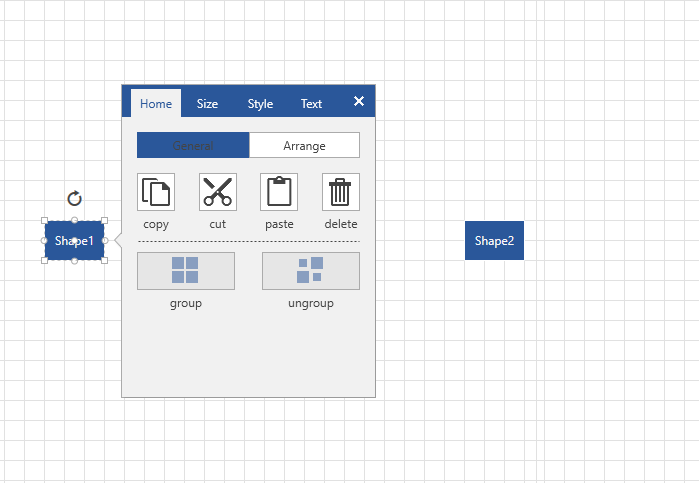
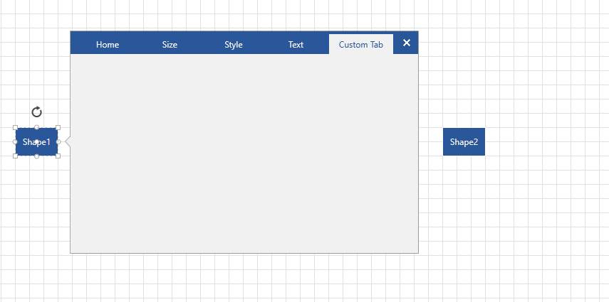

# SettingsPaneView Attached Properties

The __SettingsPaneView__ represents the default content of the RadDiagram SettingsPane. The bindings in the diagram's SettingsPane are created with custom code used through attached properties. This is necessary because the pane is opened in a Popup which is in a different visual tree and the normal XAML bindings between the application's tree and the Popup's tree might not work as expected. The SettingsPaneView exposes the following attached properties.

* __SettingsPaneView.EditorItemType__ : An enumeration property that determines on which item types this binding should be applied. It contains the following flags: __None, Shapes, Connections, Custom, All__

* __SettingsPaneView.EditorPropertyName__: A string property that represents the property of the currently edited shape. For example, if you set the property to the "CustomText" string, the logic in the property changed callback of the attached property will use reflection to find a property with the same name defined in the shape object.

* __SettingsPaneView.EditorValue__:  A string property that defines the value of which property of the current control should be taken and applied on the currently edited shape.

* __SettingsPaneView.ContainerEditItemType__: An enumeration property that determines on which item types this binding should be applied. It contains the following flags: __None, Shapes, Connections, Custom, All__

* __SettingsPaneView.ContainerEditProperty__: An enumeration property that determines if the type set in __ContainerEditItemType__ should be disabled or hidden. It contains the following flags: __IsEnabled, Visibility__

* __SettingsPaneView.CurrentEditType__: An enumeration property property that gets or sets the currently edited type.

In the following sections we will demonstrate how you can use the EditorItemType, EditorPropertyName and EditorValue attached properties. In the examples we will add custom __RadTabItem__ to the SettingsPaneView and bind its visibility property to a property of a business object. So that this __RadTabItem__ is visible for specific shapes. First, we need to create a Diagram and populate it with some shapes in an MVVM scenario.

#### __[C#] Example 1: Creating ViewModels__
{{region csharp-raddiagram-extensions-extensions-settingspaneview-attachedproperties-0}}
public class Model : NodeViewModelBase
{
    public Model()
    {
	Visibility = Visibility.Collapsed;
    }
    public Visibility Visibility { get; set; }
}

public class Link : LinkViewModelBase<NodeViewModelBase>
{
}

public class DiagramGraphSource : ObservableGraphSourceBase<NodeViewModelBase, Link>
{
    public DiagramGraphSource()
    {
	Model shape1 = new Model() { Content = "Shape1", Position = new Point(100, 100), Visibility = Visibility.Visible };
	Model shape2 = new Model() { Content = "Shape2", Position = new Point(300, 100) };

	this.AddNode(shape1);
	this.AddNode(shape2);
    }
} 
{{endregion}}

Next, we can go ahead and define a __RadDiagram__ and a __SettingsPane__ in our View:

#### __[XAML] Example 2: Defining RadDiagram in XAML__
{{region xaml-raddiagram-extensions-extensions-settingspaneview-attachedproperties-1}}
	<telerik:RadDiagram x:Name="diagram" xmlns:primitives="clr-namespace:Telerik.Windows.Controls.Diagrams.Primitives;assembly=Telerik.Windows.Controls.Diagrams">
		<telerik:RadDiagram.ShapeTemplate>
			<DataTemplate>
				<TextBlock Text="{Binding Content, Mode=TwoWay}" />
			</DataTemplate>
		</telerik:RadDiagram.ShapeTemplate>
		<telerik:RadDiagram.ShapeEditTemplate>
			<DataTemplate>
				<TextBox Text="{Binding Content, Mode=TwoWay}" />
			</DataTemplate>
		</telerik:RadDiagram.ShapeEditTemplate>
		<primitives:ItemInformationAdorner.AdditionalContent>
			<telerik:SettingsPane Diagram="{Binding ElementName=diagram}" SettingsPaneViewWidth="410"/>
		</primitives:ItemInformationAdorner.AdditionalContent>            
		<telerik:RadDiagram.ShapeStyle>
			
		</telerik:RadDiagram.ShapeStyle>
	</telerik:RadDiagram> 
{{endregion}}

And finally, we need to set the RadDiagram GraphSource property:

#### __[C#] Example 3: Setting GraphSource property__
{{region csharp-raddiagram-extensions-extensions-settingspaneview-attachedproperties-2}}
	public MainWindow()
	{
		InitializeComponent();
		this.diagram.GraphSource = new DiagramGraphSource();
	} 
{{endregion}}

If you run the application now, the RadDiagram should display the two shapes. When you select one of shapes, the __SettingsPane__ will appear on the right side. 

Now we can add an additional __RadTabItem__ to the __SettingsPaneView__. In order to do that we need to [extract and edit the default template]() of the __SettingsPaneView__. __Example 4__ contains the default template of the __SettingsPaneView__ based on the __Office2016__ theme and the custom __RadTabItem__.

#### __[C#] Example 4: Modified template of the SettingsPaneView__
{{region csharp-raddiagram-extensions-extensions-settingspaneview-attachedproperties-3}}
	<ResourceDictionary xmlns="http://schemas.microsoft.com/winfx/2006/xaml/presentation"
					xmlns:x="http://schemas.microsoft.com/winfx/2006/xaml"
					xmlns:sys="clr-namespace:System;assembly=mscorlib"
					xmlns:telerik="http://schemas.telerik.com/2008/xaml/presentation"
					xmlns:telerik1="clr-namespace:Telerik.Windows.Controls;assembly=Telerik.Windows.Controls"
					xmlns:primitives="clr-namespace:Telerik.Windows.Controls.Diagrams.Primitives;assembly=Telerik.Windows.Controls.Diagrams"
					xmlns:extensions="clr-namespace:Telerik.Windows.Controls.Diagrams.Extensions;assembly=Telerik.Windows.Controls.Diagrams.Extensions"
					xmlns:local="clr-namespace:SettingsPane_Tool">
		<sys:String x:Key="GlyphClose"></sys:String>
		<FontFamily x:Key="TelerikWebUI">/Telerik.Windows.Controls;component/Themes/Fonts/TelerikWebUI.ttf#TelerikWebUI</FontFamily>
		<ItemsPanelTemplate x:Key="PaneTabControlItemsPanel">
			<telerik:RadUniformGrid Rows="1"/>
		</ItemsPanelTemplate>
		<DropShadowEffect x:Key="DiagramEffect" BlurRadius="3" Opacity="0.1" ShadowDepth="3"/>
		<telerik1:InvertedBooleanConverter x:Key="InvertedBooleanConverter"/>
		
	</ResourceDictionary> 
{{endregion}}

To bind the __Visibility__ property of the __RadTabItem__ to a property of your Model you can use the __EditorItemType, EditorPropertyName, and EditorValue__ attached properties. The DataContext of the attached properties in the currently selected RadDiagramShape. The business object is held in the DataContext property. Using this information the EditorPropertyName attached property will be bound to the custom Visibility property. The __EditorItemType__ will specify to which elements to apply this functionality. In this example, we will set it to regular shapes and custom ones. As for the final attached property - EditorValue, since the DataContext is the __RadDiagramShape__, we can use RelativeSource Self-binding to bind to the __RadTabItem__ Visibility property. __Example 5__ demonstrates this approach.

#### __[C#] Example 5: Add custom RadTabItem and set the SettingsPaneView attached properties__
{{region csharp-raddiagram-extensions-extensions-settingspaneview-attachedproperties-3}}
	<telerik:RadTabItem Header="Custom Tab"
						extensions:SettingsPaneView.EditorPropertyName="DataContext.IsVisible"
						extensions:SettingsPaneView.EditorItemType="Shapes,Custom"
						extensions:SettingsPaneView.EditorValue="{Binding Path=Visibility,Mode=TwoWay, RelativeSource={RelativeSource Self}}"/>
{{endregion}}

## See Also

* [Getting Started]()
* [DiagramExtensions ViewModels]()
* [Extensions Overview]()
