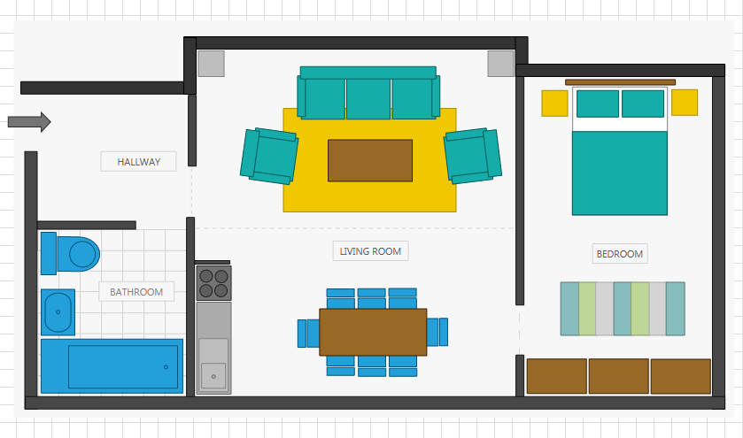
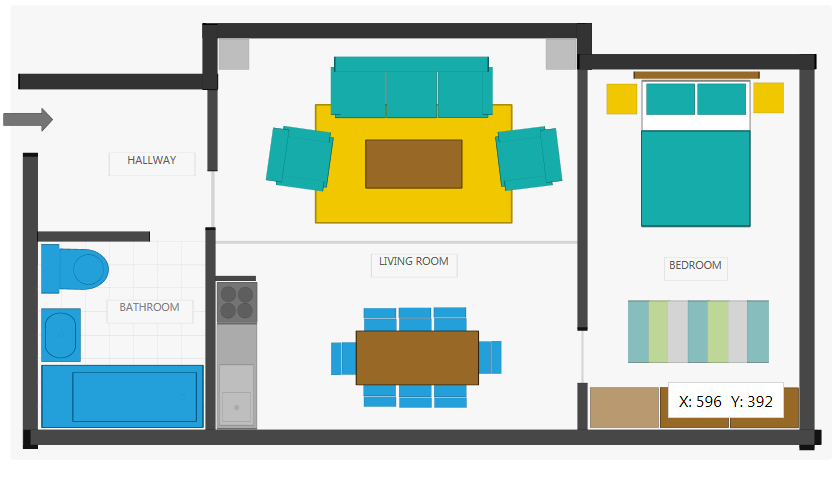

# Html Support

As __RadDiagram__ supports serialization, you can save your diagramming solution in a custom __XML__ format. The __HTML support__ is built on top of this serialization logic. It is not conceived as an 'export' from within __RadDiagram__ rather we use JaveScript to convert the RadDiagram's serialization __XML__ into an __SVG__ diagram inside the browser. This way you can avoid using any plugins and instead use plain HTML to display a diagramming structure build with __RadDiagram__. This script can load a saved XML diagram or use a JavaScript variable that holds it. Internally the JavaScript makes use of the Kendo API to output the necessary HTML (SVG tags). This doesn't mean however that you need a Kendo UI license to use this script since it only uses a handful of Kendo files which are part of the Kendo core.
			

## SVG Render

In order to take advantage of the Html support and render a diagramming structure in SVG, you need to include the following scripts in your html page:

* http://code.jquery.com/jquery-1.7.1.min.js

* http://cdn.kendostatic.com/2012.2.710/js/kendo.all.min.js

* radDiagram.js

Next, you need to add a __DIV__ container to host the rendered SVG like so:
				

	
    

		  

Finally, you need to load the saved XML diagram in the container: 

	
    
		  

You can find the code implementation of the __Html support__ along with some useful sample Diagramming structures in [github](https://github.com/telerik/diagram-html-export). You can further extend the SVG representation of a diagramming solution by defining dynamic tooltips providing more information about a clicked shape in the SVG. The sample solution attached in __github__ demonstrates one approach for implementing such logic.
				

>Please note that the __radDiagram.js__ file is an open source implementation that you can change to better fit your requirements.
					

If you decide to use the open source JavaScript code to display a RadDiagram serialization xml in an SVG, you can also examine the [Diagrams FirstLook](http://demos.telerik.com/silverlight/#Diagrams/FirstLook)[Diagrams->FirstLook](http://demos.telerik.com/wpf/#Diagrams/FirstLook) example and specifically the __ExportToHtml__ button. If you download the demo solutions, you will be able to take a closer look at the export implementation which basically creates an __html__ file using the scripts described above and displaying the SVG form of the diagrams in a __div__ element.
				

If, for example, you open the __FloorPlan__ sample in the Diagrams FirstLook demo:

Using the __Export to Html__ button you will be able to create an html file displaying an SVG representation of the floor plan:

## Limitations

* The described HTML support creates an __SVG that is a read-only__ representation of a diagram created in either the Silverlight or the WPF RadDiagram control. At the moment you can't alter the generated diagram in any way.
						

* __SVG doesn't have a text-wrapping property__, which means that if your shapes contain wrapped text it will likely be rendered across and outside the bounds in the SVG representation.
						

* Diagram elements with a size (__Width__ or __Height__) set to __Auto__ will not be rendered correctly in SVG. Here again, this is due to the fact that auto-size is not part of the SVG technology. This means that your auto-sized diagram elements will be rendered but with an incorrect size. The solution to this issue is to make sure that you scale the elements in XAML so that during the serialization an actual size will be saved rather than the __'Auto'__ value.
						

* Arrow heads scale differently in SVG than in XAML. This may lead to inconsistencies in the arrow heads of very large connections (thick lines) between the original diagramming structure and the SVG representation. 

* Shapes which get their __Background__ from a global theme in XAML will be rendered gray in SVG. This is due to the fact that the __Theme__ assigns a color dynamically while the serialized __Background__ is empty. Much like the __Auto__ property above, you can remediate this by assigning explicitly a __Background__ so that the serialized XML contains effectively a value.
						

* __Images are not supported.__ The images contained in the serialized diagrams are encoded in a binary format which cannot be handled by the JavaScript code.
						

* __Custom templates are not supported.__ The JavaScript importer has no access to the XAML templates defined outside the XML file and as such has no knowledge of how to render custom content. This is why the SVG renderer is mostly functional when using basic geometric shapes.
					
