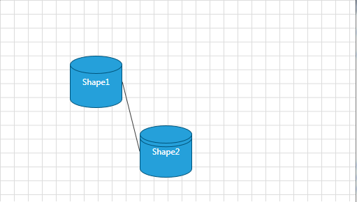
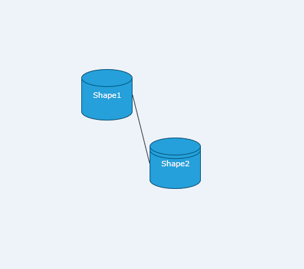
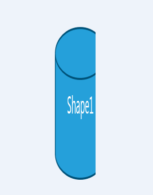
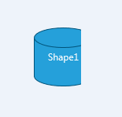

# Image Export

This article describes the __RadDiagram ExportToImage__ feature.
	  

The __RadDiagram__ framework provides a method and a command for exporting its current state to an image file. You can control the type and size of the created image along with the area of the diagram that should be exported.
	  

## ExportToImage() method

The __RadDiagram.ExportToImage()__ method allows you to export the diagram to an image. It takes the following arguments:
		

* __Stream__*stream* - this is a __required__ attribute that represents the stream of the file where the diagram should be exported to.
			

* 

__Telerik.Windows.Media.Imaging.BitmapEncoderhttp://www.telerik.com/help/silverlight/t_telerik_windows_media_imaging_bitmapencoder.html__* encoder* - this attribute defines the image format. You can use any of the following encoders to create the file:
			  

* [BmpBitmapEncoder](http://www.telerik.com/help/silverlight/t_telerik_windows_media_imaging_bmpbitmapencoder.html)

* [PngBitmapEncoder](http://www.telerik.com/help/silverlight/t_telerik_windows_media_imaging_pngbitmapencoder.html) - this is the default encoder used by the __ExportToImage()__ method.
				  

__System.Windows.Media.Imaging.BitmapEncoderhttp://msdn.microsoft.com/en-us/library/system.windows.media.imaging.bitmapencoder.aspx__* encoder* - this attribute defines the image format. You can use any of the following encoders to create the file:
			  

* [BmpBitmapEncoder](http://msdn.microsoft.com/en-us/library/system.windows.media.imaging.bmpbitmapencoder.aspx)

* [GifBitmapEncoder](http://msdn.microsoft.com/en-us/library/system.windows.media.imaging.gifbitmapencoder.aspx)

* [JpegBitmapEncoder](http://msdn.microsoft.com/en-us/library/system.windows.media.imaging.jpegbitmapencoder.aspx)

* [PngBitmapEncoder](http://msdn.microsoft.com/en-us/library/system.windows.media.imaging.pngbitmapencoder.aspx)

* [TiffBitmapEncoder](http://msdn.microsoft.com/en-us/library/system.windows.media.imaging.tiffbitmapencoder.aspx)

* [WmpBitmapEncoder](http://msdn.microsoft.com/en-us/library/system.windows.media.imaging.wmpbitmapencoder.aspx)

* __Nullable<Rect>__*enclosingBounds* - this attribute determines the portion of the diagram surface which should be exported
			

* __Size__*returnImageSize* - this attribute determines the size of the created image file
			

* __Brush__*backgroundBrush* - this attribute determines the brush that should be applied as a background of the created image
			

* __Thickness__*margin* - this attribute allows you to specify a __Margin__ around the __RadDiagram__ when exporting it to an image file.
			

Below you can find a few examples demonstrating how to use the __ExportToImage()__ method to customize the export. For the purpose of these examples we will use the following __RadDiagram__ definition:
		

	
<telerik:RadDiagram x:Name="xDiagram">
    <telerik:RadDiagramShape x:Name="Shape1"
                                Content="Shape1"
                                Geometry="{telerik:FlowChartShape ShapeType=Database1Shape}"
                                Position="100,80" />
    <telerik:RadDiagramShape x:Name="Shape2"
                                Content="Shape2"
                                Geometry="{telerik:FlowChartShape ShapeType=Database2Shape}"
                                Position="200,180" />
    <telerik:RadDiagramConnection Source="{Binding ElementName=Shape1}" Target="{Binding ElementName=Shape2}" />
</telerik:RadDiagram>		  
		  

>Please note that the examples in this tutorial are showcasing Telerik Windows8 theme. In the
			[Setting a Theme](http://www.telerik.com/help/silverlight/common-styling-apperance-setting-theme.html#Setting_Application-Wide_Built-In_Theme_in_the_Code-Behind)[Setting a Theme](http://www.telerik.com/help/wpf/common-styling-apperance-setting-theme-wpf.html#Setting_Application-Wide_Built-In_Theme_in_the_Code-Behind)
			article you can find more information on how to set an application-wide theme.
		  

We will also create a __RadButton__ control and we will handle its __Click__ event handler to invoke the __RadDiagram.ExportToImage()__ method.
		

	
 <telerik:RadButton Content="Export to Image" Click="ExportToImage" />		  
		  

* Define only the stream of the file:

	
private void ExportToImage(object sender, RoutedEventArgs e)
{
    using (var stream = File.Open(@"c:\temp\xDiagram.png", FileMode.Create))
    {
        xDiagram.ExportToImage(stream);
    }
}			 
			 

	
Private Sub ExportToImage(sender As Object, e As RoutedEventArgs)
	Using stream = File.Open("c:\temp\xDiagram.png", FileMode.Create)
		xDiagram.ExportToImage(stream)
	End Using
End Sub			  
			  



	
private void ExportToImage(object sender, RoutedEventArgs e)
{
    SaveFileDialog dialog = new SaveFileDialog() { DefaultFileName = "xDiagram.png"};
    bool? result = dialog.ShowDialog();
    if (result == true)
    {
        using (var stream = dialog.OpenFile())
        {
            xDiagram.ExportToImage(stream);
        }
    }
}			 
			 

	
Private Sub ExportToImage(sender As Object, e As RoutedEventArgs)
	Dim dialog As New SaveFileDialog() With { .DefaultFileName = "xDiagram.png"}
	Dim result As System.Nullable(Of Boolean) = dialog.ShowDialog()
	If result = True Then
		Using stream = dialog.OpenFile()
			xDiagram.ExportToImage(stream)
		End Using
	End If
End Sub			  
			  

This operation will result in the creating of a file named xDiagram.png and it will have the following content:

* Define the portion of the diagram to be exported and the size of the image file:

	
private void ExportToImage(object sender, RoutedEventArgs e)
{
    using (var stream = File.Open(@"c:\temp\xDiagram.png", FileMode.Create))
    {
        xDiagram.ExportToImage(stream,null,new Rect(10,10,150,150),new Size(200,600));
    }
}			 
			 

	
Private Sub ExportToImage(sender As Object, e As RoutedEventArgs)
	Using stream = File.Open("c:\temp\xDiagram.png", FileMode.Create)
		xDiagram.ExportToImage(stream, Nothing, New Rect(10, 10, 150, 150), New Size(200, 600))
	End Using
End Sub			  
			  



	
private void ExportToImage(object sender, RoutedEventArgs e)
{
    SaveFileDialog dialog = new SaveFileDialog() { DefaultFileName = "xDiagram.png"};
    bool? result = dialog.ShowDialog();
    if (result == true)
    {
        using (var stream = dialog.OpenFile())
        {
            xDiagram.ExportToImage(stream,null,new Rect(10,10,150,150),new Size(200,600));
        }
    }
}			 
			 

	
Private Sub ExportToImage(sender As Object, e As RoutedEventArgs)
	Dim dialog As New SaveFileDialog() With { .DefaultFileName = "xDiagram.png"}
	Dim result As System.Nullable(Of Boolean) = dialog.ShowDialog()
	If result = True Then
		Using stream = dialog.OpenFile()
			xDiagram.ExportToImage(stream, Nothing, New Rect(10, 10, 150, 150), New Size(200, 600))
		End Using
	End If
End Sub			  
			  

This operation will result in the creating of a file named xDiagram.png with a size of 200x200 and it will contain the portion of the __RadDiagram__ defined by the rectangle *(10, 10, 150, 150)*. This is why the image file will contain only a part of the diagram and it will stretch it to fit the required size:
			

* Define only the stream and the portion of the diagram to be exported:

	
private void ExportToImage(object sender, RoutedEventArgs e)
{
    using (var stream = File.Open(@"c:\temp\xDiagram.png", FileMode.Create))
    {
        xDiagram.ExportToImage(stream,null,new Rect(10,10,150,150));
    }
}			 
			 

	
Private Sub ExportToImage(sender As Object, e As RoutedEventArgs)
	Using stream = File.Open("c:\temp\xDiagram.png", FileMode.Create)
		xDiagram.ExportToImage(stream, Nothing, New Rect(10, 10, 150, 150))
	End Using
End Sub			  
			  



	
private void ExportToImage(object sender, RoutedEventArgs e)
{
    SaveFileDialog dialog = new SaveFileDialog() { DefaultFileName = "xDiagram.png"};
    bool? result = dialog.ShowDialog();
    if (result == true)
    {
        using (var stream = dialog.OpenFile())
        {
            xDiagram.ExportToImage(stream,null,new Rect(10,10,150,150));
        }
    }
}			 
			 

	
Private Sub ExportToImage(sender As Object, e As RoutedEventArgs)
	Dim dialog As New SaveFileDialog() With { .DefaultFileName = "xDiagram.png"}
	Dim result As System.Nullable(Of Boolean) = dialog.ShowDialog()
	If result = True Then
		Using stream = dialog.OpenFile()
			xDiagram.ExportToImage(stream, Nothing, New Rect(10, 10, 150, 150))
		End Using
	End If
End Sub			  
			  

This operation will result in the creating of a file named xDiagram.png that contains only the portion of the __RadDiagram__ defined by the rectangle *(10, 10, 150, 150)*:
			

* Define the stream and the margin of the diagram to be exported:

	
private void ExportToImage(object sender, RoutedEventArgs e)
{
    using (var stream = File.Open(@"c:\temp\xDiagram.png", FileMode.Create))
    {
        xDiagram.ExportToImage(stream, backgroundBrush: new SolidColorBrush(Colors.BlanchedAlmond));
    }
}			 
			 

	
Private Sub ExportToImage(sender As Object, e As RoutedEventArgs)
	Using stream = File.Open("c:\temp\xDiagram.png", FileMode.Create)
		xDiagram.ExportToImage(stream, backgroundBrush := New SolidColorBrush(Colors.BlanchedAlmond))
	End Using
End Sub			  
			  



	
private void ExportToImage(object sender, RoutedEventArgs e)
{
    SaveFileDialog dialog = new SaveFileDialog() { DefaultFileName = "xDiagram.png"};
    bool? result = dialog.ShowDialog();
    if (result == true)
    {
        using (var stream = dialog.OpenFile())
        {
           xDiagram.ExportToImage(stream, backgroundBrush: new SolidColorBrush(Colors.BlanchedAlmond));
        }
    }
}			 
			 

	
Private Sub ExportToImage(sender As Object, e As RoutedEventArgs)
	Dim dialog As New SaveFileDialog() With { .DefaultFileName = "xDiagram.png"}
	Dim result As System.Nullable(Of Boolean) = dialog.ShowDialog()
	If result = True Then
		Using stream = dialog.OpenFile()
			xDiagram.ExportToImage(stream, backgroundBrush := New SolidColorBrush(Colors.BlanchedAlmond))
		End Using
	End If
End Sub			  
			  

This operation will result in the creating of a file named xDiagram.png that contains the __RadDiagram__ displayed on a BlanchedAlmond background:
			Now if we set the *margin* attribute of the method to *20*

	
xDiagram.ExportToImage(stream, backgroundBrush: new SolidColorBrush(Colors.BlanchedAlmond), margin: new Thickness(20));		 
			 

	
xDiagram.ExportToImage(stream, backgroundBrush := New SolidColorBrush(Colors.BlanchedAlmond), margin := New Thickness(20))	  
			  

The xDiagram.png image will display the same diagram but its background area will be larger as the method added a Margin of 20px around the diagram:

## Export() Method

__RadDiagram__ also exposes an __Export(string exportFormat)__ method that takes a __string__ argument. The method can export the content of your diagram in an __.png__ or __.bmp__ image file. In order to specify the type of the output image file, you need to set the argument of the method to either "png" or "bmp":
		

	
<telerik:RadDiagram x:Name="xDiagram">
    <telerik:RadDiagramShape x:Name="Shape1"
                                Content="Shape1"
                                Geometry="{telerik:FlowChartShape ShapeType=Database1Shape}"
                                Position="100,80" />
    <telerik:RadDiagramShape x:Name="Shape2"
                                Content="Shape2"
                                Geometry="{telerik:FlowChartShape ShapeType=Database2Shape}"
                                Position="200,180" />
    <telerik:RadDiagramConnection Source="{Binding ElementName=Shape1}" Target="{Binding ElementName=Shape2}" />
</telerik:RadDiagram>	
		  

	
		  //export to BMP
		  xDiagram.Export("bmp");
		  //export to PNG
		  //xDiagram.Export("png");
		  

	
		  'export to BMP
		  xDiagram.Export("bmp")
		  'export to PNG
		  'xDiagram.Export("png")
		  

The result of the above implementation will be a __.bmp__ file with the following content:

## DiagramCommands.Export command

You can also use the __DiagramCommands.Export__ command to export the diagram to an image file. It takes as a parameter the type of the image file. However, please keep in mind that the __Export__ command supports only export to __.bmp__ or __.png__ image files. If you don't define a __CommandParameter__, the command will create a __.png__ file:
		

	
<telerik:RadButton Command="telerik:DiagramCommands.Export" CommandTarget="{Binding ElementName=xDiagram}" CommandParameter="bmp" Content="Export" />		 		  

Using the above __RadButton__ definition, we can export the __RadDiagram__ to the following __.bmp__ file:
		

You can also invoke the execution method of the command from code-behind:

	
Telerik.Windows.Controls.Diagrams.DiagramCommands.Export.Execute("bmp", null);		  
		  

	
Telerik.Windows.Controls.Diagrams.DiagramCommands.Export.Execute("bmp", Nothing)		  
		  

# See Also
