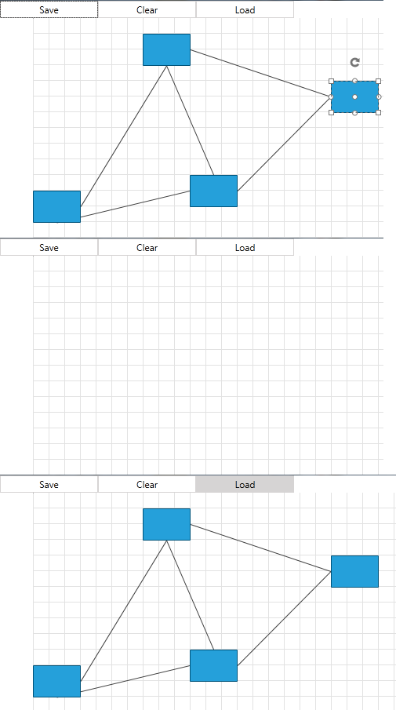

# Serialization

__RadDiagram Framework__ allows you to serialize (save) your current diagram in an XML string and later deserialize it (load). You can achieve this with the __RadDiagram.Save()__ and __RadDiagram.Load(string serializationString)__ methods. You may also use the DiagramCommands __Save__ and __Open__.
			

## Save And Load A RadDiagram

In the code below you can see how to save and load a __RadDiagram__ using Commands. Please note that before saving the current diagramming structure, it is best to check whether there are any items to save:
				

>Please note that the examples in this tutorial are showcasing Telerik Windows8 theme. In the [Setting a Theme](http://www.telerik.com/help/silverlight/common-styling-apperance-setting-theme.html#Setting_Application-Wide_Built-In_Theme_in_the_Code-Behind)[Setting a Theme](http://www.telerik.com/help/wpf/common-styling-apperance-setting-theme-wpf.html#Setting_Application-Wide_Built-In_Theme_in_the_Code-Behind) article you can find more information on how to set an application-wide theme.



#### __XAML__

{{region raddiagrams_features_serialization_1}}
	<Grid>
	        <Grid.RowDefinitions>
	            <RowDefinition Height="Auto" />
	            <RowDefinition Height="*" />
	        </Grid.RowDefinitions>
	      
	        <telerik:RadDiagram x:Name="diagram" Grid.Row="1">
	            <telerik:RadDiagramShape />
	            <telerik:CommandManager.CommandBindings>
	                <telerik:CommandBindingCollection>
	                    <telerik:CommandBinding Command="telerik:DiagramCommands.Save"
	                            Executed="CommandBinding_Executed_Save"
	                            CanExecute="CommandBinding_CanExecute" />
	                    <telerik:CommandBinding Command="telerik:DiagramCommands.Open"
	                            Executed="CommandBinding_Executed_Open" />
	                </telerik:CommandBindingCollection>
	            </telerik:CommandManager.CommandBindings>
	        </telerik:RadDiagram>
	        <StackPanel Orientation="Horizontal">
	            <telerik:RadButton Width="125" Command="telerik:DiagramCommands.Save"
	                    CommandTarget="{Binding ElementName=diagram}" Content="Save" />
	            <telerik:RadButton Width="125" Command="telerik:DiagramCommands.Copy"
	                    CommandTarget="{Binding ElementName=diagram}" Content="Copy" />
	            <telerik:RadButton Width="125" Command="telerik:DiagramCommands.Paste"
	                    CommandTarget="{Binding ElementName=diagram}" Content="Paste" />
	            <telerik:RadButton Width="125" Command="telerik:DiagramCommands.Open"
	                    CommandTarget="{Binding ElementName=diagram}" Content="Load" />
	        </StackPanel>
	</Grid>
	{{endregion}}



#### __XAML__

{{region raddiagrams_features_serialization_0}}
	<Grid>
	        <Grid.RowDefinitions>
	            <RowDefinition Height="Auto" />
	            <RowDefinition Height="*" />
	        </Grid.RowDefinitions>
	            <StackPanel Orientation="Horizontal">
	                <telerik:RadButton Width="125" 
	                                   Command="telerik:DiagramCommands.Save"
	                                   CommandTarget="{Binding ElementName=diagram}"
	                                   Content="Save" />
	                <telerik:RadButton Width="125" 
	                                   Command="telerik:DiagramCommands.Clear"
	                                   CommandTarget="{Binding ElementName=diagram}"
	                                   Content="Clear" />
	                <telerik:RadButton Width="125" 
	                                   Command="telerik:DiagramCommands.Open"
	                                   CommandTarget="{Binding ElementName=diagram}"
	                                   Content="Load" />
	            </StackPanel>
	            <telerik:RadDiagram x:Name="diagram" Grid.Row="1">
	                <telerik:RadDiagramShape  />
	                <telerik:RadDiagram.CommandBindings>
	                    <CommandBinding Command="telerik:DiagramCommands.Save" Executed="CommandBinding_Executed_Save" CanExecute="CommandBinding_CanExecute"/>
	                    <CommandBinding Command="telerik:DiagramCommands.Open" Executed="CommandBinding_Executed_Open" />
	                </telerik:RadDiagram.CommandBindings>
	            </telerik:RadDiagram>
	</StackPanel>
	{{endregion}}



#### __C#__

{{region raddiagrams_features_serialization_0}}
	private string diagramXMLString;       
	
	public MainWindow()
	{
		StyleManager.ApplicationTheme = new Windows8Theme();
		InitializeComponent();          
	}
	
	private void CommandBinding_Executed_Save(object sender, ExecutedRoutedEventArgs e)
	{
	   diagramXMLString =  this.diagram.Save();
	}
	
	private void CommandBinding_Executed_Open(object sender, ExecutedRoutedEventArgs e)
	{
		if (diagramXMLString != null)
		{
			this.diagram.Load(diagramXMLString);
		}
	}
	
	private void CommandBinding_CanExecute(object sender, CanExecuteRoutedEventArgs e)
	{
		e.CanExecute = this.diagram.Items.Count > 0;
	}
	{{endregion}}

#### __VB.NET__

{{region raddiagrams_features_serialization_0}}
	Private diagramXMLString As String
	
	Public MainWindow()
		StyleManager.ApplicationTheme = New Windows8Theme()
		InitializeComponent()
	End Sub
	
	Private Sub CommandBinding_Executed_Save(ByVal sender As Object, ByVal e As ExecutedRoutedEventArgs)
		diagramXMLString = Me.diagram.Save()
	End Sub
	
	Private Sub CommandBinding_Executed_Open(ByVal sender As Object, ByVal e As ExecutedRoutedEventArgs)
		If diagramXMLString IsNot Nothing Then
			Me.diagram.Load(diagramXMLString)
		End If
	End Sub
	
	Private Sub CommandBinding_CanExecute(ByVal sender As Object, ByVal e As CanExecuteRoutedEventArgs)
		e.CanExecute = Me.diagram.Items.Count > 0
	End Sub
	{{endregion}}

>Please note that the Content of the Shapes and the Connections is serialized as String. This means that if you have control like ListBox or TreeView as a Content , it will be not serialized successfully.
					

## Extending RadDiagram Serialization

By default, not every property of the RadDiagramItem is serialized. Below is the list of the properties that are automatically serialized:
				

* __RadDiagramShape__

* ZIndex

* Position

* Stroke

* StrokeThickness

* StrokeDashArray

* Background

* Size

* Content

* Foreground

* BorderBrush

* Thickness

* FontSize

* FontWeight

* FontFamily

* Geometry

* __RadDiagramConnection__

* ZIndex

* Position

* Stroke

* StrokeThickness

* StrokeDashArray

* Background

* SourceConnectorPosition

* TargetConnectorPosition

* SourceCapType

* TargetCapType

* SourceCapSize

* TargetCapSize

* StartPoint

* Source

* EndPoint

* Target

For every other property that you need to be part of the Serialization/Deserialization process, you have to use the __RadDiagram.ShapeDeserialized__ and
					__RadDiagram.ShapeSerialized__ or
					__RadDiagram.ConnectionDeserialized__ and __RadDiagram.ConnectionSerialized__ events.
					Below is shown how you can serialized the Opacity of the Shapes:
				

	
              void diagram_ShapeDeserialized(object sender, ShapeSerializationRoutedEventArgs e)
              {
                     // load the saved property
                     (e.Shape as RadDiagramShape).Opacity = Convert.ToDouble(e.SerializationInfo["Opacity"], CultureInfo.InvariantCulture);
              }

              void diagram_ShapeSerialized(object sender, ShapeSerializationRoutedEventArgs e)
              {
                     // save custom or other property
                     e.SerializationInfo["Opacity"] = (e.Shape as RadDiagramShape).Opacity.ToInvariant();
              }
		  
		  

	
              Private Sub diagram_ShapeDeserialized(ByVal sender As Object, ByVal e As ShapeSerializationRoutedEventArgs)
					 ' load the saved property
					 TryCast(e.Shape, RadDiagramShape).Opacity = Convert.ToDouble(e.SerializationInfo("Opacity"), CultureInfo.InvariantCulture)
              End Sub

			  Private Sub diagram_ShapeSerialized(ByVal sender As Object, ByVal e As ShapeSerializationRoutedEventArgs)
					 ' save custom or other property
					 e.SerializationInfo("Opacity") = (TryCast(e.Shape, RadDiagramShape)).Opacity.ToInvariant()
			  End Sub	  
		  

>Please note that the __Double.ToInvariant()__ extension method is defined in the __Telerik.Windows.Diagrams.Core__ namespace and in order to use it in your application, you'll have to add a using statement: using Telerik.Windows.Diagrams.Core;

# See Also

 * [Getting Started]()

 * [Populating with Data]()

 * [Shapes]()

 * [Connections]()

 * [Virtualization]()

 * [Commands]()

 * [Diagram Events]()

 * [Items Events]()
