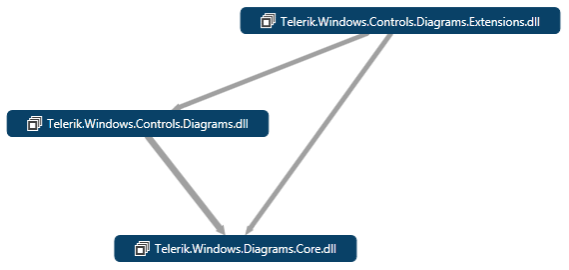
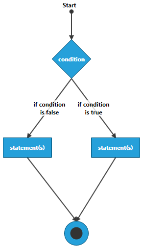
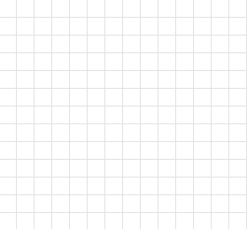
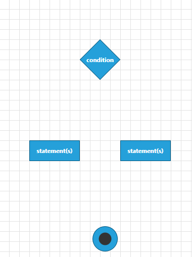
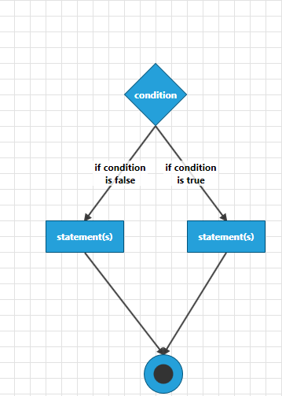
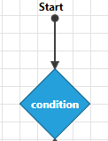

# Getting Started

Telerik __RadDiagrams__ are powerful Diagramming framework that can bring to life your rich data-visualization scenarios.
	  

In order to use the __Telerik Diagramming Framework__ in your projects you have to add references to the following assemblies:
	  

* __Telerik.Windows.Controls__

* __Telerik.Windows.Controls.Diagrams__

* __Telerik.Windows.Diagrams.Core__

The interdependency of the main assemblies is quite straightforward, the only thing that is not obvious here is that the __Telerik.Windows.Controls.Diagrams.Extensions__ assembly also depends on the:
	  

* __Telerik.Windows.Controls.Input.dll__

* __Telerik.Windows.Controls.Navigation.dll__

>tipYou can find more info about the __RadControls__ dependencies [here](http://www.telerik.com/help/wpf/installation-installing-controls-dependencies-wpf.html).
		

This tutorial will walk you through the main concepts and tools of the __Telerik Diagramming Framework__ while helping you to create the flow diagram of an "if-else" operator.

>Please note that the examples in this tutorial are showcasing Telerik Windows8 theme. In the [Setting a Theme](http://www.telerik.com/help/silverlight/common-styling-apperance-setting-theme.html#Setting_Application-Wide_Built-In_Theme_in_the_Code-Behind)[Setting a Theme](http://www.telerik.com/help/wpf/common-styling-apperance-setting-theme-wpf.html#Setting_Application-Wide_Built-In_Theme_in_the_Code-Behind) article you can find more information on how to set an application-wide theme.
		

## Graph Object Model

The __Graph Object Model__ is the main concept behind the Diagramming framework. It contains the following three main objects:
		

* __Graph__ - this is the structure that contains the __RadDiagramShapes__ and __RadDiagramConnections__. In the __Telerik Diagramming Framework__ the graph is represented by the __RadDiagram__ class.
			

* __Shape__ - the shape describes a node of a __Graph__ that in the __Telerik Diagramming Framework__ is represented by the __RadDiagramShape__ class.
			

* __Connection__ - the connection describes the edges of the graph and it is basically an object that connects zero, one or two shapes. In the __Telerik Diagramming Framework__ the connection is represented by the __RadDiagramConnection__ class.
			

>tipThe __RadDiagram__ items are represented by the __RadDiagramItem__ class. Therefore both __RadDiagramConnection__ and __RadDiagramShape__ classes derive from the __RadDiagramItem__ class.
		  

>importantIn order to populate the __RadDiagram__ with __RadDiagramItems__ you can add __RadDiagramShapes__ and __RadDiagramConnections__ in the __RadDiagram.Items__ collection from code-behind ([read more]()) or declaratively in xaml ([read more]()). Also as the __RadDiagram__ control is a data-driven control, it supports data binding. In order to bind the __RadDiagram__ to a collection, you can use its __GraphSource__ property. Note that when the __GraphSource__ property is set, the __Items__ collection is made read-only and fixed-size.  For more information please refer to the [DataBinding]() tutorial.
		  

## Setting up the drawing canvas

When you want to create a diagram in your application, you first need to add the __RadDiagram__ control, as it represents the main canvas onto which the Diagramming tools and shapes are drawn.
		

#### __XAML__

{{region raddiagram_getting_started_0}}
    <Grid xmlns:telerik="http://schemas.telerik.com/2008/xaml/presentation">
        <telerik:RadDiagram />
    </Grid>
	{{endregion}}

As a result you'll get the default drawing canvas:

>__RadDiagram__ exposes a set of properties that allow you to customize the graph layout and operations. For example you can set up the active mouse tool, specify if a cut, copy, paste or delete operation is allowed and customize the background color, the cells height and width as well as the __GridLine__ thickness of the drawing canvas.
		  

## Add RadDiagramShapes

In order to create a diagram describing the flow of an "if-else" operator, you will need 4 shapes - two will represent the statements, one will describe the condition and one will represent the final result of the operator.

Let's start with the condition of the "if-else" operator - in a block diagram a condition is usually described by a diamond shape, called a __decision__ shape.
		

>tipThe __RadDiagramShape__ exposes a __Geometry__ property that allows you to create a custom geometry or use predefined shape geometry. The predefined shape geometries in the __Telerik Diagramming Framework__ are described by the __ArrowShape__, __CommonShape__ and __FlowChartShape__ extension classes. For more information pelase refer to the [DiagramShapes]() tutorial.
		  

#### __XAML__

{{region raddiagram_getting_started_1}}
    <Grid>
        <telerik:RadDiagram>
            <telerik:RadDiagramShape Geometry="{telerik:FlowChartShape ShapeType=DecisionShape}" />
        </telerik:RadDiagram>
    </Grid>
	{{endregion}}

You can define the size of the shape and set its __Content__ and __x:Name__ properties to better describe it.
		

#### __XAML__

{{region raddiagram_getting_started_2}}
    <Grid>
        <telerik:RadDiagram>
            <telerik:RadDiagramShape x:Name="ConditionShape"
                                     Width="80"
                                     Height="80"
                                     Content="condition"
                                     FontWeight="Bold"
                                     Geometry="{telerik:FlowChartShape ShapeType=DecisionShape}" />
        </telerik:RadDiagram>
    </Grid>
	{{endregion}}

To describe the statements of the "if-else" operator you can use the default geometry of the __RadDiagramShape__:
		

#### __XAML__

{{region raddiagram_getting_started_3}}
    <Grid>
        <telerik:RadDiagram>
            <telerik:RadDiagramShape x:Name="ConditionShape"
                                     Width="80"
                                     Height="80"
                                     Content="condition"
                                     FontWeight="Bold"
                                     Geometry="{telerik:FlowChartShape ShapeType=DecisionShape}" />
            <telerik:RadDiagramShape x:Name="StatementShape1"
                                     Width="100"
                                     Content="statement(s)"
                                     FontWeight="Bold" />
            <telerik:RadDiagramShape x:Name="StatementShape2"
                                     Width="100"
                                     Content="statement(s)"
                                     FontWeight="Bold" />
        </telerik:RadDiagram>
    </Grid>
	{{endregion}}

Adding multiple shapes in the __RadDiagram__ without setting their position, by default will position all shapes at the top left corner of the drawing canvas. In order to rearrange their layout, you need to set the __Position__ property of each shape. This property is of type __Point__ and it gets or sets the coordinates of the top left point of a shape.
		

#### __XAML__

{{region raddiagram_getting_started_4}}
    <Grid>
        <telerik:RadDiagram>
            <telerik:RadDiagramShape x:Name="ConditionShape"
                                     Width="80"
                                     Height="80"
                                     Content="condition"
                                     FontWeight="Bold"
                                     Geometry="{telerik:FlowChartShape ShapeType=DecisionShape}"
                                     Position="160,80" />
            <telerik:RadDiagramShape x:Name="StatementShape1"
                                     Width="100"
                                     Content="statement(s)"
                                     FontWeight="Bold"
                                     Position="60,280" />
            <telerik:RadDiagramShape x:Name="StatementShape2"
                                     Width="100"
                                     Content="statement(s)"
                                     FontWeight="Bold"
                                     Position="240,280" />
        </telerik:RadDiagram>
    </Grid>
	{{endregion}}

To describe the final result of the operator you can use an ellipse shape. __Telerik Diagramming Framework__ provides such a predefined shape - in the __CommonShape__ extension class you can find a shape of type __EllipseShape__.
		

#### __XAML__

{{region raddiagram_getting_started_5}}
    <Grid>
        <telerik:RadDiagram>
            <telerik:RadDiagramShape x:Name="EndShape"
                                     Width="50"
                                     Height="50"
                                     Content="End"
                                     FontWeight="Bold"
                                     Geometry="{telerik:CommonShape ShapeType=EllipseShape}" />
        </telerik:RadDiagram>
    </Grid>
	{{endregion}}

>tipThe __RadDiagramItem__ class exposes __ContentTemplate__ and __ContentTemplateSelector__ properties that allow you to customize the content of the __RadDiagramShapes__ and __RadDiagramConnections__.
		  

You can customize the content of the ellipse __RadDiagramShape__ to mark it as the end of the "if-else" flow diagram.
		

#### __XAML__

{{region raddiagram_getting_started_6}}
    <Grid>
        <telerik:RadDiagram>
            <telerik:RadDiagramShape x:Name="ConditionShape"
                                     Width="80"
                                     Height="80"
                                     Content="condition"
                                     FontWeight="Bold"
                                     Geometry="{telerik:FlowChartShape ShapeType=DecisionShape}"
                                     Position="160,80" />
            <telerik:RadDiagramShape x:Name="StatementShape1"
                                     Width="100"
                                     Content="statement(s)"
                                     FontWeight="Bold"
                                     Position="60,280" />
            <telerik:RadDiagramShape x:Name="StatementShape2"
                                     Width="100"
                                     Content="statement(s)"
                                     FontWeight="Bold"
                                     Position="240,280" />
            <telerik:RadDiagramShape x:Name="EndShape"
                                     Width="50"
                                     Height="50"
                                     FontWeight="Bold"
                                     Geometry="{telerik:CommonShape ShapeType=EllipseShape}"
                                     Position="185,450">
                <telerik:RadDiagramShape.ContentTemplate>
                    <DataTemplate>
                        <Ellipse Width="25"
                                 Height="25"
                                 Fill="#FF333333" />
                    </DataTemplate>
                </telerik:RadDiagramShape.ContentTemplate>
            </telerik:RadDiagramShape>
        </telerik:RadDiagram>
    </Grid>
	{{endregion}}

## Add RadDiagramConnections

Finally you can connect all shapes using __RadDiagramConnections__.
		

>tipThe __RadDiagramConnection__ class exposes a set of properties that allow you to define and customize the source and target of the connection. For more information please refer to the [DiagramConnection]() tutorial.
		  

In order to connect the shapes and finish the flow diagram of the "if-else" operator, you need to set up 5 connections: 

* Add connections between the 'condition' shape and the 'statements' shapes:
			

#### __XAML__

{{region raddiagram_getting_started_7}}
    <telerik:RadDiagramConnection Content="if condition is false"
                                  FontWeight="Bold"
                                  Source="{Binding ElementName=ConditionShape}"
                                  SourceConnectorPosition="Bottom"
                                  StrokeThickness="2"
                                  Target="{Binding ElementName=StatementShape1}"
                                  TargetCapType="Arrow1Filled">
        <telerik:RadDiagramConnection.ContentTemplate>
            <DataTemplate>
                <TextBlock Width="70"
                           TextAlignment="Center"
                           Text="{Binding}"
                           TextWrapping="Wrap" />
            </DataTemplate>
        </telerik:RadDiagramConnection.ContentTemplate>
    </telerik:RadDiagramConnection>
    <telerik:RadDiagramConnection Content="if condition is true"
                                  FontWeight="Bold"
                                  Source="{Binding ElementName=ConditionShape}"
                                  SourceConnectorPosition="Bottom"
                                  StrokeThickness="2"
                                  Target="{Binding ElementName=StatementShape2}"
                                  TargetCapType="Arrow1Filled">
        <telerik:RadDiagramConnection.ContentTemplate>
            <DataTemplate>
                <TextBlock Width="70"
                           TextAlignment="Center"
                           Text="{Binding}"
                           TextWrapping="Wrap" />
            </DataTemplate>
        </telerik:RadDiagramConnection.ContentTemplate>
    </telerik:RadDiagramConnection>
	{{endregion}}

* Add connections between the 'statements' shape and the 'final result' shapes:
			

#### __XAML__

{{region raddiagram_getting_started_8}}
    <telerik:RadDiagramConnection Source="{Binding ElementName=StatementShape1}"
                                  SourceConnectorPosition="Bottom"
                                  StrokeThickness="2"
                                  Target="{Binding ElementName=EndShape}"
                                  TargetCapType="Arrow1Filled" />
    <telerik:RadDiagramConnection Source="{Binding ElementName=StatementShape2}"
                                  SourceConnectorPosition="Bottom"
                                  StrokeThickness="2"
                                  Target="{Binding ElementName=EndShape}"
                                  TargetCapType="Arrow1Filled" />
	{{endregion}}

* Add the connection that points to the start of the operator:
			

#### __XAML__

{{region raddiagram_getting_started_9}}
    <telerik:RadDiagramConnection HorizontalContentAlignment="Center"
                                  VerticalContentAlignment="Top"
                                  Content="Start"
                                  FontWeight="Bold"
                                  SourceCapType="Arrow6Filled"
                                  StrokeThickness="2"
                                  Target="{Binding ElementName=ConditionShape}"
                                  TargetCapType="Arrow1Filled"
                                  StartPoint="200,20">
        <telerik:RadDiagramConnection.ContentTemplate>
            <DataTemplate>
                <TextBlock Margin="-18"
                           Text="{Binding}" />
            </DataTemplate>
        </telerik:RadDiagramConnection.ContentTemplate>
    </telerik:RadDiagramConnection>
	{{endregion}}

## RadDiagram Example - "if-else" operator flow diagram

Below you can find the final xaml definition of the "if-else" flow diagram:

#### __XAML__

{{region raddiagram_getting_started_10}}
    <Grid  xmlns:telerik="http://schemas.telerik.com/2008/xaml/presentation">
        <telerik:RadDiagram>
            <telerik:RadDiagramShape x:Name="ConditionShape"
                                     Width="80"
                                     Height="80"
                                     Content="condition"
                                     FontWeight="Bold"
                                     Geometry="{telerik:FlowChartShape ShapeType=DecisionShape}"
                                     Position="160,80" />
            <telerik:RadDiagramConnection HorizontalContentAlignment="Center"
                                          VerticalContentAlignment="Top"
                                          Content="Start"
                                          FontWeight="Bold"
                                          SourceCapType="Arrow6Filled"
                                          StrokeThickness="2"
                                          Target="{Binding ElementName=ConditionShape}"
                                          TargetCapType="Arrow1Filled"
                                          StartPoint="200,20">
                <telerik:RadDiagramConnection.ContentTemplate>
                    <DataTemplate>
                        <TextBlock Margin="-18" Text="{Binding}" />
                    </DataTemplate>
                </telerik:RadDiagramConnection.ContentTemplate>
            </telerik:RadDiagramConnection>
            <telerik:RadDiagramShape x:Name="StatementShape1"
                                     Width="100"
                                     Content="statement(s)"
                                     FontWeight="Bold"
                                     Position="60,280" />
            <telerik:RadDiagramConnection Content="if condition is false"
                                          FontWeight="Bold"
                                          Source="{Binding ElementName=ConditionShape}"
                                          SourceConnectorPosition="Bottom"
                                          StrokeThickness="2"
                                          Target="{Binding ElementName=StatementShape1}"
                                          TargetCapType="Arrow1Filled">
                <telerik:RadDiagramConnection.ContentTemplate>
                    <DataTemplate>
                        <TextBlock Width="70"
                                   Text="{Binding}"
                                   TextAlignment="Center"
                                   TextWrapping="Wrap" />
                    </DataTemplate>
                </telerik:RadDiagramConnection.ContentTemplate>
            </telerik:RadDiagramConnection>
            <telerik:RadDiagramShape x:Name="StatementShape2"
                                     Width="100"
                                     Content="statement(s)"
                                     FontWeight="Bold"
                                     Position="240,280" />
            <telerik:RadDiagramConnection Content="if condition is true"
                                          FontWeight="Bold"
                                          Source="{Binding ElementName=ConditionShape}"
                                          SourceConnectorPosition="Bottom"
                                          StrokeThickness="2"
                                          Target="{Binding ElementName=StatementShape2}"
                                          TargetCapType="Arrow1Filled">
                <telerik:RadDiagramConnection.ContentTemplate>
                    <DataTemplate>
                        <TextBlock Width="70"
                                   Text="{Binding}"
                                   TextAlignment="Center"
                                   TextWrapping="Wrap" />
                    </DataTemplate>
                </telerik:RadDiagramConnection.ContentTemplate>
            </telerik:RadDiagramConnection>
            <telerik:RadDiagramShape x:Name="EndShape"
                                     Width="50"
                                     Height="50"
                                     FontWeight="Bold"
                                     Geometry="{telerik:CommonShape ShapeType=EllipseShape}"
                                     Position="185,450">
                <telerik:RadDiagramShape.ContentTemplate>
                    <DataTemplate>
                        <Ellipse Width="25"
                                 Height="25"
                                 Fill="#FF333333" />
                    </DataTemplate>
                </telerik:RadDiagramShape.ContentTemplate>
            </telerik:RadDiagramShape>
            <telerik:RadDiagramConnection Source="{Binding ElementName=StatementShape1}"
                                          SourceConnectorPosition="Bottom"
                                          StrokeThickness="2"
                                          Target="{Binding ElementName=EndShape}"
                                          TargetCapType="Arrow1Filled" />
            <telerik:RadDiagramConnection Source="{Binding ElementName=StatementShape2}"
                                          SourceConnectorPosition="Bottom"
                                          StrokeThickness="2"
                                          Target="{Binding ElementName=EndShape}"
                                          TargetCapType="Arrow1Filled" />
        </telerik:RadDiagram>
    </Grid>
	{{endregion}}

# See Also

 * [Populating with Data]()

 * [Shapes]()

 * [Connections]()

 * [Items Editing]()

 * [Removing Items]()

 * [Mouse Tools]()

 * [Keyboard Support]()

 * [Rotation]()

 * [Resizing]()

 * [ZOrder]()

 * [Selection]()

 * [Diagram Events]()

 * [Items Events]()
