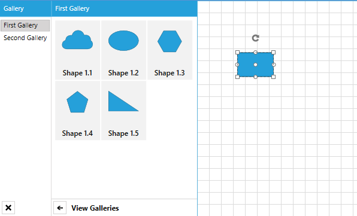
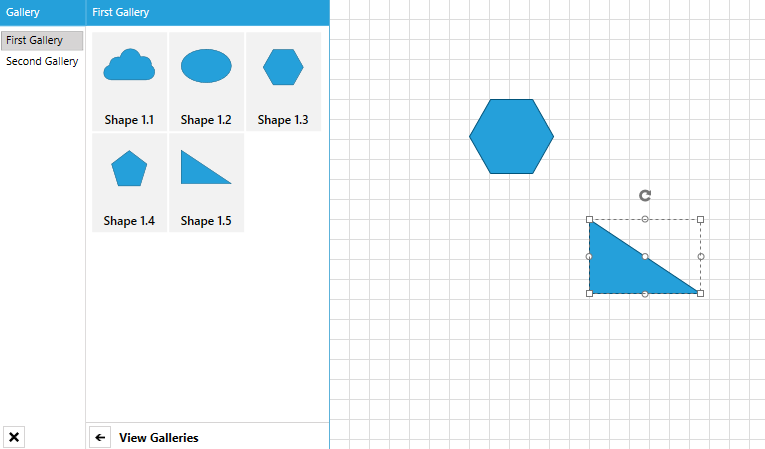

# Drag Items from a Custom Databound DiagramToolbox

This tutorial describes how to implement a drag/drop operation between a custom data-bound __RadDiagramToolbox__ and a __RadDiagram__.           

>Please note that the examples in this tutorial are showcasing Telerik Windows8 theme. In the [Setting a Theme](http://www.telerik.com/help/silverlight/common-styling-apperance-setting-theme.html#Setting_Application-Wide_Built-In_Theme_in_the_Code-Behind)[Setting a Theme](http://www.telerik.com/help/wpf/common-styling-apperance-setting-theme-wpf.html#Setting_Application-Wide_Built-In_Theme_in_the_Code-Behind) article you can find more information on how to set an application-wide theme.

For the purpose of this tutorial we will create e sample __Grid__ with two columns - the first one holding a __RadDiagramToolbox__ and the second one - a __RadDiagram__.                

#### __XAML__

{{region raddiagram-howto-drag-custom-toolboxitem-0}}
	  <Grid>
	    <Grid.DataContext>
	        ...
	    </Grid.DataContext>
	    <Grid.Resources>
	        ...
	    </Grid.Resources>
		
	    <Grid.ColumnDefinitions>
	        <ColumnDefinition Width="Auto" />
	        <ColumnDefinition Width="*" />
	    </Grid.ColumnDefinitions>
	
	    <telerik:RadDiagramToolbox x:Name="toolbox"
	                                Title="Gallery"
	                                Width="330"
	                                HorizontalAlignment="Right"
	                                Header="{Binding SelectedItem.Header,
	                                                RelativeSource={RelativeSource Self}}"
	                                ItemTemplate="{StaticResource ToolboxGroupTemplate}"
	                                ItemsSource="{Binding Items}"
	                                Visibility="{Binding IsChecked,
	                                                    ElementName=toolboxButton,
	                                                    Converter={StaticResource BooleanToVisibilityConverter}}" />
	    <telerik:RadDiagram Grid.Column="1" />
	</Grid>
{{endregion}}

>tip You can find the __DataContext__ implementation and the __Resources__ section of the __Grid__ in the [DiagramToolbox - How to Populate RadDiagramToolbox with Custom Data Items](1daec0e4-4559-44a0-847e-9b3e769fea1c#PopulateWithCustomData) section.                    

If you run the application at this stage, you will be able to drag shapes from the toolbox and drop them onto the diagramming surface. This is due to the built-in support for drag/drop operations between the __RadDiagramToolbox__ and the __RadDiagram__ components. As the __RadDiagramToolboxItems__ are marked as draggable by default, as soon as a drag operation is initiated, the __DragDropManager DragInitialize__ event is fired. The __Diagramming Framework__ handles this event internally and creates a __DiagramDropInfo__ object that describes the dragged shapes. This process is further described in the [DragDrop Support](1daec0e4-4559-44a0-847e-9b3e769fea1c#DragDropSupport) section of the __RadDiagramToolbox__ article.

Once a __RadDiagram__ instance receives a drop of a __DiagramDropInfo__ object, it uses the [SerializationService](1479043d-76bd-44ee-9f6c-7d1acd000767#SerializationService) to retrieve the settings of the dragged __RadDiagramItem__ and to create a new item in its __Items__ or __GraphSource__ collection.

However, please note that the dragged shapes don't keep their original __Geometry__ once dropped. Instead the drop operation creates a rectangular shape in the __RadDiagram__. This is due to the fact that the __SerializaionService__ does not serialize the __Geometry__ property of a __RadDiagram(Container)Shape__. Instead, you need to manually serialize the property and retrieve it after the drop operation.

For that purpose, we need to first attach an event handler for the default __SerializationService ItemSerializing__ event. The default __SerializationService__ is the one internally handling the serialization of the dragged toolbox shapes and once you attach a handler for the __ItemSerializing__ event, you will be able to plug into that serialization and serialize more properties of the __RadDiagram(Container)Shapes__.

#### __C#__

{{region raddiagram-howto-drag-custom-toolboxitem-0}}
	public ToolboxDragDropExample()
	{
	    InitializeComponent();
	    SerializationService.Default.ItemSerializing += Default_ItemSerializing;
	}
	
	void Default_ItemSerializing(object sender, SerializationEventArgs<IDiagramItem> e)
	{
	    if (e.Entity is RadDiagramShape)
	    {
	        e.SerializationInfo["MyGeometry"] = (e.Entity as RadDiagramShape).Geometry.ToString(CultureInfo.InvariantCulture);
	    }
	}
{{endregion}}

#### __VB.NET__

{{region raddiagram-howto-drag-custom-toolboxitem-0}}
	Public Sub New()
	    InitializeComponent()
	    AddHandler SerializationService.[Default].ItemSerializing, AddressOf Default_ItemSerializing
	End Sub
	
	Private Sub Default_ItemSerializing(sender As Object, e As SerializationEventArgs(Of IDiagramItem))
	    If TypeOf e.Entity Is RadDiagramShape Then
	        e.SerializationInfo("MyGeometry") = TryCast(e.Entity, RadDiagramShape).Geometry.ToString(CultureInfo.InvariantCulture)
	    End If
	End Sub
{{endregion}}

Next we need to deserialize the __Geometry__ property after the end of the drop operation. As the __RadDiagram__ receives a __DiagramDropInfo__ object, it knows that there is a serialization information that has to be processed. This is why a drop operation originating from a __RadDiagramToolbox__ fires the __RadDiagram ShapeDeserialized__ event. And you can attach a handler for it in the __RadDiagram__ definition and deserialize any set of custom properties that you have manually serialized.

#### __XAML__

{{region raddiagram-howto-drag-custom-toolboxitem-1}}
	 <telerik:RadDiagram Grid.Column="1" ShapeDeserialized="RadDiagram_ShapeDeserialized"/>
{{endregion}}

#### __C#__

{{region raddiagram-howto-drag-custom-toolboxitem-1}}
	private void RadDiagram_ShapeDeserialized(object sender, ShapeSerializationRoutedEventArgs e)
	{
	    if (e.Shape as RadDiagramShape != null)
	    {
	        (e.Shape as RadDiagramShape).Geometry = GeometryParser.GetGeometry(e.SerializationInfo["MyGeometry"].ToString());
	    }
	}
{{endregion}}

#### __VB.NET__

{{region raddiagram-howto-drag-custom-toolboxitem-1}}
	Private Sub RadDiagram_ShapeDeserialized(sender As Object, e As ShapeSerializationRoutedEventArgs)
	    If TryCast(e.Shape, RadDiagramShape) IsNot Nothing Then
	        TryCast(e.Shape, RadDiagramShape).Geometry = GeometryParser.GetGeometry(e.SerializationInfo("MyGeometry").ToString())
	    End If
	End Sub
{{endregion}}

Now that we have configured the __Geometry__ property serialization, we can go ahead and serialize more properties of the dragged shapes. For instance, in this example, the __RadDiagramToolbox__ is populated with __MyShape__ business items. The __Header__ of these items is displayed underneath each shape in the toolbox and we can serialize it to use it as a __Content__ of the dropped shape on the diagramming surface.                

#### __C#__

{{region raddiagram-howto-drag-custom-toolboxitem-2}}
	void Default_ItemSerializing(object sender, SerializationEventArgs<IDiagramItem> e)
	{
	    if (e.Entity is RadDiagramShape)
	    {
	        e.SerializationInfo["MyGeometry"] = (e.Entity as RadDiagramShape).Geometry.ToString(CultureInfo.InvariantCulture);
	        if((e.Entity as RadDiagramShape).DataContext is MyShape)
	        e.SerializationInfo["DataContent"] = ((e.Entity as RadDiagramShape).DataContext as MyShape).Header;
	    }
	}
	
	private void RadDiagram_ShapeDeserialized(object sender, ShapeSerializationRoutedEventArgs e)
	{
	    if (e.Shape as RadDiagramShape != null)
	    {
	        (e.Shape as RadDiagramShape).Geometry = GeometryParser.GetGeometry(e.SerializationInfo["MyGeometry"].ToString());
	        (e.Shape as RadDiagramShape).Content = e.SerializationInfo["DataContent"].ToString();
	    }
	}
{{endregion}}

#### __VB.NET__

{{region raddiagram-howto-drag-custom-toolboxitem-2}}
	Private Sub Default_ItemSerializing(sender As Object, e As SerializationEventArgs(Of IDiagramItem))
	    If TypeOf e.Entity Is RadDiagramShape Then
	        e.SerializationInfo("MyGeometry") = TryCast(e.Entity, RadDiagramShape).Geometry.ToString(CultureInfo.InvariantCulture)
	        If TypeOf TryCast(e.Entity, RadDiagramShape).DataContext Is MyShape Then
	            e.SerializationInfo("DataContent") = TryCast(TryCast(e.Entity, RadDiagramShape).DataContext, MyShape).Header
	        End If
	    End If
	End Sub
	
	Private Sub RadDiagram_ShapeDeserialized(sender As Object, e As ShapeSerializationRoutedEventArgs)
	    If TryCast(e.Shape, RadDiagramShape) IsNot Nothing Then
	        TryCast(e.Shape, RadDiagramShape).Geometry = GeometryParser.GetGeometry(e.SerializationInfo("MyGeometry").ToString())
	        TryCast(e.Shape, RadDiagramShape).Content = e.SerializationInfo("DataContent").ToString()
	    End If
	End Sub
{{endregion}}

If you run the project now, you will be able to drag shapes from the toolbox and drop them in the diagram. The shapes will keep their __Geometry__ and they will display the original __Header__ data property as their __Content__.

>tip You can download a runnable project of the demonstrated example from our online SDK repository [here](https://github.com/telerik/xaml-sdk), after navigating to __Diagram/CustomToolboxDragDrop__.

# See Also
 * [Drag and Drop Support]()
 * [DiagramToolbox]()
 * [Use MVVM in RadDiagram]()
 * [Serialize a Databound Diagram]()