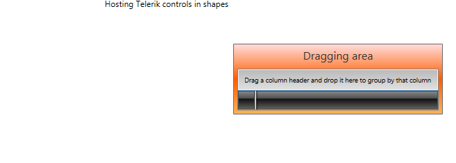
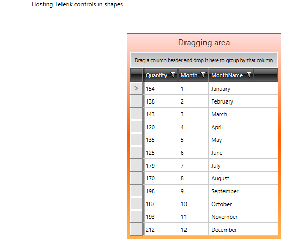
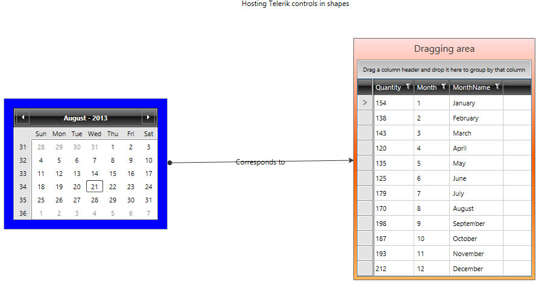

# Place RadControls in Diagram Shapes

This tutorial demonstrates how to use __UI for WPF____UI for Silverlight__ in the content of a __RadDiagramShape__ component.
      

## 

As the __RadDiagramShape__ essentially derives from a __ContentControl__, its __Content__ can wrap other controls. For the purpose of this tutorial we will use a __RadCalendar__ and a __RadGridView__ and will display both in __RadDiagramShapes__. We will also connect these shapes with a __RadDiagramConnection__.
        

Let's start by defining a __RadDiagram__ instance in our view:
        

#### __XAML__

{{region raddiagram-howto-radcontrols-in-shape-0}}
	<Grid x:Name="LayoutRoot" Background="White">
		<Grid.RowDefinitions>
			<RowDefinition Height="Auto" />
			<RowDefinition Height="*" />
		</Grid.RowDefinitions>
		<TextBlock HorizontalAlignment="Center" Text="Hosting Telerik controls in shapes" />
		<telerik:RadDiagram x:Name="diagram" 
							Grid.Row="1" 
							Grid.RowSpan="1" 
							ActiveTool="PointerTool" 
							Background="White"
							IsBackgroundSurfaceVisible="false" 
							Zoom="1">
		</telerik:RadDiagram>
	</Grid>
	{{endregion}}

Next, we can add a __RadDiagramShape__ that contains a __RadGridView__ component. We will define these controls in our XAML view:
        

#### __XAML__

{{region raddiagram-howto-radcontrols-in-shape-1}}
	<Grid x:Name="LayoutRoot" Background="White">
		<Grid.RowDefinitions>
			<RowDefinition Height="Auto" />
			<RowDefinition Height="*" />
		</Grid.RowDefinitions>
		<TextBlock HorizontalAlignment="Center" Text="Hosting Telerik controls in shapes" />
		<telerik:RadDiagram x:Name="diagram" 
							Grid.Row="1" 
							Grid.RowSpan="1" 
							ActiveTool="PointerTool" 
							Background="White"
							IsBackgroundSurfaceVisible="false" 
							Zoom="1">
			<telerik:RadDiagramShape x:Name="gridShape" 
									Position="600,50" 
									UseGlidingConnector="true"
									HorizontalContentAlignment="Stretch" 
									VerticalContentAlignment="Stretch">
				<Grid>
					<Grid.RowDefinitions>
						<RowDefinition Height="30" />
						<RowDefinition />
					</Grid.RowDefinitions>
					<TextBlock Text="Dragging area" HorizontalAlignment="Center" FontSize="16" />
					<telerik:RadGridView ItemsSource="{Binding}" 
										Grid.Row="1" 
										Background="LightBlue"
										BorderBrush="SteelBlue" />
				</Grid>
			</telerik:RadDiagramShape>
		</telerik:RadDiagram>
	</Grid>
	{{endregion}}

If you run the solution at this point, you should get the following diagramming structure:

And as our __RadGridView__ is currently empty, we can go ahead and populate it with sample data. For that purpose, we first need to define a custom data class - let's name it *ProductSales*:
        

#### __C#__

{{region raddiagram-howto-radcontrols-in-shape-0}}
	public class ProductSales
	{
	    public ProductSales(int quantity, int month, string monthName)
	    {
	        this.Quantity = quantity;
	        this.Month = month;
	        this.MonthName = monthName;
	    }
	
	    public int Quantity { get; set; }
	    public int Month { get; set; }
	    public string MonthName { get; set; }
	}
	{{endregion}}

#### __VB.NET__

{{region raddiagram-howto-radcontrols-in-shape-0}}
	Public Class ProductSales
	    Public Sub New(quantity As Integer, month As Integer, monthName As String)
	        Me.Quantity = quantity
	        Me.Month = month
	        Me.MonthName = monthName
	    End Sub
	
	    Public Property Quantity() As Integer
	        Get
	            Return m_Quantity
	        End Get
	        Set(value As Integer)
	            m_Quantity = Value
	        End Set
	    End Property
	    Private m_Quantity As Integer
	    Public Property Month() As Integer
	        Get
	            Return m_Month
	        End Get
	        Set(value As Integer)
	            m_Month = Value
	        End Set
	    End Property
	    Private m_Month As Integer
	    Public Property MonthName() As String
	        Get
	            Return m_MonthName
	        End Get
	        Set(value As String)
	            m_MonthName = Value
	        End Set
	    End Property
	    Private m_MonthName As String
	End Class
	{{endregion}}

Next in our code-behind we can create a method that returns a list of __ProductSales__ and use its result as a __DataContext__ of the view:
        

#### __C#__

{{region raddiagram-howto-radcontrols-in-shape-1}}
	private static List<ProductSales> GetProductSales()
	{
	    var persons = new List<ProductSales>
		{
			new ProductSales(154, 1, "January"), 
	        new ProductSales(138, 2, "February"), 
	        new ProductSales(143, 3, "March"), 
	        new ProductSales(120, 4, "April"), 
	        new ProductSales(135, 5, "May"), 
	        new ProductSales(125, 6, "June"), 
	        new ProductSales(179, 7, "July"), 
	        new ProductSales(170, 8, "August"), 
	        new ProductSales(198, 9, "September"), 
	        new ProductSales(187, 10, "October"), 
	        new ProductSales(193, 11, "November"), 
	        new ProductSales(212, 12, "December")
		};
	    return persons;
	}
	public Example()
	{
	    InitializeComponent();
	    this.DataContext = GetProductSales();
	}
	{{endregion}}

#### __VB.NET__

{{region raddiagram-howto-radcontrols-in-shape-1}}
	Private Shared Function GetProductSales() As List(Of ProductSales)
	    Dim persons = New List(Of ProductSales)() From {
	        New ProductSales(154, 1, "January"),
	        New ProductSales(138, 2, "February"),
	        New ProductSales(143, 3, "March"),
	        New ProductSales(120, 4, "April"),
	        New ProductSales(135, 5, "May"),
	        New ProductSales(125, 6, "June"),
	        New ProductSales(179, 7, "July"),
	        New ProductSales(170, 8, "August"),
	        New ProductSales(198, 9, "September"),
	        New ProductSales(187, 10, "October"),
	        New ProductSales(193, 11, "November"),
	        New ProductSales(212, 12, "December")
	    }
	    Return persons
	End Function
	Public Sub New()
	    InitializeComponent()
	    Me.DataContext = GetProductSales()
	End Sub
	{{endregion}}

Now if we run the solution we will have a populated __RadGridView__ control inside the __RadDiagramShape__.

We can also define a shape in the code-behind file and set its content to any RadControl. Please have a look at the example below as it demonstrates how to create a __RadDiagramShape__ and use a __RadCalendar__ in its __Content__:
        

#### __C#__

{{region raddiagram-howto-radcontrols-in-shape-2}}
	public Example()
	{
	    InitializeComponent();
	    this.DataContext = GetProductSales();
	    this.Loaded += this.OnLoaded;
	}
	
	private void OnLoaded(object sender, RoutedEventArgs routedEventArgs)
	{
	    // the alternative to this code approach is to set the ContentTemplate in XAML
	    // See the documentation on this - http://www.telerik.com/help/wpf/raddiagrams-features-shapes.html
	    var calendar = new RadDiagramShape()
	    {
	        Position = new Point(20, 150),
	        Content = new RadCalendar { SelectedDate = DateTime.Now.AddDays(254), Margin = new Thickness(10) },
	        Background = new SolidColorBrush(Colors.Blue),
	        BorderBrush = new SolidColorBrush(Colors.DarkGray),
	        BorderThickness = new Thickness(1),
	        UseGlidingConnector = true,
	        HorizontalContentAlignment = HorizontalAlignment.Stretch,
	        VerticalContentAlignment = VerticalAlignment.Stretch
	    };
	    this.diagram.AddShape(calendar);
	}
	{{endregion}}

#### __VB.NET__

{{region raddiagram-howto-radcontrols-in-shape-2}}
	Public Sub New()
	    InitializeComponent()
	    Me.DataContext = GetProductSales()
	    AddHandler Me.Loaded, AddressOf Me.OnLoaded
	End Sub
	
	Private Sub OnLoaded(sender As Object, routedEventArgs As RoutedEventArgs)
	    ' the alternative to this code approach is to set the ContentTemplate in XAML
	    ' See the documentation on this - http://www.telerik.com/help/wpf/raddiagrams-features-shapes.html
	    Dim calendar = New RadDiagramShape() With {
	            .Position = New Point(20, 150),
	            .Content = New RadCalendar() With
	                        {
	                            .SelectedDate = DateTime.Now.AddDays(254),
	                            .Margin = New Thickness(10)
	                        },
	            .Background = New SolidColorBrush(Colors.Blue),
	            .BorderBrush = New SolidColorBrush(Colors.DarkGray),
	            .BorderThickness = New Thickness(1),
	            .UseGlidingConnector = True,
	            .HorizontalContentAlignment = HorizontalAlignment.Stretch,
	            .VerticalContentAlignment = VerticalAlignment.Stretch
	    }
	    Me.diagram.AddShape(calendar)
	End Sub
	{{endregion}}

Running the project now should display two shapes within the __RadDiagram__ instance:

Finally, we can connect these shapes using a single connection. Let's set it up in the __OnLoaded()__ method implementation:
        

#### __C#__

{{region raddiagram-howto-radcontrols-in-shape-3}}
	private void OnLoaded(object sender, RoutedEventArgs routedEventArgs)
	{
	    // the alternative to this code-approach is to set the ContentTemplate in XAML
	    // See the documentation on this, http://www.telerik.com/help/wpf/raddiagrams-features-shapes.html
	    var calendar = new RadDiagramShape()
	    {
	        //...
	    };
	    this.diagram.AddShape(calendar);
	
	    var con = this.diagram.AddConnection(this.diagram.Shapes[1], this.diagram.Shapes[0]) as RadDiagramConnection;
	    con.Content = "Corresponds to";
	    con.SourceCapType = CapType.Arrow6Filled;
	    con.TargetCapType = CapType.Arrow2Filled;
	}
	{{endregion}}

#### __VB.NET__

{{region raddiagram-howto-radcontrols-in-shape-3}}
	Private Sub OnLoaded(sender As Object, routedEventArgs As RoutedEventArgs)
	    ' the alternative to this code-approach is to set the ContentTemplate in XAML
	    ' See the documentation on this, http://www.telerik.com/help/wpf/raddiagrams-features-shapes.html
	    Dim calendar = New RadDiagramShape() From {
	                                                ...
	                                              }
	    Me.diagram.AddShape(calendar)
	
	    Dim con = TryCast(Me.diagram.AddConnection(Me.diagram.Shapes(1), Me.diagram.Shapes(0)), RadDiagramConnection)
	    con.Content = "Corresponds to"
	    con.SourceCapType = CapType.Arrow6Filled
	    con.TargetCapType = CapType.Arrow2Filled
	End Sub
	{{endregion}}

>tipYou can download a runnable project of the demonstrated example from our online SDK repository [here](https://github.com/telerik/xaml-sdk), after navigating to __Diagram/ControlShape__.
          
