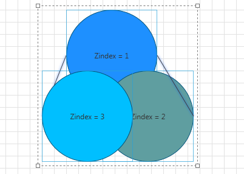
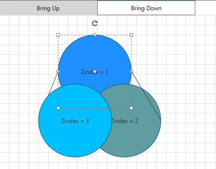
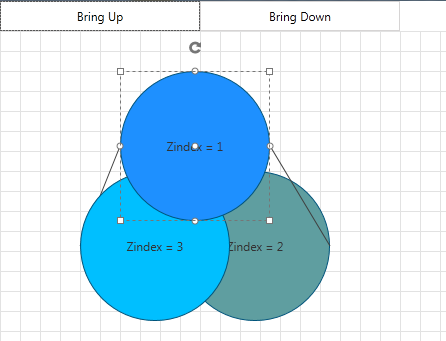

# ZOrder

__RadDiagram__ gives you the ability to control the __Z-Order__ of shapes and connections by using their
		__ZIndex__ property. You can also use __RadDiagramCommands__ in order to increase/decrease __ZIndex__ of the selected __RadDiagramItems__ simultaneously.
	  

>Please note that the examples in this tutorial are showcasing Telerik Windows8 theme. In the
		  [Setting a Theme](http://www.telerik.com/help/silverlight/common-styling-apperance-setting-theme.html#Setting_Application-Wide_Built-In_Theme_in_the_Code-Behind)[Setting a Theme](http://www.telerik.com/help/wpf/common-styling-apperance-setting-theme-wpf.html#Setting_Application-Wide_Built-In_Theme_in_the_Code-Behind)
		  article you can find more information on how to set an application-wide theme.
		

## Using the ZIndex property

Consider the following code:
		

{{region raddiagrams-features-zorder-1}}
	        <telerik:RadDiagram x:Name="diagram" Grid.Row="1">
	            <telerik:RadDiagramShape x:Name="shape1" 
	                                     Width="150"
	                                     Height="150"
	                                     Background="DeepSkyBlue"
	                                     Content="Zindex = 3"
	                                     Geometry="{telerik:CommonShape ShapeType=EllipseShape}"
	                                     Position="80 120"
	                                     ZIndex="3" />
	            <telerik:RadDiagramShape x:Name="shape2" 
	                                     Width="150"
	                                     Height="150"
	                                     Background="CadetBlue"
	                                     Content="Zindex = 2"
	                                     Geometry="{telerik:CommonShape ShapeType=EllipseShape}"
	                                     Position="180 120"
	                                     ZIndex="2" />
	            <telerik:RadDiagramShape x:Name="shape3" 
	                                     Width="150"
	                                     Height="150"
	                                     Background="DodgerBlue"
	                                     Content="Zindex = 1"
	                                     Geometry="{telerik:CommonShape ShapeType=EllipseShape}"
	                                     Position="120 20"
	                                     ZIndex="1" />
	
	            <telerik:RadDiagramConnection Source="{Binding ElementName=shape3}" 
	                                          SourceConnectorPosition="Right"
	                                          Target="{Binding ElementName=shape2}"
	                                          TargetConnectorPosition="Right"
	                                          ZIndex="4" />
	
	            <telerik:RadDiagramConnection Source="{Binding ElementName=shape3}" 
	                                          SourceConnectorPosition="Left"
	                                          Target="{Binding ElementName=shape1}"
	                                          TargetConnectorPosition="Left"
	                                          ZIndex="0" />
	        </telerik:RadDiagram>
	{{endregion}}

We have reversed the natural ZOrder of the 3 Shapes. On the other hand, the connection on the right is on top of the shapes and connection on the left is below them:
		

## Using the RadDiagram Commands

__RadDiagram__ provides a set of predefined commands for manipulating the selected items' ZIndices. __"BringForward"__ and __"SendBackward"__ allow you to increase/decrease the Z-Indices of the selected RadDiagramItems.
		  If you need to bring the selected item(s) on top of all other items or below them, you can use __"BringToFront"__ and __"SentToback"__:
		

{{region raddiagrams-features-zorder-0}}
	    <Grid>
	        <Grid.RowDefinitions>
	            <RowDefinition Height="Auto" />
	            <RowDefinition Height="*" />
	        </Grid.RowDefinitions>
	        <StackPanel Orientation="Horizontal">
	            <telerik:RadButton Width="200" 
	                               Height="30"
	                               Command="telerik:DiagramCommands.BringToFront"
	                               CommandTarget="{Binding ElementName=diagram}"
	                               Content="Bring Up" />
	            <telerik:RadButton Width="200" 
	                               Height="30"
	                               Command="telerik:DiagramCommands.SendToBack"
	                               CommandTarget="{Binding ElementName=diagram}"
	                               Content="Bring Down" />
	        </StackPanel>
	        <telerik:RadDiagram x:Name="diagram" Grid.Row="1">
	            <telerik:RadDiagramShape x:Name="shape1" 
	                                     Width="150"
	                                     Height="150"
	                                     Background="DeepSkyBlue"
	                                     Content="Zindex = 3"
	                                     Geometry="{telerik:CommonShape ShapeType=EllipseShape}"
	                                     Position="80 120"
	                                     ZIndex="3" />
	            <telerik:RadDiagramShape x:Name="shape2" 
	                                     Width="150"
	                                     Height="150"
	                                     Background="CadetBlue"
	                                     Content="Zindex = 2"
	                                     Geometry="{telerik:CommonShape ShapeType=EllipseShape}"
	                                     Position="180 120"
	                                     ZIndex="2" />
	            <telerik:RadDiagramShape x:Name="shape3" 
	                                     Width="150"
	                                     Height="150"
	                                     Background="DodgerBlue"
	                                     Content="Zindex = 1"
	                                     Geometry="{telerik:CommonShape ShapeType=EllipseShape}"
	                                     Position="120 20"
	                                     ZIndex="1" />
	
	            <telerik:RadDiagramConnection Source="{Binding ElementName=shape3}" 
	                                          SourceConnectorPosition="Right"
	                                          Target="{Binding ElementName=shape2}"
	                                          TargetConnectorPosition="Right"
	                                          ZIndex="4" />
	
	            <telerik:RadDiagramConnection Source="{Binding ElementName=shape3}" 
	                                          SourceConnectorPosition="Left"
	                                          Target="{Binding ElementName=shape1}"
	                                          TargetConnectorPosition="Left"
	                                          ZIndex="0" />
	        </telerik:RadDiagram>
	    </Grid>
	{{endregion}}

This way configured, the two buttons are ready to bring to front or sent to back the selected items of the __RadDiagram__:
		

Here is the result of selecting the shape with ZIndex = 1 and clicking the left button:
		

# See Also

 * [Structure]()

 * [Getting Started]()

 * [Populating with Data]()

 * [Shapes]()

 * [Connections]()

 * [Items Editing]()

 * [Rotation]()

 * [Resizing]()

 * [Selection]()
