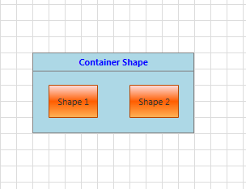
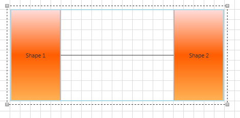

# Styling and Style Selectors

This topic describes the properties you can use to customize the default look-and-feel of the __RadDiagram__ items.	  

The __RadDiagram__ exposes the following __Style__ properties to allow you to easily customize its __Shapes, Connections, Connectors__ as well as the default selection and grouping rectangles.	  

* __ShapeStyle__ - applies a __Style__ on all __RadDiagramsShapes__ defined in the __RadDiagram__. Further information about the __RadDiagramShape__ you can find [here]().		  

* __ShapeStyleSelector__ - defines a __StyleSelector__, which can be used to apply different __Styles__ on different __RadDiagramShape__ instances inside the __RadDiagram__.		  

* __ContainerShapeStyle__ - applies a __Style__ on all __RadDiagramContainerShape__ objects defined in the __RadDiagram__ instance. Further information about the __RadDiagramContainerShape__ you can find [here]().		  

* __ConnectionStyle__ - applies a __Style__ on all __RadDiagramsConnections__ defined in the __RadDiagram__. Further information about the __RadDiagramConnection__ you can find [here]().		  

* __ConnectionStyleSelector__ - defines a __StyleSelector__, which can be used to apply different __Styles__ on different __RadDiagramsConnection__ instances inside the __RadDiagram__.		  

* __ConnectorStyle__ - this property gives you the ability to apply a customized style on all __RadDiagramConnectors__ inside the __RadDiagram__. Further information about the __RadDiagramConnector__ you can find [here]().		  

* __GroupStyle__ - this property allows you to create a custom style targeting the __Rectangle__ object that visualizes the __RadDiagramItems__ grouping. This __RadDiagram__ feature is described in more details [here]().		  

* __SelectionRectangleStyle__ - this property allows you to create a custom style targeting the __Rectangle__ object that visualizes the __RadDiagramItems__ selection. More information about this __RadDiagram__ feature you can find [here]().		  

## Customize the RadDiagramShape Style

You can apply a customized __Style__ targeting the __RadDiagramShape__ class through the __RadDiagram.ShapeStyle__ property. This way you'll be able to apply one style for all shapes created inside the __RadDiagram__ instance:	  

#### __XAML__
    <Grid>
        <Grid.Resources>
            
        </Grid.Resources>
        <telerik:RadDiagram x:Name="xDiagram" ShapeStyle="{StaticResource CustomShapeStyle}">
            <telerik:RadDiagramShape x:Name="shape1" Position="20,20" Content="Shape 1" />
            <telerik:RadDiagramShape x:Name="shape2" Position="220,20" Content="Shape 2" />
            <telerik:RadDiagramConnection Source="{Binding ElementName=shape1}"
                    Target="{Binding ElementName=shape2}" />
        </telerik:RadDiagram>
    </Grid>		  		  

However, if you have different shapes and/or you prefer to display shapes with different styles, then you should use the __ShapeStyleSelector__ property. The most common use of the "selectors" is to display different kind of data based on custom logic defined inside a selector class. This is why they are usually used when implementing MVVM approach in an application. In the __RadDiagram__ you can use the __ShapeStyleSelector__ to apply different styles on different types of shapes when the __RadDiagram.GraphSource__ collection is populated with business items. [This tutorial ]() can guide you through such a scenario.		

## Customize the RadDiagramContainerShape Style

The __RadDiagram.ContainerShapeStyle__ property allows you to apply a custom style on all __RadDiagramContainerShape__ objects displayed on the diagramming surface:
	  
#### __XAML__
	
    <Grid>
        <Grid.Resources>
            
        </Grid.Resources>
        <telerik:RadDiagram x:Name="xDiagram"
                ContainerShapeStyle="{StaticResource CustomContainerShapeStyle}">
            <telerik:RadDiagramContainerShape Position="120,120" Content="Container Shape">
                <telerik:RadDiagramShape Content="Shape 1" Position="140,160"/>
                <telerik:RadDiagramShape Content="Shape 2" Position="240,160"/>
            </telerik:RadDiagramContainerShape>
        </telerik:RadDiagram>
    </Grid>   

## Customize the RadDiagramConnection Style

You can apply a customized __Style__ targeting the __RadDiagramConnection__ class through the __RadDiagram.ConnectionStyle__ property. This way you'll be able to apply one style for all connections created inside the __RadDiagram__ instance:
		
#### __XAML__
	
    <Grid>
        <Grid.Resources>
            
        </Grid.Resources>
        <telerik:RadDiagram x:Name="xDiagram"
                ConnectionStyle="{StaticResource CustomConnectionStyle}">
            <telerik:RadDiagramShape x:Name="shape1" Position="20,20" Content="Shape 1" />
            <telerik:RadDiagramShape x:Name="shape2" Position="220,20" Content="Shape 2" />
            <telerik:RadDiagramConnection Source="{Binding ElementName=shape1}"
                    Target="{Binding ElementName=shape2}" />
        </telerik:RadDiagram>
    </Grid>	  

However, if you have different connections and/or you prefer to display connections with different styles, then you should use the __ConnectionStyleSelector__ property. This property is very handy when creating an MVVM diagramming solution where you'd like to populate the __RadDiagram__ with multiple types of connections and visualize each type differently. [This tutorial]() can guide through the implementation of such an example.		

## Customize the RadDiagramConnector Style

You can also apply a customized __Style__ targeting the __RadDiagramConnector__ class through the __RadDiagram.ConnectorStyle__ property. This way you'll be able to apply one style for all connectors displayed inside a __RadDiagram__ instance:		  

#### __XAML__
    <Grid>
        <Grid.Resources>
            
        </Grid.Resources>
        <telerik:RadDiagram x:Name="xDiagram" ConnectorStyle="{StaticResource CustomConnectorStyle}">
            <telerik:RadDiagramShape x:Name="shape1" Position="20,20" Content="Shape 1" />
            <telerik:RadDiagramShape x:Name="shape2" Position="220,20" Content="Shape 2" />
            <telerik:RadDiagramConnection Source="{Binding ElementName=shape1}"
                    Target="{Binding ElementName=shape2}" />
            <telerik:RadDiagramConnection Source="{Binding ElementName=shape2}"
                    EndPoint="360,40" TargetCapType="Arrow1Filled"/>
        </telerik:RadDiagram>
    </Grid>  		  

## Customize the RadDiagram Grouping Rectangle

Grouping, in the context of the __Telerik Diagramming Framework__, is a way of organizing shapes and connections in logical groups. Groups are non-visual, logical collections of shapes and/or connections and/or other groups. A grouping is visualized through a blue grouping  __Rectangle__ object: 

And if you need to customize the default style settings of this rectangle, you can use the __GroupStyle__ property. In the following example, the __Stroke__ and __StrokeThickness__ properties of the rectangle are modified to create a different look of the grouping feature:	  

#### __XAML__
    <Grid>
        <Grid.RowDefinitions>
            <RowDefinition Height="Auto" />
            <RowDefinition Height="*" />
        </Grid.RowDefinitions>
        <Grid.Resources>
            
        </Grid.Resources>
        <telerik:RadButton Content="Group" Click="Group" />
        <telerik:RadDiagram Grid.Row="1" x:Name="xDiagram"
                GroupStyle="{StaticResource CustomGroupStyle}">
            <telerik:RadDiagramShape x:Name="shape1" Position="20,20" Content="Shape 1" />
            <telerik:RadDiagramShape x:Name="shape2" Position="220,20" Content="Shape 2" />
            <telerik:RadDiagramConnection Source="{Binding ElementName=shape1}"
                    Target="{Binding ElementName=shape2}" />
        </telerik:RadDiagram>
	</Grid>

## Customize the RadDiagram Selection Rectangle

The __RadDiagram__ gives you the ability to select one or multiple __RadDiagramItems__. The default representation of this selection is a single __Rectangle__ object:

If you need to customize the style settings of the selection rectangle, you can use the __SelectionRectangleStyle__ property. In the following example, you can see how to change the __Stroke__ property of the rectangle to red:		

#### __XAML__
    <Grid>
        <Grid.RowDefinitions>
            <RowDefinition Height="Auto" />
            <RowDefinition Height="*" />
        </Grid.RowDefinitions>
        <Grid.Resources>
            
        </Grid.Resources>
        <telerik:RadButton Content="Group" Click="Group" />
        <telerik:RadDiagram Grid.Row="1" x:Name="xDiagram" SelectionMode="Multiple"
                SelectionRectangleStyle="{StaticResource CustomSelectionRectangleStyle}">
            <telerik:RadDiagramShape x:Name="shape1" Position="20,20" Content="Shape 1" />
            <telerik:RadDiagramShape x:Name="shape2" Position="220,20" Content="Shape 2" />
            <telerik:RadDiagramConnection Source="{Binding ElementName=shape1}"
                    Target="{Binding ElementName=shape2}" />
        </telerik:RadDiagram>
    </Grid>

# See Also
 * [Customize Appearance]()
 * [Shapes]()
 * [Connections]()
 * [Custom Connectors]()
 * [Selection]()
 * [Grouping]()