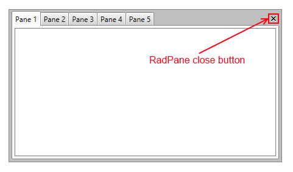
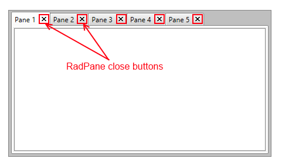
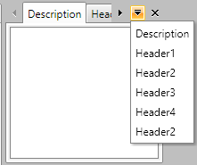

# Document Host

The __DocumentHost__ is meant to be the default container for the editable documents in your application. By default it occupies the whole central area of the __RadDocking__ control and each newly added pane is docked as a new tab page inside of it.

Here is the XAML declaration of the above structure.

#### __XAML__

{{region raddocking-features-document-host_0}}
	<telerik:RadDocking x:Name="radDocking">
	    <telerik:RadDocking.DocumentHost>
	        <telerik:RadSplitContainer>
	            <telerik:RadPaneGroup x:Name="radPaneGroup" >
	                <telerik:RadPane x:Name="radPane1" Header="Document 1">
	                    <TextBlock TextWrapping="Wrap" Text=""></TextBlock>
	                </telerik:RadPane>
	                <telerik:RadPane x:Name="radPane2" Header="Document 2">
	                    <TextBlock TextWrapping="Wrap" Text=""></TextBlock>
	                </telerik:RadPane>
	                <telerik:RadPane x:Name="radPane3" Header="Document 3">
	                    <TextBlock TextWrapping="Wrap" Text=""></TextBlock>
	                </telerik:RadPane>
	            </telerik:RadPaneGroup>
	        </telerik:RadSplitContainer>
	    </telerik:RadDocking.DocumentHost>
	</telerik:RadDocking>
{{endregion}}

>tipSince the __DocumentHost__ is meant to host the editable documents in your application, it is good idea to use [RadDocumentPanes]() instead of [RadPanes]().

>Placing __RadPaneGroup__ directly in the __DocumentHost__ is not a supported scenario in the RadDocking control. The RadPaneGroup needs to be placed in a __RadSplitContainer__.

## Modifying DocumentHost

The __DocumentHost__ is part of the template of the __RadDocking__ control. To learn how to modify it, take a look at the [Templating the RadDocking]() topic.

## Setting the CloseButtonPosition

You could easily set the close button position of the Panes that are placed in the DocumentHost by setting the __CloseButtonPosition__ property of the __RadDocking__ control to one of the three built-in predefined settings (InGroup, InPane and InPaneAndGroup).

The next code snippet shows how to set the CloseButtonPosition to InPane:
  
#### __XAML__

{{region raddocking-features-document-host_1}}
	<telerik:RadDocking CloseButtonPosition="InPane">
		<telerik:RadDocking.DocumentHost>
			<telerik:RadSplitContainer>
				<telerik:RadPaneGroup x:Name="radPaneGroup" >
					<telerik:RadPane x:Name="radPane1" Header="Document 1">
						<TextBlock TextWrapping="Wrap" Text=""></TextBlock>
					</telerik:RadPane>
					<telerik:RadPane x:Name="radPane2" Header="Document 2">
						<TextBlock TextWrapping="Wrap" Text=""></TextBlock>
					</telerik:RadPane>
					<telerik:RadPane x:Name="radPane3" Header="Document 3">
						<TextBlock TextWrapping="Wrap" Text=""></TextBlock>
					</telerik:RadPane>
				</telerik:RadPaneGroup>
			</telerik:RadSplitContainer>
		</telerik:RadDocking.DocumentHost>
	</telerik:RadDocking>
{{endregion}}

The next descriptions describe the built-in predefined CloseButtonPosition settings and their visual representation when they are set:

1. __InGroup__ – this is the default value of the CloseButtonPosition property which causes the close button of the currently active Pane in the PaneGroup to be visible in the top right corner of the PaneGroup

	

1. __InPane__ – places separate close button for each Pane in their tab

	

1. __InPaneAndGroup__ – places separate close button for each Pane in their tab and a close button for the currently active Pane in the PaneGroup in the top right corner of the group.

	
	
## Showing the Arrows and DropDownMenuButton

When the number of Panes inside the __DocumentHost__ increases and there is not enough space available inside the tabstrip they begun to shrink. In order to see the whole Headers of the Panes you can use the __ScrollViewer.HorizontalScrollBarVisibility__ attached property of the __PaneGroup__ inside the __DocumentHost__. An arrows will be visualized on both sides of the tabstrip:

#### __XAML__

{{region raddocking-features-document-host_2}}
	<telerik:RadPaneGroup ScrollViewer.HorizontalScrollBarVisibility="Auto">
{{endregion}}

__Figure 1:__ __DocumentHost__ with a visible __HorizontalScrollBar__:

By design the __HorizontalScrollBarVisibility__ property is disabled and can be visualized either by setting it to __Visible__ or __Auto__ (the arrow buttons will become visible when the space is not enough).

In addition to this you could also display the __DropDownMenuButton__ that contains a list of all Panes inside the __DocumentHost__. For that purpose the __DropDownDisplayMode__ property could be used:

#### __XAML__

{{region raddocking-features-document-host_3}}
	<telerik:RadPaneGroup ScrollViewer.HorizontalScrollBarVisibility="Auto" DropDownDisplayMode="Visible">
{{endregion}}

The __DropDownDisplayMode__ property could be set to any of the following values:
* __Collapsed__ – the drop down will never be shown.
* __Visible__ – the drop down will always be visible.
* __WhenNeeded__ – the drop down will be shown only when there is not enough space the Tabs to be arranged. 

Figure 2 demonstrate the appearance of the __DocumentHost__ when the __DropDownMenuButton__ and __HorizontalScrollBar__ are visualized.

__Figure 2:__ __DocumentHost__ with visible __HorizontalScrollBar__ and __DropDownMenuButton__:

# See Also

 * [Pane Groups]()

 * [Split Container]()

 * [Tool Window]()

 * [Compass]()

 * [RadDocumentPane]()
