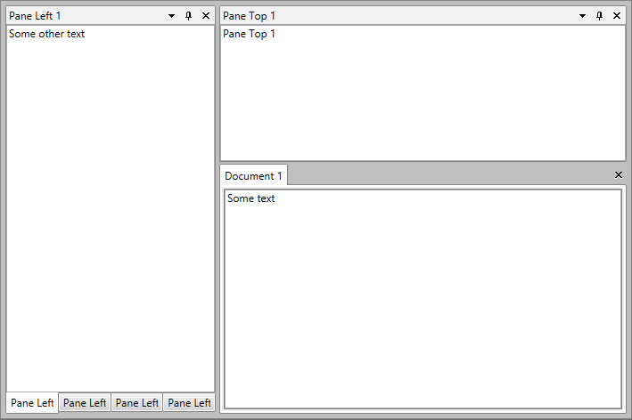
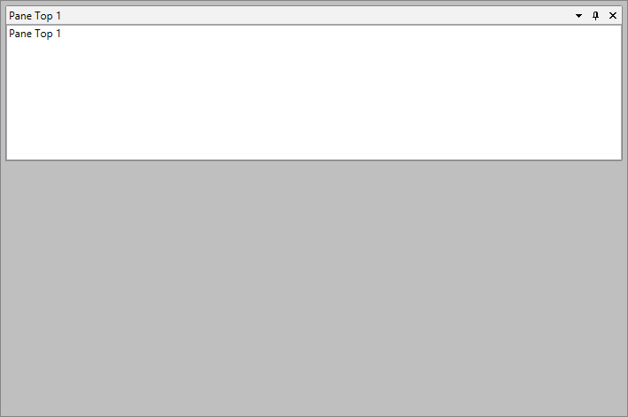
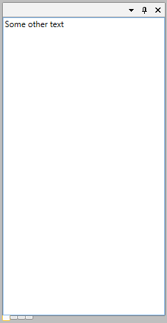

# Save/Load Layout Events

With R2 2016 of UI for WPFSilverlight the ability to change the default save/load layout mechanism of __RadDocking__ is now available. This is now possible using the __ElementLayoutSaving__ (also available with R2 2016), __ElementLoading__ and __CustomElementLoading__ events of the __RadDocking__ control. 

Using the __ElementLayoutSaving__ and __ElementLoading__ events you could decide which exact properties of the Pane, PaneGroup, SplitContainer or the Docking control to be saved or loaded. While using the __CustomElementLoading__ event you are now able to easily load custom docking elements that derive from __RadPane__, __RadPaneGroup__ or __RadSplitContainer__. Inside the __ElementLayoutSaving__ you could also easily exclude a specific __RadPane__, __RadPaneGroup__ or __RadSplitContainer__ from saving.

In this article we will go through all these events:

* [Saving properties](#saving-properties)

* [Loading properties](#loading-properties)

* [Loading of custom elements](#loading-of-custom-elements)

* [ElementLayoutCleaning] (#elementlayoutcleaning)

For the current article we will use the declaration of RadDocking shown in __Example 1__:

#### __[XAML] Example 1: RadDocking declaration__

{{region raddocking-features-custom-save-load-layout_0}}
	<telerik:RadDocking x:Name="radDocking" 
						ElementLayoutSaving="radDocking_ElementLayoutSaving"
                        CustomElementLoading="radDocking_CustomElementLoading"
                        ElementLayoutCleaning="radDocking_ElementLayoutCleaning">
		<telerik:RadDocking.DocumentHost>
			<telerik:RadSplitContainer>
				<telerik:RadPaneGroup x:Name="DocumentGroup">
					<telerik:RadDocumentPane Header="Document 1" Title="Document 1" telerik:RadDocking.SerializationTag="DocumentPane">
						<TextBox x:Name="DocumentTextBox" Text="Some text" />
					</telerik:RadDocumentPane>
				</telerik:RadPaneGroup>
			</telerik:RadSplitContainer>
		</telerik:RadDocking.DocumentHost>
		<telerik:RadSplitContainer InitialPosition="DockedLeft">
			<telerik:RadPaneGroup telerik:RadDocking.SerializationTag="PaneGroup">
				<telerik:RadPane Header="Pane Left 1"  telerik:RadDocking.SerializationTag="PaneLeft1">
					<TextBox x:Name="TextBox" Text="Some other text" />
				</telerik:RadPane>
				<telerik:RadPane Header="Pane Left 2"  telerik:RadDocking.SerializationTag="PaneLeft2">
					<TextBox Text="Pane Left 2" />
				</telerik:RadPane>
				<telerik:RadPane Header="Pane Left 3"  telerik:RadDocking.SerializationTag="PaneLeft3">
					<TextBox Text="Pane Left 3" />
				</telerik:RadPane>
				<telerik:RadPane Header="Pane Left 4"  telerik:RadDocking.SerializationTag="PaneLeft4">
					<TextBox Text="Pane Left 4" />
				</telerik:RadPane>
			</telerik:RadPaneGroup>
		</telerik:RadSplitContainer>
		<telerik:RadSplitContainer InitialPosition="DockedTop">
			<telerik:RadPaneGroup>
				<telerik:RadPane Header="Pane Top 1" telerik:RadDocking.SerializationTag="PaneTop1">
					<TextBox Text="Pane Top 1" />
				</telerik:RadPane>
			</telerik:RadPaneGroup>
		</telerik:RadSplitContainer>
	</telerik:RadDocking>
{{endregion}}

If you run the application now, you will see a docking with some SplitContainers, PaneGroups and Panes, as shown in __Figure 1__.

#### __Figure 1: RadDocking generated by the code in Example 1__

## Saving properties

By handling the __ElementLayoutSaving__ event of __RadDocking__ you could save any desired property of the element (Pane, PaneGroup, SplitContainer or the Docking control) that is currently saving or exclude that element from saving.  This is possible using the __ElementProperties__ dictionary and the __Cancel__ property of the __LayoutSerializationSavingEventArgs__ of the event. 

>The event is only called for the elements that have a set __SerializationTag__.

The __ElementProperties__ property is of type Dictionary. The value and its associated key should be of type string - the key is the name of the property you want to save. 
__Example 2__ demonstrates how you could easily add the CanFloat property of a Pane to the dictionary you want to save in the XML:

#### __[C#] Example 2: Adding properties to ElementProperties__

{{region raddocking-features-custom-save-load-layout_1}}
	private void radDocking_ElementLayoutSaving(object sender, LayoutSerializationSavingEventArgs e)
	{
		var pane = e.AffectedElement as RadPane;

		if(e.AffectedElementSerializationTag.Equals("PaneTop1") && pane != null)
		{
			e.ElementProperties.Add("CanFloat", pane.CanFloat.ToString());
		}
	}
{{endregion}}

If you want to prevent some of the already saved properties included in the dictionary not to be saved again you could just remove them from it. 

__Example 3__ demonstrates how you could exclude the Header of a pane from saving:

#### __[C#] Example 3: Prevent properties from saving__

{{region raddocking-features-custom-save-load-layout_2}}
	private void radDocking_ElementLayoutSaving(object sender, LayoutSerializationSavingEventArgs e)
	{
		var pane = e.AffectedElement as RadPane;

		if(e.AffectedElementSerializationTag.Equals("PaneTop1") && pane != null)
		{
			e.ElementProperties.Add("CanFloat", pane.CanFloat.ToString());
			if(e.ElementProperties.ContainsKey("Header"))
			{
				e.ElementProperties.Remove("Header");
			}
		}
	}
{{endregion}}

__Example 4__ shows the generated XML after the execution of the code of __Example 3__ - notice the Header of the "PaneTop1" was not saved, but the __CanFloat__ property was:

#### __[XAML] Example 4: Generated XML after saving__

{{region raddocking-features-custom-save-load-layout_3}}
	<?xml version="1.0" encoding="utf-8"?>
	<RadDocking SerializationTag="dock">
		<DocumentHost>
			<RadSplitContainer>
				<Items>
					<RadPaneGroup SelectedIndex="0">
						<Items>
							<RadDocumentPane SerializationTag="DocumentPane" IsDockable="True" Title="Document 1" Header="Document 1" />
						</Items>
					</RadPaneGroup>
				</Items>
			</RadSplitContainer>
		</DocumentHost>
		<SplitContainers>
			<RadSplitContainer Dock="DockedLeft" Width="240">
				<Items>
					<RadPaneGroup SerializationTag="PaneGroupLeft" SelectedIndex="0">
						<Items>
							<RadPane SerializationTag="PaneLeft1" IsDockable="True" Header="Pane Left 1" />
							<RadPane SerializationTag="PaneLeft2" IsDockable="True" Header="Pane Left 2" />
							<RadPane SerializationTag="PaneLeft3" IsDockable="True" Header="Pane Left 3" />
							<RadPane SerializationTag="PaneLeft4" IsDockable="True" Header="Pane Left 4" />
						</Items>
					</RadPaneGroup>
				</Items>
			</RadSplitContainer>
			<RadSplitContainer Dock="DockedTop" Height="180">
				<Items>
					<RadPaneGroup SelectedIndex="0">
						<Items>
							<RadPane SerializationTag="PaneTop1" IsDockable="True" CanFloat="False" />
						</Items>
					</RadPaneGroup>
				</Items>
			</RadSplitContainer>
		</SplitContainers>
	</RadDocking>
{{endregion}}

Using the __Cancel__ property of the __LayoutSerializationSavingEventArgs__ you could easily exclude a specific __RadPane__, __RadSplitContainer__ or __RadPaneGroup__ from saving. In order to do so the __Cancel__ property should be set to True. 

__Example 5__ demonstrates how to exclude a specific RadPane and RadPaneGroup from saving:

#### __[C#] Example 5: Exclude from saving__

{{region raddocking-features-custom-save-load-layout_4}}
	private void radDocking_ElementLayoutSaving(object sender, LayoutSerializationSavingEventArgs e)
	{
		if (e.AffectedElementSerializationTag.Equals("PaneGroup") ||
			e.AffectedElementSerializationTag.Equals("DocumentPane"))
		{
			e.Cancel = true;
		}
	}
{{endregion}}

The generated XML file after executing the code in __Example 5__ is shown in __Example 6__:

#### __[XAML] Example 6: Generated XML after saving__

{{region raddocking-features-custom-save-load-layout_5}}
	<?xml version="1.0" encoding="utf-8"?>
	<RadDocking SerializationTag="dock">
		<DocumentHost>
			<RadSplitContainer>
				<Items>
					<RadPaneGroup SelectedIndex="0">
						<Items />
					</RadPaneGroup>
				</Items>
			</RadSplitContainer>
		</DocumentHost>
		<SplitContainers>
			<RadSplitContainer Dock="DockedLeft" Width="240">
				<Items />
			</RadSplitContainer>
			<RadSplitContainer Dock="DockedTop" Height="180">
				<Items>
					<RadPaneGroup SelectedIndex="0">
						<Items>
							<RadPane SerializationTag="PaneTop1" IsDockable="True" Header="Pane Top 1" />
						</Items>
					</RadPaneGroup>
				</Items>
			</RadSplitContainer>
		</SplitContainers>
	</RadDocking>
{{endregion}}

__Figure 2__ visualized how RadDocking looks after loading the saved layout:

#### __Figure 2: RadDocking after execution of Example 5__

## Loading properties

In order to prevent a specific property from loading the __ElementLoading__ event needs to be handled. By using the __ElementProperties__ dictionary (that contains all saved properties) you could simply remove the properties that should not be loaded. 

__Example 7__ demonstrates how to prevent the Header property of the left docked Panes from loading:

#### __[C#] Example 7: Loading properties__

{{region raddocking-features-custom-save-load-layout_6}}
	private void radDocking_ElementLoading(object sender, Telerik.Windows.Controls.LayoutSerializationLoadingEventArgs e)
	{
		if (e.AffectedElementSerializationTag.Contains("PaneLeft"))
		{
			if(e.ElementProperties.ContainsKey("Header"))
			{
				e.ElementProperties.Remove("Header");
			}
		}
	}
{{endregion}}

In __Figure 3__ you could see how the left docked PaneGroup visualizes after he layout is loaded.

#### __Figure 3: RadDocking after execution of Example 7__

## Loading of custom elements

In order to load a custom element other that the built-in RadSplitContainer, RadPaneGroup and RadPane instances the __CustomElementLoading__ events needs to be handled. The event will be called when loading the layout and if there is an unknown type of element. All that needs to be done in order the layout to be loaded as expected is to set the AffectedElement with the correct object. 

>The event will be called only for the Panes, PaneGroups and SplitContainers that does not have a set __SerializationTag__. Otherwise the __ElementLoading__ will be called.

__Example 7__ demonstrates how to load a custom pane (for example "MyRadPane") that derives from the default RadPane class:

#### __[C#] Example 6: Custom loading of elements__

{{region raddocking-features-custom-save-load-layout_6}}
	private void radDocking_CustomElementLoading(object sender, LayoutSerializationCustomLoadingEventArgs e)
	{
		if (e.CustomElementTypeName == "MyRadPane")
		{
			e.SetAffectedElement(new MyRadPane());
		}
	}
{{endregion}}

## ElementLayoutCleaning

When the saved layout of RadDocking starts loading the current layout of RadDocking (all RadPanes, RadPaneGroups and RadSplitContainers) is cleaned. In order to prevent an element from being cleaned the __ElementLayoutCleaning__ (introduced with R2 2016 of UI for WPFSilverlight) event could be handled. Inside it by using the __Cancel__ property of the __LayoutSerializationCleaningEventArgs__ a specific element of __RadDocking__ could be prevented from being cleaned.

>The event does not get called for the __RadDocking__ control, but only for its elements - RadPane, RadPaneGroup and RadSplitContainer.

__Example 8__ demonstrates how to prevent a PaneGroup from being cleaned when the layout is about to be loaded:

#### __[C#] Example 8: Prevent element from cleaning__

{{region raddocking-features-custom-save-load-layout_7}}
	private void radDocking_ElementLayoutCleaning(object sender, LayoutSerializationCleaningEventArgs e)
	{
		if (e.AffectedElementSerializationTag.Contains("PaneLeft"))
		{
			e.Cancel = true;
		}
	}
{{endregion}}

# See Also

 * [Overview]()

 * [Save/Load the Content of the Panes]()

 * [Save/load Layout with LINQ to XML]()
