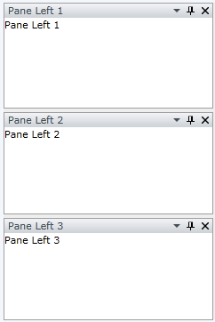
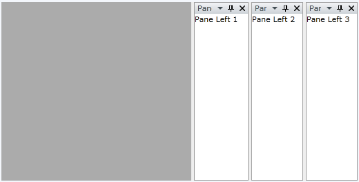
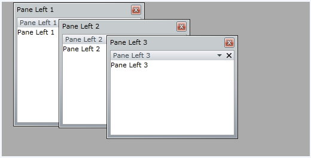
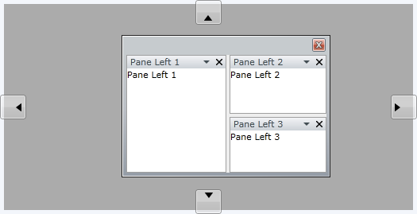

# Split Container

The __RadSplitContainer__ allows you to use movable bars to divide the displayed area into resizable parts. With the __RadDocking__'s __SplitContainers__ you can build complex layouts like the one on the snapshot below. Some practical examples of such layouts are Explorer-like and Outlook-like interfaces.

Each split container is painted in a different color.

>The class that represents the split container is __Telerik.Windows.Controls.RadSplitContainer__.

This topic covers the following features of the __RadSplitContainer__:

* [Setting the Orientation property in XAML](#setting-the-orientation-property-in-xaml)

* [Setting the Orientation property in the code-behind](#setting-the-orientation-property-in-the-code-behind)

* [Setting the initial position of the container in XAML](#setting-the-initialposition-of-the-radsplitcontainer-in-xaml)

* [Setting the initial position of the container in the code-behind](#setting-the-initialposition-of-the-radsplitcontainer-in-the-code-behind)

* [Setting the InitialSize of the RadSplitContainer](#setting-the-initialsize-of-the-radsplitcontainer)

* [Setting the initial FloatingSize of the RadSplitContainer](#setting-the-initial-floatingsize-of-the-radsplitcontainer)

* [Setting the initial FloatingLocation of the RadSplitContainer](#setting-the-initial-floatinglocation-of-the-radsplitcontainer)

* [Setting the RelativeSize of the RadSplitContainer](#setting-the-relativesize-of-the-radsplitcontainer)

* [Adding PaneGroups/SplitContainers to the RadSplitContainer programmatically](#adding-panegroups/splitcontainers-to-the-radsplitcontainer-programmatically)

* [Other important properties exposed by the RadSplitContainer](#other-important-properties-exposed-by-the-radsplitcontainer)

* [Styling the RadSplitContainer](#styling-the-radsplitcontainer)

## Setting the Orientation Property in XAML

When you want to define the orientation (__Vertical__ or __Horizontal__) in which the panes are ordered inside the container, then you need to set the __Orientation__ property of the __RadSplitContainer__.

>tipSetting the __Orientation__ property of a __RadSplitContainer__ is similar to setting the __Orientation__ property of a __StackPanel__.

* Setting the __Orientation__ property to __Vertical__

When you want to achieve __vertically__ oriented layout, you need to set the __Orientation__ property to __Vertical__. See the example below:

#### __XAML__

{{region xaml-raddocking-features-split-container_0}}
	<telerik:RadDocking x:Name="radDocking">
	    <telerik:RadSplitContainer x:Name="radSplitContainer" Orientation="Vertical">
	        <telerik:RadPaneGroup>
	            <telerik:RadPane Header="Pane Left 1" Content="Pane Left 1" />
	        </telerik:RadPaneGroup>
	        <telerik:RadPaneGroup>
	            <telerik:RadPane Header="Pane Left 2" Content="Pane Left 2"  />
	        </telerik:RadPaneGroup>
	        <telerik:RadPaneGroup>
	            <telerik:RadPane Header="Pane Left 3" Content="Pane Left 3" />
	        </telerik:RadPaneGroup>
	    </telerik:RadSplitContainer>
	</telerik:RadDocking>
{{endregion}}

* Setting the __Orientation__ property to __Horizontal__

When you want to achieve __horizontally__ oriented layout, you need to set the __Orientation__ property to __Horizontal__. Consider the previous example. If you set the container's __Orientation__ to __Horizontal__:

#### __XAML__

{{region xaml-raddocking-features-split-container_1}}
	<telerik:RadDocking x:Name="radDocking">
	    <telerik:RadSplitContainer x:Name="radSplitContainer" Orientation="Horizontal">
	        <telerik:RadPaneGroup>
	            <telerik:RadPane Header="Pane Left 1" Content="Pane Left 1" />
	        </telerik:RadPaneGroup>
	        <telerik:RadPaneGroup>
	            <telerik:RadPane Header="Pane Left 2" Content="Pane Left 2"  />
	        </telerik:RadPaneGroup>
	        <telerik:RadPaneGroup>
	            <telerik:RadPane Header="Pane Left 3" Content="Pane Left 3" />
	        </telerik:RadPaneGroup>
	    </telerik:RadSplitContainer>
	</telerik:RadDocking>
{{endregion}}

Then the result will be:

## Setting the Orientation Property in the Code-Behind

The __RadSplitContainer__'s __Orientation__ can also be set in the code-behind.

* Setting the __Orientation__ property to __Vertical__

#### __C#__

{{region cs-raddocking-features-split-container_2}}
	private void SetOrientationToVertical()
	{
	    radSplitContainer.Orientation = Orientation.Vertical;
	}
{{endregion}}

#### __VB.NET__

{{region vb-raddocking-features-split-container_3}}
	Private Sub SetOrientationToVertical()
	    radSplitContainer.Orientation = Orientation.Vertical
	End Sub
{{endregion}}

* Setting the __Orientation__ property to __Horizontal__

#### __C#__

{{region cs-raddocking-features-split-container_4}}
	private void SetOrientationToHorizontal()
	{
	    radSplitContainer.Orientation = Orientation.Horizontal;
	}
{{endregion}}

#### __VB.NET__

{{region vb-raddocking-features-split-container_5}}
	Private Sub SetOrientationToHorizontal()
	    radSplitContainer.Orientation = Orientation.Horizontal
	End Sub
{{endregion}}

>tipThe default __Orientation__ for the __RadSplitContainer__ is __Horizontal__.

## Setting the InitialPosition of the RadSplitContainer in XAML

When you want to specify the initial __dock__ position of the __RadSplitContainer__ that is inside a __Telerik.Windows.Controls.RadDocking__, you need to set the __InitialPosition__ property.

The __InitialPosition__ is a __Telerik.Windows.Controls.DockState__ enumeration, which offers the following values:

* __DockedLeft__ - use this value, when you want the __RadSplitContainer__ to be positioned on the __left__ side of the __RadDocking__ control. 

#### __XAML__

{{region xaml-raddocking-features-split-container_6}}
	<telerik:RadDocking x:Name="radDocking">
	    <telerik:RadSplitContainer x:Name="radSplitContainer" InitialPosition="DockedLeft">
	        <telerik:RadPaneGroup>
	            <telerik:RadPane Header="Pane Left 1" Content="Pane Left 1" />
	        </telerik:RadPaneGroup>
	        <telerik:RadPaneGroup>
	            <telerik:RadPane Header="Pane Left 2" Content="Pane Left 2"  />
	        </telerik:RadPaneGroup>
	        <telerik:RadPaneGroup>
	            <telerik:RadPane Header="Pane Left 3" Content="Pane Left 3" />
	        </telerik:RadPaneGroup>
	    </telerik:RadSplitContainer>
	</telerik:RadDocking>
{{endregion}}

* __DockedTop__ - use this value, when you want the __RadSplitContainer__ to be positioned on the __top__ side of the __RadDocking__ control. 

#### __XAML__

{{region xaml-raddocking-features-split-container_7}}
	<telerik:RadDocking x:Name="radDocking">
	    <telerik:RadSplitContainer x:Name="radSplitContainer" InitialPosition="DockedTop">
	        <telerik:RadPaneGroup>
	            <telerik:RadPane Header="Pane Left 1" Content="Pane Left 1" />
	        </telerik:RadPaneGroup>
	        <telerik:RadPaneGroup>
	            <telerik:RadPane Header="Pane Left 2" Content="Pane Left 2"  />
	        </telerik:RadPaneGroup>
	        <telerik:RadPaneGroup>
	            <telerik:RadPane Header="Pane Left 3" Content="Pane Left 3" />
	        </telerik:RadPaneGroup>
	    </telerik:RadSplitContainer>
	</telerik:RadDocking>
{{endregion}}

* __DockedRight__ - use this value, when you want the __RadSplitContainer__ to be positioned on the __right__ side of the __RadDocking__ control. 

#### __XAML__

{{region xaml-raddocking-features-split-container_8}}
	<telerik:RadDocking x:Name="radDocking">
	    <telerik:RadSplitContainer x:Name="radSplitContainer" InitialPosition="DockedRight">
	        <telerik:RadPaneGroup>
	            <telerik:RadPane Header="Pane Left 1" Content="Pane Left 1" />
	        </telerik:RadPaneGroup>
	        <telerik:RadPaneGroup>
	            <telerik:RadPane Header="Pane Left 2" Content="Pane Left 2"  />
	        </telerik:RadPaneGroup>
	        <telerik:RadPaneGroup>
	            <telerik:RadPane Header="Pane Left 3" Content="Pane Left 3" />
	        </telerik:RadPaneGroup>
	    </telerik:RadSplitContainer>
	</telerik:RadDocking>
{{endregion}}

* __DockedBottom__ - use this value, when you want the __RadSplitContainer__ to be positioned on the __bottom__ side of the __RadDocking__ control. 

#### __XAML__

{{region xaml-raddocking-features-split-container_9}}
	<telerik:RadDocking x:Name="radDocking">
	    <telerik:RadSplitContainer x:Name="radSplitContainer" InitialPosition="DockedBottom">
	        <telerik:RadPaneGroup>
	            <telerik:RadPane Header="Pane Left 1" Content="Pane Left 1" />
	        </telerik:RadPaneGroup>
	        <telerik:RadPaneGroup>
	            <telerik:RadPane Header="Pane Left 2" Content="Pane Left 2"  />
	        </telerik:RadPaneGroup>
	        <telerik:RadPaneGroup>
	            <telerik:RadPane Header="Pane Left 3" Content="Pane Left 3" />
	        </telerik:RadPaneGroup>
	    </telerik:RadSplitContainer>
	</telerik:RadDocking>
{{endregion}}

* __FloatingOnly__ - use this value when you want the __RadSplitContainer__ to be initially hosted in a floatable [Tool Window](). 

#### __XAML__

{{region xaml-raddocking-features-split-container_10}}
	<telerik:RadDocking x:Name="radDocking">
	    <telerik:RadSplitContainer x:Name="radSplitContainer" InitialPosition="FloatingOnly">
	        <telerik:RadPaneGroup>
	            <telerik:RadPane Header="Pane Left 1" Content="Pane Left 1" />
	        </telerik:RadPaneGroup>
	        <telerik:RadPaneGroup>
	            <telerik:RadPane Header="Pane Left 2" Content="Pane Left 2"  />
	        </telerik:RadPaneGroup>
	        <telerik:RadPaneGroup>
	            <telerik:RadPane Header="Pane Left 3" Content="Pane Left 3" />
	        </telerik:RadPaneGroup>
	    </telerik:RadSplitContainer>
	</telerik:RadDocking>
{{endregion}}

* __FloatingDockable__ - use this value when you want the __RadSplitContainer__ to be initially hosted in a floatable [Tool Window](). 

#### __XAML__

{{region xaml-raddocking-features-split-container_11}}
	<telerik:RadDocking x:Name="radDocking">
	    <telerik:RadSplitContainer x:Name="radSplitContainer" InitialPosition="FloatingDockable">
	        <telerik:RadPaneGroup>
	            <telerik:RadPane Header="Pane Left 1" Content="Pane Left 1" />
	        </telerik:RadPaneGroup>
	        <telerik:RadPaneGroup>
	            <telerik:RadPane Header="Pane Left 2" Content="Pane Left 2"  />
	        </telerik:RadPaneGroup>
	        <telerik:RadPaneGroup>
	            <telerik:RadPane Header="Pane Left 3" Content="Pane Left 3" />
	        </telerik:RadPaneGroup>
	    </telerik:RadSplitContainer>
	</telerik:RadDocking>
{{endregion}}

>Note the difference between __FloatingOnly__ and __FloatingDockable__. The both will make your pane(s) [floatable](). However, when you set the __InitialPosition__ to be __FloatingOnly__, then during run-time the user __won't be able to dock the pane(s)__.

## Setting the InitialPosition of the RadSplitContainer in the Code-Behind

The __RadSplitContainer__'s __InitialPosition__ property can also be set in the code-behind. See the code-snippets below:

* __DockedLeft__

#### __C#__

{{region cs-raddocking-features-split-container_12}}
	private void SetInitialPositionToLeft()
	{
	    radSplitContainer.InitialPosition = Telerik.Windows.Controls.Docking.DockState.DockedLeft;
	}
{{endregion}}

#### __VB.NET__

{{region vb-raddocking-features-split-container_13}}
	Private Sub SetInitialPositionToLeft()
	    radSplitContainer.InitialPosition = Telerik.Windows.Controls.Docking.DockState.DockedLeft
	End Sub
{{endregion}}

* __DockedTop__

#### __C#__

{{region cs-raddocking-features-split-container_14}}
	private void SetInitialPositionToTop()
	{
	    radSplitContainer.InitialPosition = Telerik.Windows.Controls.Docking.DockState.DockedTop;
	}
{{endregion}}

#### __VB.NET__

{{region vb-raddocking-features-split-container_15}}
	Private Sub SetInitialPositionToTop()
	    radSplitContainer.InitialPosition = Telerik.Windows.Controls.Docking.DockState.DockedTop
	End Sub
{{endregion}}

* __DockedRight__

#### __C#__

{{region cs-raddocking-features-split-container_16}}
	private void SetInitialPositionToRight()
	{
	    radSplitContainer.InitialPosition = Telerik.Windows.Controls.Docking.DockState.DockedRight;
	}
{{endregion}}

#### __VB.NET__

{{region vb-raddocking-features-split-container_17}}
	Private Sub SetInitialPositionToRight()
	    radSplitContainer.InitialPosition = Telerik.Windows.Controls.Docking.DockState.DockedRight
	End Sub
{{endregion}}

* __DockedBottom__

#### __C#__

{{region cs-raddocking-features-split-container_18}}
	private void SetInitialPositionToBottom()
	{
	    radSplitContainer.InitialPosition = Telerik.Windows.Controls.Docking.DockState.DockedBottom;
	}
{{endregion}}

#### __VB.NET__

{{region vb-raddocking-features-split-container_19}}
	Private Sub SetInitialPositionToBottom()
	    radSplitContainer.InitialPosition = Telerik.Windows.Controls.Docking.DockState.DockedBottom
	End Sub
{{endregion}}

* __FloatingOnly__

#### __C#__

{{region cs-raddocking-features-split-container_20}}
	private void SetInitialPositionToFloatingOnly()
	{
	    radSplitContainer.InitialPosition = Telerik.Windows.Controls.Docking.DockState.FloatingOnly;
	}
{{endregion}}

#### __VB.NET__

{{region vb-raddocking-features-split-container_21}}
	Private Sub SetInitialPositionToFloatingOnly()
	    radSplitContainer.InitialPosition = Telerik.Windows.Controls.Docking.DockState.FloatingOnly
	End Sub
{{endregion}}

* __FloatingDockable__

#### __C#__

{{region cs-raddocking-features-split-container_22}}
	private void SetInitialPositionToFloatingDockable()
	{
	    radSplitContainer.InitialPosition = Telerik.Windows.Controls.Docking.DockState.FloatingDockable;
	}
{{endregion}}

#### __VB.NET__

{{region vb-raddocking-features-split-container_23}}
	Private Sub SetInitialPositionToFloatingDockable()
	    radSplitContainer.InitialPosition = Telerik.Windows.Controls.Docking.DockState.FloatingDockable
	End Sub
{{endregion}}

>tipPlace each [RadPane]() ([RadPaneGroup]()) in a separate split container to have the power to initially dock them as desired using the __InitialPosition__ property.

## Setting the InitialSize of the RadSplitContainer

You can set the initial size of your split containers using the attached property __DockingPanel.InitialSize__.

#### __XAML__

{{region xaml-raddocking-features-split-container_24}}
	<telerik:RadDocking x:Name="radDocking">
	    <telerik:RadSplitContainer telerik:DockingPanel.InitialSize="80,200">
	        <telerik:RadPaneGroup>
	            <telerik:RadPane Header="Left Pane" Content="Pane Left 1" />
	        </telerik:RadPaneGroup>
	    </telerik:RadSplitContainer>
	</telerik:RadDocking>
{{endregion}}

On the snapshot you can see that the pane titled "Left Pane" has width set to 80, while its height is equal to the height of the container to which it is docked, ignoring the height specified by the __DockingPanel.InitialSize__ property.

## Setting the Initial FloatingSize of the RadSplitContainer

Similarly to the initial position, you have the ability to set the __initial floating size__ of the __RadSplitContainer__.

For this purpose you need to set the __RadDocking.FloatingSize__ attached property like it is shown in the example below:

#### __XAML__

{{region xaml-raddocking-features-split-container_25}}
	<telerik:RadDocking x:Name="radDocking">
	    <telerik:RadSplitContainer x:Name="radSplitContainer" InitialPosition="FloatingDockable"
	        telerik:RadDocking.FloatingSize="300,300">
	        <telerik:RadPaneGroup>
	            <telerik:RadPane Header="Pane Left 1" Content="Pane Left 1" />
	        </telerik:RadPaneGroup>
	        <telerik:RadPaneGroup>
	            <telerik:RadPane Header="Pane Left 2" Content="Pane Left 2"  />
	        </telerik:RadPaneGroup>
	        <telerik:RadPaneGroup>
	            <telerik:RadPane Header="Pane Left 3" Content="Pane Left 3" />
	        </telerik:RadPaneGroup>
	    </telerik:RadSplitContainer>
	</telerik:RadDocking>
{{endregion}}

>Note that the __InitialPosition__ must be set either to __FloatingOnly__ or __FloatingDockable__. Otherwise setting the __RadDocking.FloatingSize__ attached property will not affect the size of the split container.

>tipIf you want to resize the __RadSplitContainer__ during run-time, then just use the [Resizer]().

## Setting the Initial FloatingLocation of the RadSplitContainer

Similarly to the initial floating size you have the ability to set the __initial floating location__ of the __RadSplitContainer__.
        
For this purpose you need to set the __RadDocking.FloatingLocation__ attached property like it is shown in the example below:
        
#### __XAML__

{{region xaml-raddocking-features-split-container_26}}
	<telerik:RadDocking x:Name="radDocking">
	    <telerik:RadSplitContainer x:Name="radSplitContainer" InitialPosition="FloatingDockable"
	        telerik:RadDocking.FloatingLocation="10,10">
	        <telerik:RadPaneGroup>
	            <telerik:RadPane Header="Pane Left 1" Content="Pane Left 1" />
	        </telerik:RadPaneGroup>
	        <telerik:RadPaneGroup>
	            <telerik:RadPane Header="Pane Left 2" Content="Pane Left 2"  />
	        </telerik:RadPaneGroup>
	        <telerik:RadPaneGroup>
	            <telerik:RadPane Header="Pane Left 3" Content="Pane Left 3" />
	        </telerik:RadPaneGroup>
	    </telerik:RadSplitContainer>
	</telerik:RadDocking>
{{endregion}}

>Note that the __InitialPosition__ must be set either to __FloatingOnly__ or __FloatingDockable__. Otherwise setting the __RadDocking.FloatingLocation__ attached property will not affect the location of the split container.

## Setting the RelativeSize of the RadSplitContainer

For this purpose you need to set the __RelativeSize__ attached property of the __ProportionalStackPanel__ class. 
    		By using this property you can proportionally divide the width or the hight occupied by two or more __RadSplitContainers__ placed in the same RadSplitContainer. 
    		For example, if you have two split containtainers, the first one should occupy 1/3 of the available width and the second - the remaining 2/3, you have to set this proportion (1:2) in their widths as it is shown in the code snippet below.
        	
#### __XAML__

{{region xaml-raddocking-features-split-container_27}}
	<telerik:RadDocking x:Name="radDocking">
		<telerik:RadSplitContainer InitialPosition="DockedTop">
			<telerik:RadSplitContainer telerik:ProportionalStackPanel.RelativeSize="200, 200">
				<telerik:RadPaneGroup>
					<telerik:RadPane Header="Width: 1/3"  />
				</telerik:RadPaneGroup>
			</telerik:RadSplitContainer>
			<telerik:RadSplitContainer telerik:ProportionalStackPanel.RelativeSize="400, 200">
				<telerik:RadPaneGroup>
					<telerik:RadPane Header="Width: 2/3" />
				</telerik:RadPaneGroup>
			</telerik:RadSplitContainer>
		</telerik:RadSplitContainer>
	</telerik:RadDocking>
{{endregion}}

The default value is 200, 200.

## Adding PaneGroups/SplitContainers to the RadSplitContainer Programmatically

In order to add a pane group or another split container in the code-behind, you need to use the __RadSplitContainer__'s __Items__ collection. 

## Other Important Properties Exposed by the RadSplitContainer

* __IsInDocumentHost__ - read-only boolean property. Returns whether the current __RadPaneGroup__ is placed in [DocumentHost]().

* __IsInToolWindow__ - read-only boolean property. Returns whether the current __RadPaneGroup__ is in [Tool Window]().

* __SplitterPosition__ - read-only property. Returns the current dock position of the __RadSplitContainer__. If the container is in floatable window, the return value is null.  

## Styling the RadSplitContainer

To learn how to style the RadSplitContainer in your applications take a look at the [Styling the RadSplitContainer]() topic.

# See Also

 * [Tool Window]()

 * [Compass]()

 * [Pane Groups]()

 * [Document Host]()

 * [How to Freeze the Layout]()
