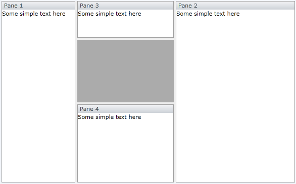

# How to Freeze the Layout

The purpose of this tutorial is to show you how to __freeze__ the entire layout of the __RadDocking__ control. That means to disable the:

* Moving and closing of panes

* Drop-down menu in the pane header

* Resizing of panes

For the purpose of this tutorial the following __RadDocking__ declaration will be used:

#### __XAML__

{{region raddocking-how-to-freeze-the-layout_0}}
	<telerik:RadDocking x:Name="radDocking">
	
	        <telerik:RadSplitContainer InitialPosition="DockedLeft">
	            <telerik:RadPaneGroup>
	                <telerik:RadPane x:Name="radPane1" Header="Pane 1">
	                    <TextBlock Text="Some simple text here"/>
	                </telerik:RadPane>
	            </telerik:RadPaneGroup>
	        </telerik:RadSplitContainer>
	
	    <telerik:RadSplitContainer InitialPosition="DockedRight">
	        <telerik:RadPaneGroup>
	            <telerik:RadPane x:Name="radPane2" Header="Pane 2">
	                <TextBlock Text="Some simple text here"/>
	            </telerik:RadPane>
	        </telerik:RadPaneGroup>
	    </telerik:RadSplitContainer>
	
	    <telerik:RadSplitContainer InitialPosition="DockedTop">
	        <telerik:RadPaneGroup>
	            <telerik:RadPane x:Name="radPane3" Header="Pane 3">
	                <TextBlock Text="Some simple text here"/>
	            </telerik:RadPane>
	        </telerik:RadPaneGroup>
	    </telerik:RadSplitContainer>
	
	    <telerik:RadSplitContainer InitialPosition="DockedBottom">
	        <telerik:RadPaneGroup>
	            <telerik:RadPane x:Name="radPane4" Header="Pane 4">
	                <TextBlock Text="Some simple text here"/>
	            </telerik:RadPane>
	        </telerik:RadPaneGroup>
	    </telerik:RadSplitContainer>
	
	</telerik:RadDocking>
{{endregion}}

## Disable the Close ("X") Button

In order to disable the close button, you need to set the __CanUserClose__ property of the __RadPane__ to __False__. So find the __RadPane__ declarations and set the __CanUserClose__ property:

#### __XAML__

{{region raddocking-how-to-freeze-the-layout_1}}
	...
	<telerik:RadPane x:Name="radPane1" Header="Pane 1" CanUserClose="False">
	...
	<telerik:RadPane x:Name="radPane2" Header="Pane 2" CanUserClose="False">
	...
	<telerik:RadPane x:Name="radPane3" Header="Pane 3" CanUserClose="False">
	...
	<telerik:RadPane x:Name="radPane4" Header="Pane 4" CanUserClose="False">
{{endregion}}

Here is the result:

## Disable the Pin/Unpin Button

In order to disable the pin/unpin button, you need to set the __CanUserPin__ property of the __RadPane__ to __False__. So find the __RadPane__ declarations and set the __CanUserPane__ property:

#### __XAML__

{{region raddocking-how-to-freeze-the-layout_2}}
	...
	<telerik:RadPane x:Name="radPane1" Header="Pane 1" CanUserClose="False" CanUserPin="False">
	...
	<telerik:RadPane x:Name="radPane2" Header="Pane 2" CanUserClose="False" CanUserPin="False">
	...
	<telerik:RadPane x:Name="radPane3" Header="Pane 3" CanUserClose="False" CanUserPin="False">
	...
	<telerik:RadPane x:Name="radPane4" Header="Pane 4" CanUserClose="False" CanUserPin="False">
{{endregion}}

Here is the result:

## Disable the Float Behavior

In order to disable the float behavior, you need to set the __CanFloat__ property of the __RadPane__ to __False__. Which means that the user will not be able to drag and drop the panes. So find the __RadPane__ declarations and set the __CanFloat__ property:

#### __XAML__

{{region raddocking-how-to-freeze-the-layout_3}}
	...
	<telerik:RadPane x:Name="radPane1" Header="Pane 1" CanUserClose="False" CanUserPin="False" CanFloat="False">
	...
	<telerik:RadPane x:Name="radPane2" Header="Pane 2" CanUserClose="False" CanUserPin="False" CanFloat="False">
	...
	<telerik:RadPane x:Name="radPane3" Header="Pane 3" CanUserClose="False" CanUserPin="False" CanFloat="False">
	...
	<telerik:RadPane x:Name="radPane4" Header="Pane 4" CanUserClose="False" CanUserPin="False" CanFloat="False">
{{endregion}}

## Disable the Drop-Down Menu in the Pane Header

In order to remove the menu from the __RadPane__, you need to remove all the menu items from the  __MenuCommands__ collection of each __RadPane__ control that doesn't need a menu.

Switch to the code-behind and clear the __MenuCommands__ collection of each __RadPane__.

#### __C#__

{{region raddocking-how-to-freeze-the-layout_4}}
	private void DisableMenu()
	{
	    radPane1.MenuCommands.Clear();
	    radPane2.MenuCommands.Clear();
	    radPane3.MenuCommands.Clear();
	    radPane4.MenuCommands.Clear();
	}
{{endregion}}

#### __VB.NET__

{{region raddocking-how-to-freeze-the-layout_5}}
	Private Sub DisableMenu()
	    radPane1.MenuCommands.Clear()
	    radPane2.MenuCommands.Clear()
	    radPane3.MenuCommands.Clear()
	    radPane4.MenuCommands.Clear()
	End Sub
{{endregion}}

Here is the result:

## Disable Resizing of the Panes

In order to disable the pane resizing, you need to use the __MinWidth__, __MinHeight__, __MaxWidth__ and __MaxHeight__ properties of the __RadSplitContainer__.

# See Also

 * [How to Customize or Remove the RadPane's Menu]()

 * [Visual Structure]()

 * [RadPane]()
