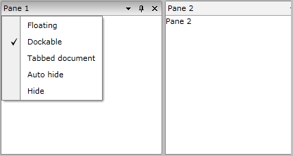

# Localization

## 

The built-in localization mechanism in Silverlight and WPF allows you to localize any string resource used by the RadDocking control. Once translated, you might use your resources in both Silverlight and WPF projects without changing anything.
       	

>tipTo learn more about the ways to localize the RadControls please read the common topic about
       	[Localization](http://www.telerik.com/help/silverlight/common-localization.html)[Localization](http://www.telerik.com/help/wpf/common-localization.html).
       	

In __RadDocking__ you can localize the context menu:
       	

The next image shows the context menu localized in German:          
          

## Resource Keys
    	The resources of the control can be localized by using an unique identifier called resource key that is assigned to each localizable string. Below you may find a list of the Resources available and their default values:
    	
<table><th><tr><td>Key</td><td>Value</td></tr></th><tr><td>Hide</td><td>Hide</td></tr><tr><td>Auto_hide</td><td>Auto hide</td></tr><tr><td>Floating</td><td>Floating</td></tr><tr><td>Dockable</td><td>Dockable</td></tr><tr><td>Tabbed_document</td><td>Tabbed document</td></tr></table>

# See Also

 * [How to Add Buttons to the Pane Header]()

 * [How to Add Icon to the RadPane's Header]()
