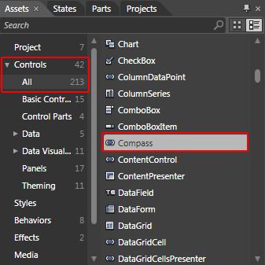
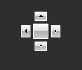
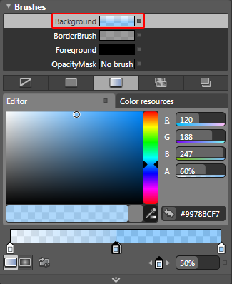
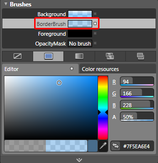
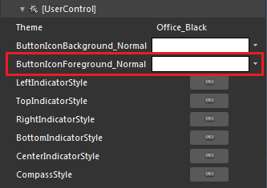
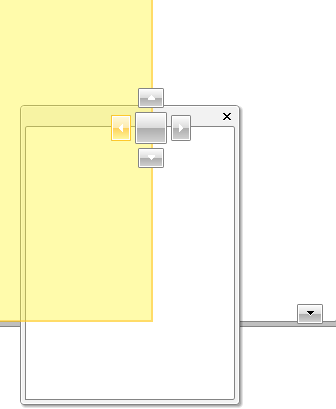

# Styling the Compass

The compass that you see, when rearranging the containers in the __RadDocking__ control, is represented by the __Compass__ control. Therefore you can't directly create a style for it in Expression Blend and you have to use a dummy control to create the style.
        
Open your __RadDocking__ project in Expression Blend and select the __RadDocking__ you want to modify. On the same scene you should place a __Compass__ control, that will be used as a dummy. To do so choose the 'Assets' tab. From the 'Controls -> All' section select the __Compass__ control:
        

With your mouse create a new instance of the control on the scene:

Now select the newly created control. Then select Object -> *Edit Style -> Edit a Copy.* You will be prompted for the name of the style and where to be placed within your application.
        
>tipIf you choose to define the style in Application, it would be available for the entire application. This allows you to define a style only once and then reuse it where needed.

After clicking OK, a style for your __Compass__ control will be created and the properties that can be set through it will be loaded in the 'Properties' pane.
        

Go to the 'Resources' pane and see the resources generated for your style.

Select the __Background__ property and change its value.
          



Select the __BorderBrush__ property and modify it.
          



* __Theme__ - is the theme applied to the control.
          
* __ButtonIconBackground_Normal__ - is the background brush applied to the left, right, top and bottom arrow elements in the compass.
          
* __ButtonIconForeground_Normal__ - is the foreground brush applied to the left, right, top and bottom arrow elements in the compass.
          
* __LeftIndicatorStyle__ - the style applied to the left indicator of the compass.
          
* __TopIndicatorStyle__ - the style applied to the top indicator of the compass.
          
* __RightIndicatorStyle__ - the style applied to the right indicator of the compass.
          
* __BottomIndicatorStyle__ - the style applied to the bottom indicator of the compass.
          
* __CenterIndicatorStyle__ - the style applied to the central indicator of the compass.
          
* __CompassStyle__ - the style containing the described elements.
          
To change the control's visual appearance you can edit the indicators' styles and templates. They all have a similar templating structure which consists of the following elements:

* __[Grid]__ - is the host container for the indicator's elements.
            
* __[ButtonChrome]__ - is the main part of the indicator's content.
                    
>tipRead more about changing a __ButtomChrome's__ default visual appearance [here](http://www.telerik.com/help/silverlight/radbuttons-styles-and-templates-styling-buttonchrome.html).
        
* __[Path]__ - represents the indicator's icon background arrow.
              
* __[Path]__ - represents the indicator's icon foreground arrow, shown on the top of the background arrow.
          

Here is an example of the above resources modified:





To change the color of the navigation arrows you have to go into the template. To do that click on the breadcrumb item with the palette-like icon and choose Edit Template -> Edit Current.



From the 'Objects and Timeline' pane you have to select each of the four paths:



and change its __Fill__ property.
          

 

After finishing with your modifications, remove the dummy control and set the style to the __RadDocking__'s __CompassStyle__ property.
        
#### __XAML__

{{region raddocking-styling-the-compass_0}}
	<telerik:RadDocking x:Name="radDocking"
	                         CompassStyle="{StaticResource CompassStyle}">
	      ...
	</telerik:RadDocking>
{{endregion}}

Here is a snapshot of the final result.





# See Also

 * [Styling and Appearance - Overview]()

 * [Compass]()

 * [Drag and Drop]()

 * [Styling the RootCompass]()

 * [Styling the Visual Cue]()
