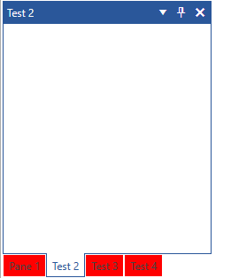

# Styling the RadPane

The __RadPane__ can be styled by creating an appropriate __Style__ and setting it to the __Style__ property of the control or by creating an implicit style.

## Targeting the RadPane Element

In order to style all __RadPane__ elements in a RadDocking, you should create a style targeting __RadPane__.

#### __[XAML] Example 1: Creating an implicit style targeting RadPane__

{{region xaml-raddocking-styling-the-radpane_0}}
	<Application.Resources>
		<!-- If you are using the NoXaml binaries, you will have to base the style on the default one for the theme like so: 
		
	</Application.Resources>

	<Grid>
        <telerik:RadDocking  x:Name="radDocking" >
            <telerik:RadSplitContainer >
                <telerik:RadPaneGroup >
                    <telerik:RadPane Header="Pane 1" />
                    <telerik:RadPane Header="Test 2"/>
                    <telerik:RadPane Header="Test 3" />
                    <telerik:RadPane Header="Test 4" />
                </telerik:RadPaneGroup>
            </telerik:RadSplitContainer>
        </telerik:RadDocking>
    </Grid>
{{endregion}}

#### __Figure 1: RadPane with Red Background in the Office2016 theme__

>important You will notice that in __Figure 1__ all RadPanes are red except the selected one. Inside the ControlTemplate of the RadPane there are triggers/visual states which set the Background when a pane becomes selected and that value takes precedence over the value from the implicit style. In order to change this behavior, you can extract and modify the RadPane ControlTemplate for the theme(s) that you are using. For more information on how to do that read, the [Editing Control Templates]() article.

## See Also

 * [Styling and Appearance - Overview]()

 * [RadPane]()

 * [Docked/Floating Panes]()

 * [Pinned/Unpinned Panes]()

 * [Controlling Appearance]()

 * [Styling the RadDocumentPane]()

 * [Styling the RadPaneGroup]()
