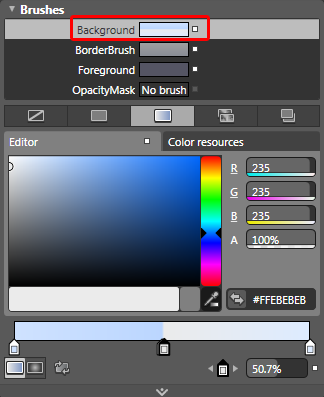
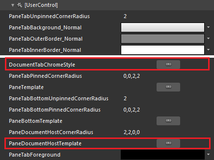
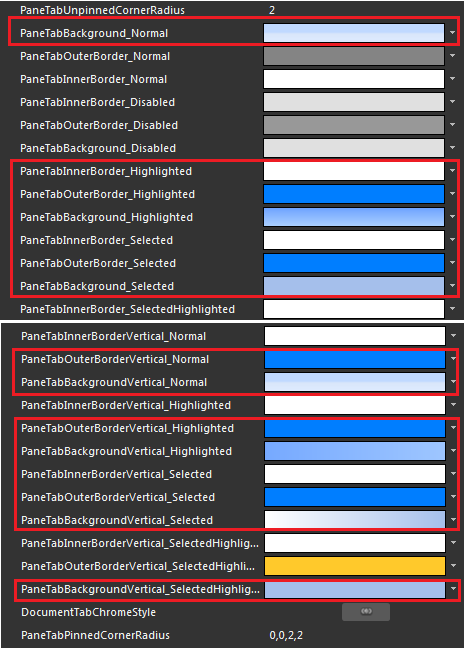
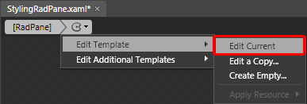
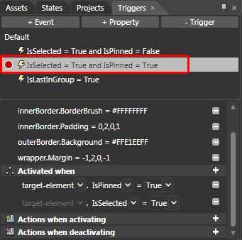
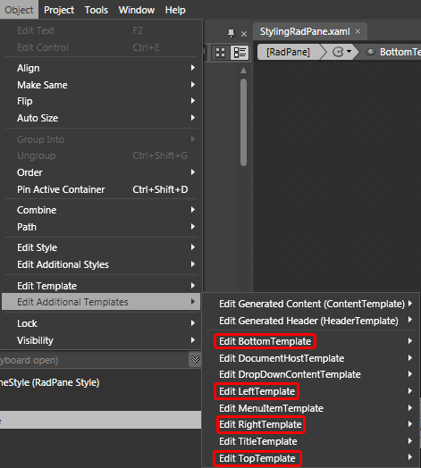
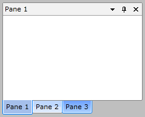
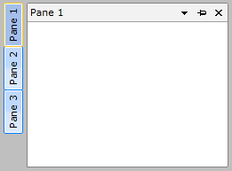
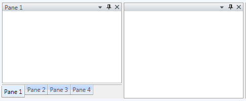

# Styling the RadPane

The __RadPane__ can be styled by creating an appropriate __Style__ and setting it to the __Style__ property of the control.

You have two options:

* To create an empty style and set it up on your own.

* To copy the default style of the control and modify it.

This topic will show you how to perform the second one.

## Modifying the Default Style

To copy the default style, load your project in Expression Blend and open the User Control that holds the __RadDocking__. In the 'Objects and Timeline' pane select the __RadPane__ you want to style. From the menu choose Object -> Edit Style -> Edit a Copy. You will be prompted for the name of the style and where to be placed.

>tipIf you choose to define the style in Application, it would be available for the entire application. This allows you to define a style only once and then reuse it where needed.

After clicking 'OK', Expression Blend will generate the default style of the __RadPane__ control in the __Resources__ section of your User Control. The properties available for the style will be loaded in the 'Properties' pane and you will be able to modify their default values. You can also edit the generated XAML in the XAML View or in Visual Studio.

If you go to the 'Resources' pane, you will see the list of all resources generated together with the style. In this list you will find the brushes, styles and templates needed to change the visual appearance of the __RadPane__. Their names indicate their usage in the generated style.

For example, select the __Background__ property and modify it. This will change the background of the __RadPane__'s header when it is not selected.



You can change the __BorderBrush__ and the __Foreground__ properties the same way.

Here are some of these resources:



* __DocumentTabChromeStyle__ - the style containing all the visual states concerning the pane.

* __PaneDocumentHostTemplate__ - contains a grid which includes the following:

	* __Chrome__ - is of type __ButtonChrome__ and has a default style __DocumentTabChromeStyle__ which exposes many editable resources which will change the pane's appearance.

	* __HeaderElement__ - is of type __TabItemContentPresenter__ and represents the pane's header.

To easily change the pane's visual appearance you can modify the brushes used in the various pane's states.

For each of the following states a couple of brushes are available:

* __Normal__ - the pane's normal state (when it's not selected or highlighted).

* __Highlighted__ - is active when the mouse is located over a particular pane's header.

* __Selected__ - is active when a pane is selected.

* __SelectedHighlighted__ - is active when the mouse id over the selected pane's header. 

The available brushes are:

*  __PaneTabInnerBorder__ - is the pane's header tab inner border in the specified state (from the list above).

*  __PaneTabOuterBorder__ - is the brush used for the pane's header tab outer boder in the specified state. 

*  __PaneTabBackground__- is the pane's header tab background brush in the specified state.

*  __PaneTabInnerBorderVertical__ - is the pane's header tab inner border brush used when it is pinned vertically in the specified state.

*  __PaneTabOuterBorderVertical__ - is the pane's header tab outer border brush used when it is pinned vertically in the specified state.

*  __PaneTabBackgroundVertical__ - is the brush used for the pane's header tab background when it is pinned vertically in the specified state. 

Here is an example of the described resources modified.





To modify the __Background__ of the __RadPane__'s header when it is selected, you have to modify the template of the __RadPane__. To do that click on the palette-like breadcrumb icon and choose *Edit Template -> Edit Current.*



Go to the 'Triggers' pane and select the following trigger.



It is responsible for changing the background of the __RadPane__'s Header when it is pinned. When the trigger is selected every change you made will be recorded by it. So from the 'Objects and Timeline' pane select the __outerBorder__ control.



Modify its __Background__ property.



You can modify the other triggers the same way depending on your liking.

Note that the __RadPane__ control exposes four templates - Top, Left, Right and Bottom. The default template is the value of the Bottom one. To modify the other templates return to the stile by clicking again on the pallette-like breadcrumb icon.



To access the other templates select *Object -> Edit Additional Templates* from the menu.



After finishing the modifications, set the style to the desired __RadPanes__.

#### __XAML__

{{region xaml-raddocking-styling-the-radpane_0}}
	<telerik:RadPane Style="{StaticResource RadPaneStyle}">
	</telerik:RadPane>
{{endregion}}

Here is a snapshot of the final result.





# See Also

 * [Styling and Appearance - Overview]()

 * [RadPane]()

 * [Docked/Floating Panes]()

 * [Pinned/Unpinned Panes]()

 * [Controlling Appearance]()

 * [Styling the RadDocumentPane]()

 * [Styling the RadPaneGroup]()
