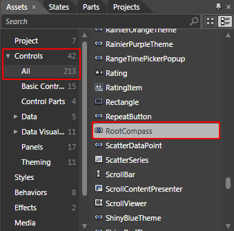
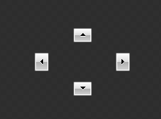
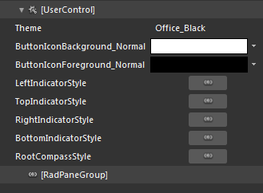
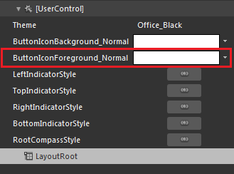
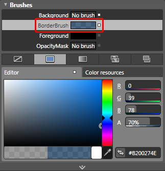
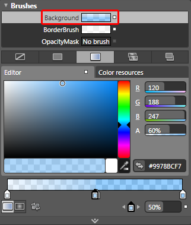
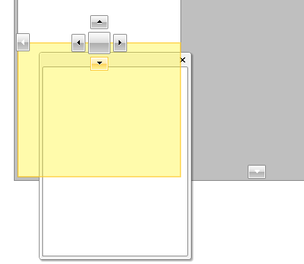

# Styling the RootCompass

The indicators that you see in the four ends of the __RadDocking__ control, when rearranging the containers in it, is represented by the __RootCompass__ control. Therefore you can't directly create a style for it in Expression Blend and you have to use a dummy control to create the style.

Open your __RadDocking__ project in Expression Blend and select the __RadDocking__ you want to modify. On the same scene you should place a __RootCompass__ control, that will be used as a dummy. To do so choose the Assets tab. From the 'Controls -> All' section select the __RootCompass__ control:

With your mouse create a new instance of the control on the scene:

Now select the newly created control. Then select Object -> *Edit Style -> Edit a Copy. *You will be prompted for the name of the style and where to be placed within your application.

>tipIf you choose to define the style in Application, it would be available for the entire application. This allows you to define a style only once and then reuse it where needed.

After clicking OK, a style for your __RootCompass__ control will be created and the properties that can be set through it will be loaded in the 'Properties' pane.
        

Go to the 'Resources' pane and see the resources generated for your style. 

* __Theme__ - is the theme applied to the control.

* __ButtonIconBackground_Normal__ - is the background brush applied to the left, right, top and bottom arrow elements in the compass.

* __ButtonIconForeground_Normal__ - is the foreground brush applied to the left, right, top and bottom arrow elements in the compass.

* __LeftIndicatorStyle__ - the style applied to the left indicator of the compass.

* __TopIndicatorStyle__ - the style applied to the top indicator of the compass.

* __RightIndicatorStyle__ - the style applied to the right indicator of the compass.

* __BottomIndicatorStyle__ - the style applied to the bottom indicator of the compass.

* __CenterIndicatorStyle__ - the style applied to the central indicator of the compass.

* __RootCompassStyle__ - the style containing the described elements.

To change the control's visual appearance you can edit the indicators' styles and templates. They all have a similar templating structure which consists of the following elements:

* __[Grid]__ - is the host container for the indicator's elements.

	* __[ButtonChrome]__ - is the main part of the indicator's content. Read more about changing its default visual appearance here.

	* __[Path]__ - represents the indicator's icon background arrow.

	* __[Path]__ - represents the indicator's icon foreground arrow, shown on the top of the background arrow.

Here is an example of the above resources modified:



Select the __BorderBrush__ property and change its value.




To change the __Background__ of the __RootCompass__ indicators and the fill of their arrows you have to go to the template. To do this click on the pallete-like breadcrumb item and select *Edit Template -> Edit Current*.




From the 'Objects and Timeline' pane select each of the __Borders__ representing the indicators:




and modify their __Background__ properties.




To change the fill of the arrows, select the __Path__ control in each of thew borders:




and modify its __Fill__ property.




After finishing with your modifications, remove the dummy control and set the style to the __RadDocking__'s __RootCompassStyle__ property.
        
#### __XAML__

{{region xaml-raddocking-styling-the-root-compass_0}}
	<telerik:RadDocking x:Name="radDocking"
	                 RootCompassStyle="{StaticResource RootCompassStyle}">
	    ...
	</telerik:RadDocking>
{{endregion}}

Here is a snapshot of the final result.

## See Also

 * [Styling and Appearance - Overview]()

 * [Compass]()

 * [Drag and Drop]()

 * [Styling the Compass]()

 * [Styling the Visual Cue]()
