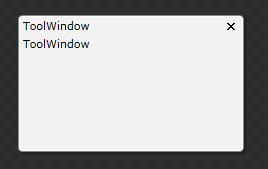
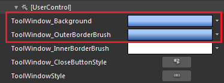
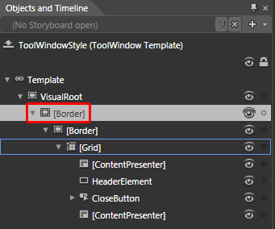
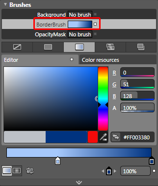
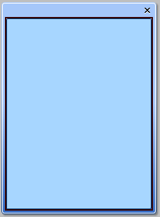

# Styling the ToolWindow

>As the __ToolWindow__ is created dynamically you cannot set the style for it declaratively. The easiest way to do this is to create a theme for your __RadDocking__ control, add the created style for the __ToolWindow__ in it and apply the theme to the control. To learn how to do it read [this]() topic.

To create the needed style for the __Theme__ you should use a dummy control. This will allow you to copy the default style for the __ToolWindow__ and modify it to your liking. To do so open the UserControl that hosts your __RadDocking__ in Expression Blend.

From the Assets tab select *Controls -> All -> ToolWindow*.

Draw one dummy control of this type somewhere on the scene.

Select it and from the menu choose *Object -> Edit Style -> Edit a Copy. *You will be prompted for the name of the style and where to be placed within your application. After clicking OK, a style for your __ToolWindow__ control will be created.

Go to the 'Resources' pane and see all of the resources generated for your style.



*  __ToolWindow_Background__ - is the background brush used for the tool window control.

*  __ToolWindow_OuterBorderBrush__ - is the outer border brush used for the tool window control.

*  __ToolWindow_InnerBorderBrush__ - is the inner border brush used for the tool window control.

*  __ToolWindow_CloseButtonStyle__ - defines the style for the window's close button.

Here is an example of the above resources modified:



To change the visual appearance of the __ToolWindow__ control you have to modify its template. To do that click on the palette-like breadcrumb icon and select *Edit Template -> Edit Current*.



From the 'Objects and Timeline' pane select the __Border__ control responsible for the border of the __ToolWindow__.



Modify the value of its __BorderBrush__ property.



To change the __Background__ of the ToolWindow select the __Border__ control responsible for that.



Modify its __Background__ property.



After finishing with the modifications you have to add the created style to the theme for your __RadDocking__. To learn how take a look at the [Theming the ToolWindow]() topic.

After moving the style to the theme you can remove it from the resources of your UserControl. Also don't forget to delete the dummy control that you have created.

Here is a snapshot of the final result.

# See Also

 * [Styling and Appearance - Overview]()

 * [Tool Window]()

 * [Theming the ToolWindow]()

 * [Drag and Drop]()

 * [Docked/Floating Panes]()
