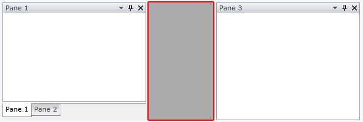
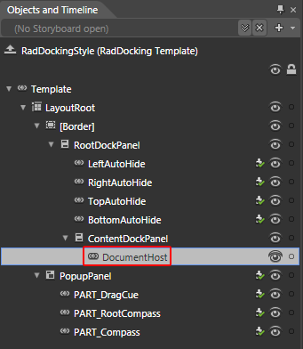
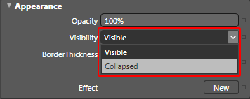
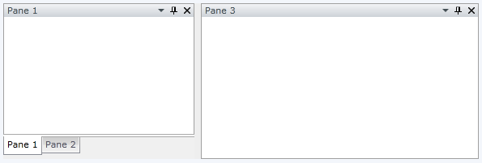

# Templating the RadDocking

In order to template the __RadDocking__ control you have to use Expression Blend. Open the UserControl containing your __RadDocking__ and select it.

Right-click on it and from the context menu select *Edit Template -> Edit a Copy*. You will be prompted for the name of the style and where to be placed within your application.

>tipIf you choose to define the style in Application, it would be available for the entire application. This allows you to define a style only once and then reuse it where needed.

After clicking the OK button, a style with target type __RadDocking__ will be created and the Expression Blend will bring you into editing the control's template.

>tipTo learn more about the structure of the __RadDocking__'s template take a look at [this]() topic.

## Removing DocumentHost

Depending on your case you can modify different things in the template. For example, if you don't use the [Document Host](), you can set its __Visibility__ to __Collapsed__ in the template.

For this purpose select it in the 'Objects and Timeline' pane.

Modify its __Visibility__ property, so it has its value set to "*Collapsed*".

Here is the result.

## See Also

 * [Overview]()

 * [Templates Structure]()

 * [Document Host]()
