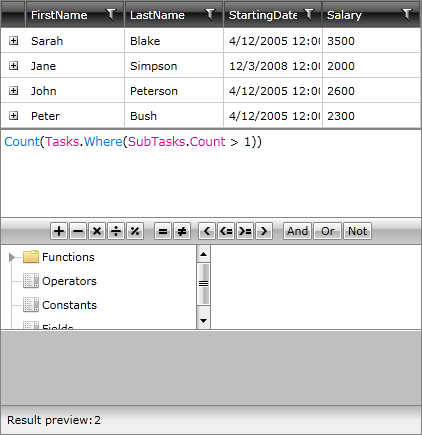

# Lambdas

## 

RadExpressionEditor allows you to benefit from the Lambda expressions as well. However, in this case the syntax is slightly different.  

While the C# Lambda looks like:

#### __C#__

{{region radexpressioneditor-expressions-lambdas_0}}
	item => item.Salary
	{{endregion}}

the equivalent expression in RadExpressionEditor should be defined like:

#### __XAML__

{{region radexpressioneditor-expressions-lambdas_1}}
	“Salary”
	{{endregion}}

         
      

The Result preview displays the result of the expression.

Furthermore, you may also define nested Lambdas. For example the LINQ expression:

#### __C#__

{{region radexpressioneditor-expressions-lambdas_2}}
	item => item.Tasks.Where(param0 => param0.SubTasks.Count > 2)
	{{endregion}}

is equivalent to:

#### __XAML__

{{region radexpressioneditor-expressions-lambdas_3}}
	Tasks.Where(SubTasks.Count > 20)
	{{endregion}}

         
      

In the example above each Employee has a property Tasks and each Task on its own has a property of SubTasks. The Result preview displays the count of the SubTasks properties which has more than one items.

>The Where function in this example is actually the Enumerable.Where(source, predicate) extension method. Because the predicate parameter is a lambda, RadExpressionEditor automatically creates a second, nested, lambda from the string expression when parsing. This is valid for all RadExpressionEditor functions which take a lambda parameter.

