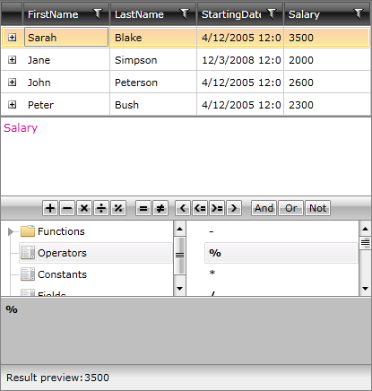

# Lambdas

## 

__RadExpressionEditor__ allows you to benefit from the __Lambda expressions__ as well. However, in this case the syntax is slightly different.  

While the C# Lambda looks like:

#### __C#__

{{region radexpressioneditor-expressions-lambdas_0}}

	item => item.Salary
{{endregion}}

the equivalent expression in __RadExpressionEditor__ should be defined like:

#### __XAML__

{{region radexpressioneditor-expressions-lambdas_1}}

	“Salary”
{{endregion}}

The __Result preview__ displays the result of the expression.

Furthermore, you may also define __nested Lambdas__. For example the __LINQ expression__:

#### __C#__

{{region radexpressioneditor-expressions-lambdas_2}}

	item => item.Tasks.Where(param0 => param0.SubTasks.Count > 2)
{{endregion}}

is equivalent to:

#### __XAML__

{{region radexpressioneditor-expressions-lambdas_3}}

	Tasks.Where(SubTasks.Count > 20)
{{endregion}}

In the example above each __Employee__ has a property __Tasks__ and each __Task__ on its own has a property of __SubTasks__. The __Result preview__ displays the count of the __SubTasks__ properties which has more than one items.

>The __Where__ function in this example is actually the __Enumerable.Where(source, predicate)__ extension method. Because the predicate parameter is a lambda, __RadExpressionEditor__ automatically creates a second, nested, lambda from the string expression when parsing. This is valid for all __RadExpressionEditor__ functions which take a lambda parameter.

