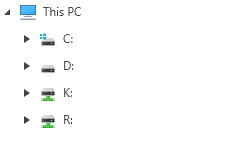
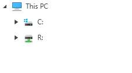

# Events

This article lists the events specific to all of the RadFileDialog controls.

* __PreviewClosed__: This event occurs when the dialog is closing. The event arguments are of type __WindowPreviewClosedEventArgs__. You can use the arguments to cancel the event.
	
	#### __[C#] Example 1: Cancel dialog closing__
	{{region cs-radfiledialogs-events-0}}
		private void FileDialog_PreviewClosed(object sender, WindowPreviewClosedEventArgs e)
        {
			e.Cancel = true;
        }
	{{endregion}}
	
* __Closed__: This event occurs when the dialog is closed. The event arguments are of type __WindowClosedEventArgs__. 

* __ExceptionRaised__: This event occurs when an exception is raised. This event could be raised in different occasions, for example - if the selected folder cannot be accessed or if the file path is too long, or when there is an error while searching, etc.

	#### __[C#] Example 2: Showing an alert when an error appears__
	{{region cs-radfiledialogs-events-1}}
		private void openDialog_ExceptionRaised(object sender, FileBrowserExceptionRaisedEventArgs e)
        {
            MessageBox.Show(e.Exception.Message);
        }
	{{endregion}}

* __DirectoryRequesting__: This event can be used to filter the navigation RadTreeView and RadBreadcrumb or any [Custom Places]() that are added. The following example demonstrates how you can filter out the "D:\\" and "K:\\" directories:

	#### __[C#] Example 3: Filtering the D and K directories__
	{{region cs-radfiledialogs-events-2}}
		private void OpenFileDialog_DirectoryRequesting(object sender, Telerik.Windows.Controls.FileDialogs.DirectoryRequestingEventArgs e)
        {
            if (e.Directory.FullName.StartsWith("D:\\") || e.Directory.FullName.StartsWith("K:\\"))
            {
                e.Cancel = true;
            }
        }
	{{endregion}}

	> If the __InitialDirectory__ of the RadFileDialog is filtered out as in __Example 3__, the current directory on load will be the default one. 

	#### __Image 1: Unfiltered Directories__
	
	#### __Image 2: Filtered Directories Based on Example 3__
	

## See Also
* [Getting Started]()
* [RadOpenFileDialog]()
* [RadOpenFolderDialog]()
* [RadSaveFileDialog]()
