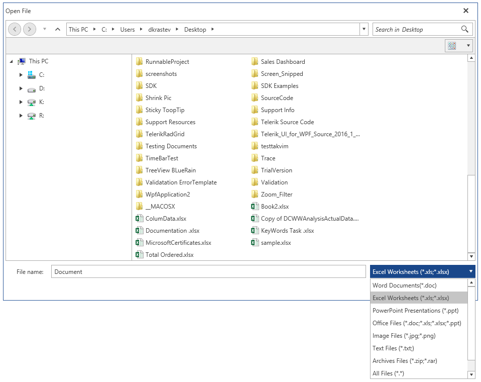

# Filtering

With the __R3 2017 SP 1__ version of Telerik UI for WPF, you can now specify a filter for the __RadOpenFileDialog and RadSaveFileDialog__ dialogs in order to indicate to the user which types of files should be opened or saved. To enable this functionality you can set the __Filter__ and __FilterIndex__ properties. 

The __Filter__ is a property of type string that determines what file extensions should be used in the combo. On the other hand, the __FilterIndex__ property can be used to get or set the index of the filter currently selected in a file dialog.

> The index value of the first filter entry is 1. 

The string set to the __Filter__ property is parsed in a strict way. So when parsing is not successful, the following __ArgumentException__ is thrown:

> __Provided filter string is not valid. Filter string should contain a description of the filter, followed by a vertical bar and the filter pattern. Must also separate multiple filter description and pattern pairs by a vertical bar. Must separate multiple extensions in a filter pattern with a semicolon. Example: "Image files (*.bmp, *.jpg)|*.bmp;*.jpg|All files (*.*)|*.*"__

## Filter in RadOpenFileDialog

To set a filter for the __RadOpenFileDialog__ dialog you can set the __Filter__ property. When this property __is not set__ the combo box __will not__ appear.

#### __[C#] Example 1: Set Filter property of RadOpenFileDialog__

{{region radfiledialogs-features-filtering-0}}
	RadOpenFileDialog openFileDialog = new RadOpenFileDialog();
	openFileDialog.FileName = "Document";
	openFileDialog.Filter = "Word Documents(*.doc)|*.doc|Excel Worksheets (*.xls;*.xlsx)|*.xls;*.xlsx|"+
							"PowerPoint Presentations (*.ppt)|*.ppt" +
							"|Office Files (*.doc;*.xls;*.xlsx;*.ppt)|*.doc;*.xls;*.xlsx;*.ppt" +
							"|Image Files (*.jpg;*.png)|*.jpg;*.png" +
							"|Text Files (*.txt;)|*.txt;" +
							"|Archives Files (*.zip;*.rar)|*.zip;*.rar" +
							"|All Files (*.*)|*.*";
	openFileDialog.FilterIndex = 2;
	openFileDialog.ShowDialog();
{{endregion}}

#### __Figure 1: Filter combo box visualization in RadOpenFileDialog__

## Filter in RadSaveFileDialog

To set a filter for the __RadSaveFileDialog__ dialog you can set the __Filter__ property. When this property __is not set__ the combo box will appear but will be empty. 

> Note that the filter property does not only filter the files in the main pane but also determines the type of the file which will be saved.

#### __[C#] Example 2: Set Filter property of RadSaveFileDialog__

{{region radfiledialogs-features-filtering-1}}
	RadSaveFileDialog saveFileDialog = new RadSaveFileDialog();
	saveFileDialog.FileName = "Document";
	saveFileDialog.Filter = "Word Documents(*.doc)|*.doc|Excel Worksheets (*.xls;*.xlsx)|*.xls;*.xlsx|"+
							"PowerPoint Presentations (*.ppt)|*.ppt" +
							"|Office Files (*.doc;*.xls;*.xlsx;*.ppt)|*.doc;*.xls;*.xlsx;*.ppt" +
							"|Image Files (*.jpg;*.png)|*.jpg;*.png" +
							"|Text Files (*.txt;)|*.txt;" +
							"|Archives Files (*.zip;*.rar)|*.zip;*.rar" +
							"|All Files (*.*)|*.*";
	saveFileDialog.FilterIndex = 2;
	saveFileDialog.ShowDialog();
{{endregion}}

#### __Figure 2: Filter combo box visualization in RadSaveFileDialog__

## See Also

 * [Getting Started]()
 * [RadOpenFileDialog]()
 * [RadOpenFolderDialog]()
 * [RadSaveFileDialog]()
