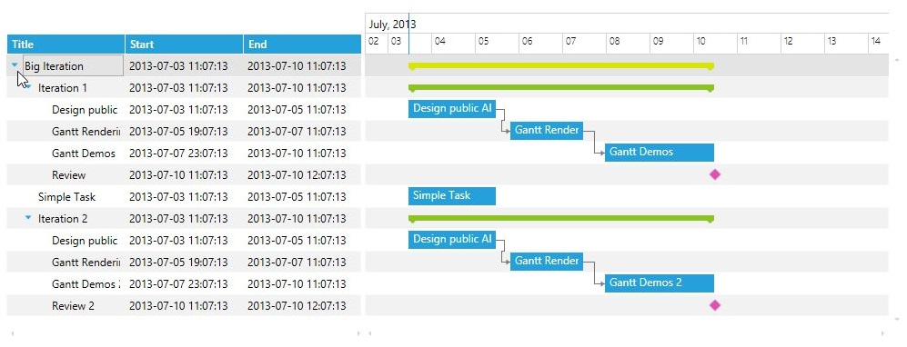
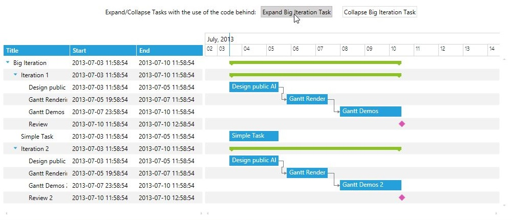

# Expand and Collapse

In the __RadGanttView__ control it is possible to customize the initial expand behavior of its tasks in order to achieve a custom desired behavior. You could easily achieve a fully initially expanded or collapsed behavior by setting the __InitialExpandBehavior__ of the control. There is also a built-in expand and collapse service that could be used to expand and collapse a specific task from the code behind.

## Custom InitialExpandBehavior

The next example demonstrates how to create a behavior that will collapsed only the lowest level (zero level) tasks and expand all of the inner tasks:

>Before proceeding with this article you should get familiar with [Implementing View-ViewModel]().

1. First you should populate the RadGanttView control’s __TasksSource__ properties with some sample data. More details can be found [here]().

1. Create a class that implements the __IInitialExpandBehavior__ interface:

	#### __C#__

	{{region radganttview-features-items-expand-collapse-1}}
		public class CustomInitialExpandBehavior : IInitialExpandBehavior
		{
		
		}
	{{endregion}}

1. Implement its __ShouldExpandItemByDefault()__ method by creating a condition that returns true if the __HierarchicalItem’s__ Level is above 0:

	#### __C#__

	{{region radganttview-features-items-expand-collapse-2}}
		public class CustomInitialExpandBehavior : IInitialExpandBehavior
		{
			public bool ShouldExpandItemByDefault(Telerik.Windows.Core.HierarchicalItem item)
			{
				var shouldExpand = item.Level > 0;
		
				return shouldExpand;
			}
		}
	{{endregion}}

1. Declare the control in the xaml and set its __Columns__. The RadGanttView control should look like this:

	#### __XAML__

	{{region radganttview-features-items-expand-collapse-1}}
		<telerik:RadGanttView TasksSource="{Binding Tasks}"
							  VisibleRange="{Binding VisibleTime}"
			<telerik:RadGanttView.Columns>
				<telerik:TreeColumnDefinition Header="Title" MemberBinding="{Binding Title}" Width="130"/>
				<telerik:ColumnDefinition MemberBinding="{Binding Start}" Header="Start" Width="130"/>
				<telerik:ColumnDefinition MemberBinding="{Binding End}" Header="End" Width="130"/>
			</telerik:RadGanttView.Columns>
		</telerik:RadGanttView>
	{{endregion}}

1. Finally you will need to set the __InitialExpandBehavior__ of the RadGanttView control to the newly created CustomInitialExpandBehavior:

	#### __XAML__

	{{region radganttview-features-items-expand-collapse-2}}
		<telerik:RadGanttView TasksSource="{Binding Tasks}"
							  VisibleRange="{Binding VisibleTime}"
							  InitialExpandBehavior="{StaticResource CustomInitialExpandBehavior}">
			<telerik:RadGanttView.Columns>
				<telerik:TreeColumnDefinition Header="Title" MemberBinding="{Binding Title}" Width="130"/>
				<telerik:ColumnDefinition MemberBinding="{Binding Start}" Header="Start" Width="130"/>
				<telerik:ColumnDefinition MemberBinding="{Binding End}" Header="End" Width="130"/>
			</telerik:RadGanttView.Columns>
		</telerik:RadGanttView>
	{{endregion}}

The next screenshots show the final result. At startup the lowers level (Big Iteration) task is collapsed while all of its inner tasks (Iteration 1, Iteration 2) are expanded:

## Built-in ExpandCollapseService

In the RadGanttView control there is a built-in __ExpandCollapseService__ that could be used to expand or collapse a specific task in the control.

The next example will enhance the previous example by adding two button one for expanding the “Big Iteration” task and one that collapses it.  

* First you will need to declare the RadGanttView control and populate it with some sample data. We are going to use the previously explained in the [“Custom InitialExpandBehavior”](#----------custom-initialexpandbehavior------) section example.

* Add two buttons and declare their Click events:

#### __XAML__

{{region radganttview-features-items-expand-collapse-3}}
	<StackPanel Orientation="Horizontal">
	    <TextBlock Text="Expand/Collapse Tasks with the use of the code behind:" Margin="10 0 0 20" VerticalAlignment="Center"/>
	    <Button Content="Expand Big Iteration Task" x:Name="ExpandButton" Click="ExpandButton_Click" Margin="10 0 10 20"/>
	    <Button Content="Collapse Big Iteration Task" x:Name="CollapseButton" Click="CollapseButton_Click" Margin="10 0 10 20"/>
	</StackPanel>
{{endregion}}

* In the Click events of the two buttons call the __ExpandItem()__ and __CollapseItem()__ methods of the built-in __ExpandCollapseService__ to expand and collapse the first task (the Big Iteration task).

#### __C#__

{{region radganttview-features-items-expand-collapse-3}}
	private void ExpandButton_Click(object sender, RoutedEventArgs e)
	{
	    var firstTask = (this.GanttView.TasksSource as IList<GanttTask>)[0];
	    this.GanttView.ExpandCollapseService.ExpandItem(firstTask);
	}
	
	private void CollapseButton_Click(object sender, RoutedEventArgs e)
	{
	    var firstTask = (this.GanttView.TasksSource as IList<GanttTask>)[0];
	    this.GanttView.ExpandCollapseService.CollapseItem(firstTask);
	}
{{endregion}}

The next screenshots show the final result:

