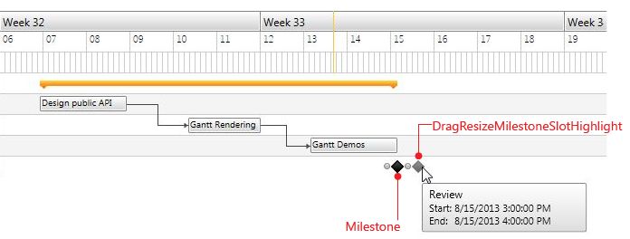
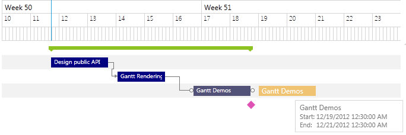

# GanttView Styles

You can check how to set a theme to the control in [this topic](). Using implicit styles makes it much easier to customize different parts of the control.

>Before proceeding, check the [Implicit Style]()[Implicit Style]() article.

You can modify the look of the __RadGanttView__ and its elements separately by simply creating an implicit style with the correct TargetType. Also you will have the option to create a Style based on the default Style for a certain element.

Let’s for example have a GanttView control defined like this:

#### __XAML__

{{region xaml-radganttview-styles-and-templates-overview_0}}
	<telerik:RadGanttView x:Name="ganttView" TasksSource="{Binding Tasks}" >
	    <telerik:RadGanttView.TimeRulerLines>
	        <telerik:GroupTickLine>
	            <telerik:TickInterval Interval="OneWeek" />
	        </telerik:GroupTickLine>
	        <telerik:MajorTickLine>
	            <telerik:TickInterval Interval="OneDay" />
	        </telerik:MajorTickLine>
	        <telerik:MinorTickLine>
	            <telerik:TickInterval Interval="ThreeHours" />
	        </telerik:MinorTickLine>
	    </telerik:RadGanttView.TimeRulerLines>
	    <telerik:RadGanttView.Columns>
	        <telerik:TreeColumnDefinition MemberBinding="{Binding Title}" Header="Title" Width="AutoHeaderAndContent"/>
	        <telerik:ColumnDefinition MemberBinding="{Binding Start}" Header="Start" Width="AutoHeaderAndContent"/>
	        <telerik:ColumnDefinition MemberBinding="{Binding End}" Header="End" Width="AutoHeaderAndContent"/>
	    </telerik:RadGanttView.Columns>
	</telerik:RadGanttView>
{{endregion}}

The following scheme shows the name of each element  that can be styled:

In the next screenshots we will focus on the Columns part of the GanttView control:

>CellHighlight and TreeCellHighlight are used for both highlighted and selected states of the Cell/TreeCell respectively.

If we have CellTemplate and/or CellEditTemplate defined, the generated containers are different. For example, let&s change our GanttView Columns like this:

#### __XAML__

{{region xaml-radganttview-styles-and-templates-overview_4}}
	<telerik:RadGanttView x:Name="ganttView2" TasksSource="{Binding Tasks}" >
	    <!--...-->
	    <telerik:RadGanttView.Columns>
	        <telerik:TreeColumnDefinition Header="Title" MemberBinding="{Binding Title}" Width="AutoHeaderAndContent">
	            <telerik:TreeColumnDefinition.CellTemplate >
	                <DataTemplate>
	                    <TextBlock Text="{Binding Title}" />
	                </DataTemplate>
	            </telerik:TreeColumnDefinition.CellTemplate>
	            <telerik:TreeColumnDefinition.CellEditTemplate>
	                <DataTemplate>
	                    <TextBox Text="{Binding Title,Mode=TwoWay}" />
	                </DataTemplate>
	            </telerik:TreeColumnDefinition.CellEditTemplate>
	        </telerik:TreeColumnDefinition>
	        <telerik:ColumnDefinition MemberBinding="{Binding Start}" Header="Start" Width="AutoHeaderAndContent">
	            <telerik:ColumnDefinition.CellTemplate >
	                <DataTemplate>
	                    <TextBlock Text="{Binding Start}" />
	                </DataTemplate>
	            </telerik:ColumnDefinition.CellTemplate>
	            <telerik:ColumnDefinition.CellEditTemplate>
	                <DataTemplate>
	                    <telerik:RadDateTimePicker SelectedValue="{Binding Start,Mode=TwoWay}" />
	                </DataTemplate>
	            </telerik:ColumnDefinition.CellEditTemplate>
	        </telerik:ColumnDefinition>
	        <!--...-->
	    </telerik:RadGanttView.Columns>
	</telerik:RadGanttView>
{{endregion}}

The containers in the grid will be Cell/TreeCell instead of SimpleCell/SimpleTreeCell. Also the containers for editing will be CellEditing/TreeCellEditing:

In case we have SpecialSlots defined:

#### __XAML__

{{region xaml-radganttview-styles-and-templates-overview_1}}
	<telerik:RadGanttView x:Name="ganttView1" TasksSource="{Binding Tasks}" >
	    <!--...-->
	    <telerik:RadGanttView.SpecialSlotsGenerator>
	        <telerik:WeekDaysGenerator FirstDay="Monday" DaysCount="5" />
	    </telerik:RadGanttView.SpecialSlotsGenerator>
	</telerik:RadGanttView>
{{endregion}}

We can style them as well:

The next screenshots show all the elements used for DragDrop and Resize functionality of the control:

In the following table you will find the corresponding TargetType for each of these elements:

<b>Element<b/>	|	<b>TargetType<b/>
---	|	---
Relation	|	RelationContainer
Event	|	EventContainer
Summary	|	SummaryContainer
Milestone	|	MilestoneContainer
ColumnHeader	|	ColumnHeaderContainer
SimpleCell	|	SimpleCellContainer
Cell	|	CellContainer
CellHighlight	|	CellHighlightContainer
CellEditing	|	CellEditingContainer
SimpleTreeCell	|	SimpleTreeCellContainer
TreeCell	|	TreeCellContainer
TreeCellHighlight	|	TreeCellHighlightContainer
TreeCellEditing	|	TreeCellEditingContainer
BorderContainer	|	BorderContainer
AlternatingBorderContainer	|	AlternatingBorderContainer
SpecialSlot	|	SpecialSlotContainer
GroupTick	|	GroupTickContainer
MinorTick	|	MinorTickContainer
MajorTick	|	MajorTickContainer
CurrentHourTick	|	CurrentHourTickContainer
RowHighlight	|	RowHighlightContainer
RowSelection	|	RowSelectionContainer
DragResizeSlotHighlight	|	DragResizeSlotHighlightContainer
DragResizeMilestoneSlotHighlight	|	DragResizeMilestoneSlotHighlightContainer
DragResizeSummarySlotHighlight	|	DragResizeSummarySlotHighlightContainer
GanttDragResizeVisualCue	|	GanttDragResizeVisualCue
GanttPresenterSplitter	|	GanttPresenterSplitter
ExpandToggleButton	|	ToggleButton
Deadline		|	DeadlineContainer

## Examples

We will go through two examples:

* [Basing Styles on a theme Style](#basing-styles-on-a-theme-style)

* [Setting implicit style to a certain element](#setting-implicit-style-to-a-certain-element)

### Basing Styles on a theme Style

Each of these containers listed in the table has a style formed by the name of the container type followed by a “Style” suffix. For example, for the EventContainer there is a style with x:Key=”EventContainerStyle”.

So, let’s create the following implicit style:

#### __XAML__

{{region xaml-radganttview-styles-and-templates-overview_2}}
	
{{endregion}}

This will lead to the following result:

### Setting implicit style to a certain element

In case you need to further customize an element, you could create an implicit style for it. Here is a simple example for the DragResizeSlotHighlightContainer element:

#### __XAML__

{{region xaml-radganttview-styles-and-templates-overview_3}}
	
{{endregion}}

After adding this Style, the element will look like this:
