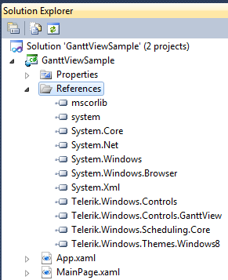
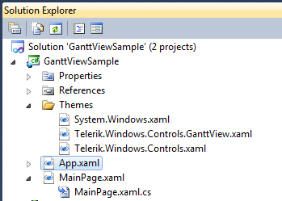

# Setting a Theme

## 

The purpose of this article is to show you how to set a built-in theme to __RadGanttView__ for SilverlightWPF.

__RadGanttView__ control supports styling only with Implicit Styles. This means that you cannot style it with StyleManager.
       

>tipDetailed information about the use of implicit styles can be found 
       	[here](http://www.telerik.com/help/silverlight/styling-apperance-implicit-styles-overview.html)[here](http://www.telerik.com/help/wpf/styling-apperance-implicit-styles-overview.html).

So, in order to set a theme to the GanttView, you should merge the following xaml files in App.xaml file:
      		
      	

* System.Windows.xaml

* Telerik.Windows.Controls.xaml

* Telerik.Windows.Controls.GanttView.xaml

There are two ways to reference the needed xaml files:

* Directly from the theme assembly:Let's, for example, apply Windows8 theme to the control. This means that we should add a reference to Telerik.Windows.Themes.Windows8.dll as well:Then merge the xaml files in the App.xaml like this:
      

#### __XAML__

{{region radganttview-styles-and-templates-setting-theme_0}}
	<Application.Resources>
		<ResourceDictionary>
			<ResourceDictionary.MergedDictionaries>
				<ResourceDictionary Source="/Telerik.Windows.Themes.Windows8;component/Themes/System.Windows.xaml"/>
				<ResourceDictionary Source="/Telerik.Windows.Themes.Windows8;component/Themes/Telerik.Windows.Controls.xaml"/>
				<ResourceDictionary Source="/Telerik.Windows.Themes.Windows8;component/Themes/Telerik.Windows.Controls.GanttView.xaml"/>
			</ResourceDictionary.MergedDictionaries>
		</ResourceDictionary>
	</Application.Resources>
	{{endregion}}

* Copy the xaml files to a folder in the project:
        	Create a Theme folder and copy the required files from T__hemes.Implicit/../Windows8/../Themes/__ folder located in the installation folder of RadControls:Then merge the xaml files in the App.xaml like this:
      

#### __XAML__

{{region radganttview-styles-and-templates-setting-theme_1}}
	<Application.Resources>
		<ResourceDictionary>
			<ResourceDictionary.MergedDictionaries>
				<ResourceDictionary Source="Themes/System.Windows.xaml" />
				<ResourceDictionary Source="Themes/Telerik.Windows.Controls.xaml" />
				<ResourceDictionary Source="Themes/Telerik.Windows.Controls.GanttView.xaml" />
			</ResourceDictionary.MergedDictionaries>
		</ResourceDictionary>
	</Application.Resources>
	{{endregion}}

Either way you choose, the end result will be the following:

