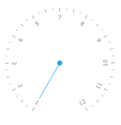

# Creating Radial Gauge

One of the gauges you can create with the __RadGauge__ control, is a radial gauge. It is represented by a circle container with a scale in it. Additionally it can display various indicators that point to a certain value off the scale. This topic will guide you in creating a trivial radial gauge and will explain the following:
      

* [Defining a RadialGauge](#Defining_a_RadialGauge)

* [Defining a RadialScale](#Defining_a_RadialScale)

* [Defining an Indicator](#Defining_an_Indicator)

* [Set Indicator's Position](#Set_Indicator's_Position)

* [Configuring the Gauge](#Configuring_the_Gauge)

## Defining a RadialGauge

>

              In order to use the __RadGauge__ control and its components you have to reference the following assemblies:
            

* __Telerik.Windows.Controls.DataVisualization.dll__

* __Telerik.Windows.Controls.dll__

          The radial gauge type is represented by the __RadRadialGauge__ class. The __RadRadialGauge__ control is used for wrapping radial scales. You can place one or more __RadialScale__ objects inside of it. Here is an example of an instance of the __RadRadialGauge__ control with dimensions __300x300__.
        

>

              To use the __RadGauge__ control and its components in XAML you have to declare the following namespace:
            

#### __XAML__

{{region radgauge-getting-started-creating-radial-gauge_0}}
	xmlns:telerik="http://schemas.telerik.com/2008/xaml/presentation"
	{{endregion}}

## Defining a RadialScale

In order to define a scale inside the RadialGauge control you have to use the RadialScale control. The RadialGauge works as an ItemsControl, which takes RadialScale controls as items. This means that you can have more than one scale inside the radial gauge. Here is an example of a single RadialScale.

>tip
          To learn more about the usage of the __RadialScale__ control read the [Radial Scale]() topic.
        

#### __XAML__

{{region radgauge-getting-started-creating-radial-gauge_2}}
	<telerik:RadRadialGauge x:Name="radialGauge"
	                        Width="300"
	                        Height="300"
	                        telerik:StyleManager.Theme="Windows8">
	    <telerik:RadialScale Min="1"
	                         Max="12">
	    </telerik:RadialScale>
	</telerik:RadRadialGauge>
	{{endregion}}

Here is a snapshot of the result.

               
            

## Defining an Indicator

          The __RadialScale__ control allows you to display different types of indicators that point to a value off the scale. To specify an indicator use the Indicators property, which is of type __UIElementCollection__. This means that the __Indicators__ property can hold more than one indicator. Here is an example of RadialScale that uses a __Needle__ indicator to mark the current value as well as __Pinpoint__ to mark the center of the Gauge
        

#### __XAML__

{{region radgauge-getting-started-creating-radial-gauge_3}}
	 <telerik:RadRadialGauge x:Name="radialGauge"
	                        Width="300"
	                        Height="300"
	                        telerik:StyleManager.Theme="Windows8">
	    <telerik:RadialScale Min="1"
	                         Max="12">
	        <telerik:RadialScale.Indicators>
	            <telerik:Needle />
	            <telerik:Pinpoint/>
	        </telerik:RadialScale.Indicators>
	    </telerik:RadialScale>
	</telerik:RadRadialGauge>
	{{endregion}}

Here is a snapshot of the result.

               
            

## Set Indicator's Position

          To make the indicator point to a certain value from the scale, you have to use the __Value__ property of the indicator. Here is an example.
        

#### __XAML__

{{region radgauge-getting-started-creating-radial-gauge_4}}
	<telerik:RadRadialGauge Name="radialGauge"
	                    Width="300"
	                    Height="300"
	                    telerik:StyleManager.Theme="Windows8">
	    <telerik:RadialScale Name="scale"
	                    Min="1"
	                    Max="11">
	        <telerik:RadialScale.Indicators>
	            <telerik:Needle Name="needle" Value="6" />
	            <telerik:Pinpoint />
	        </telerik:RadialScale.Indicators>
	    </telerik:RadialScale>
	</telerik:RadRadialGauge>
	{{endregion}}

Here is a snapshot of the result.

               
            

## Configuring the Gauge

To configure and setup the radial gauge you can use tha various properties of the elements inside of it. In order to get familiar with them read the following topics regarding:

* [Ranges]()

* [Indicators]()

* [Ticks]()

* [Labels]()
