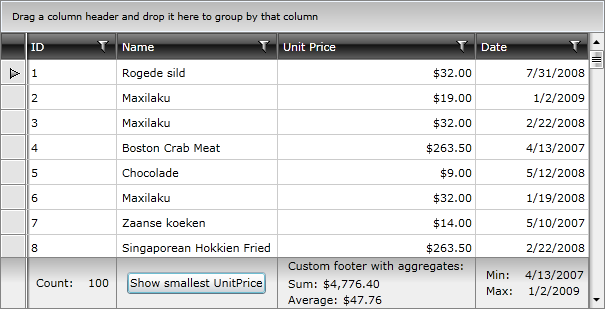

# Aggregate Functions

The column footers can be used to display aggregated information about the data in the column via aggregate functions. The aggregate functions might be found in the __Telerik.Windows.Data__ assembly.

The available functions are:

* __AverageFunction__ – returns the average of the values in the column. 

* __CountFunction__ – returns the number of all items in the column 

* __FirstFunction__ – returns the first element in the column according to the current sorting. 

* __LastFunction__ – returns the last elements in the column according to the current sorting. 

* __MaxFunction__ – returns the Max of the values in the column. 

* __MinFunction__ – returns the Min of the values in the column. 

* __SumFunction__ – returns the Sum of all values in the column. 

>tipYou can also create your own custom functions similar to these by inheriting the __Telerik.Windows.Data.EnumerableAggregateFunction__ class.

>tipYou could also use a [Generic AggregateFunction](http://www.telerik.com/help/wpf/allmembers_t_telerik_windows_data_aggregatefunction_2.html)[Generic AggregateFunction](http://www.telerik.com/help/silverlight/allmembers_t_telerik_windows_data_aggregatefunction_2.html) to define some custom aggregate expressions. An example can be found [here](http://demos.telerik.com/silverlight/#GridView/CustomAggregates).

The footer cell displays the caption and the result of the selected aggregate function.

To display an aggregate function for a certain column, just instantiate the function you need and add it to the __AggregateFunctions__ collection of that column.

#### __XAML__

{{region gridview-columns-aggregate-functions_1}}

	<telerik:GridViewDataColumn Header="ID"
                                DataMemberBinding="{Binding EmployeeID}"
                                UniqueName="ID">
		<telerik:GridViewDataColumn.AggregateFunctions>
			<telerik:CountFunction Caption="Count: " />
		</telerik:GridViewDataColumn.AggregateFunctions>
	</telerik:GridViewDataColumn>
{{endregion}}

#### __C#__

{{region gridview-columns-aggregate-functions_2}}

	CountFunction f = new CountFunction();
	((GridViewDataColumn)this.radGridView.Columns["ID"]).AggregateFunctions.Add(f);
{{endregion}}

#### __VB.NET__

{{region gridview-columns-aggregate-functions_3}}

	Dim f As New CountFunction()
	DirectCast(Me.radGridView.Columns("ID"), GridViewDataColumn).AggregateFunctions.Add(f)
{{endregion}}

>You need to set the __ShowColumnFooters__ property of the RadGridView to true in order to display the aggregates.
            
>You need to set the __ShowGroupFooters__ property of the RadGridView to true in order to display the aggregates under Grouped rows.
            
>You need to set the __SourceField__ property of the AggregateFunctions to specify the field to use in calculating the result.
            
>We use System.Linq to generate a proper __Expression__ to do the calculation based on the aggregate function defined and the type of the bound data.
          
If a recalculation of the aggregates is needed, you may call the CalculateAggregates() method of the grid:

#### __C#__

{{region gridview-columns-aggregate-functions_4}}

	private void Button1_Click(object sender, RoutedEventArgs e)
	{
	   this.radGridView.CalculateAggregates();
	}
{{endregion}}

That way the column aggregates will be updated and the group aggregates will not be. Please check this [troubleshooting article]() on how to refresh them.
        

>tipAggregate functions can also be defined per groups. To find out more take a look at [Group Aggregates]().

# See Also

 * [RadGridView Overview]()

 * [Group Aggregates]()

 * [Aggregates are not shown]()

 * [Aggregates are not updated]()
