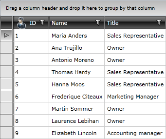

# Column Headers

Usually the top cell of a column is called Header. Its purpose is to set a caption for the column, which describes the data displayed in it.

To set value for the header use the __Header__ property of the column. 

#### __XAML__

{{region gridview-columns-column-headers_0}}

	<telerik:GridViewDataColumn DataMemberBinding="{Binding EmployeeID}"
	                            Header="ID" />
{{endregion}}

The __Header__ property is of type __object__ and you are not limited to just using plain text. For example, you can add a corresponding picture to be displayed as header.

#### __XAML__

{{region gridview-columns-column-headers_1}}

	<telerik:GridViewDataColumn DataMemberBinding="{Binding EmployeeID}">
		<telerik:GridViewDataColumn.Header>
	        <StackPanel Orientation="Horizontal">
	            <Image Stretch="None"
	                   Source="../../Images/User.png"
	                   Margin="0,0,5,0" />
	            <TextBlock Text="ID"
	                       VerticalAlignment="Center" />
	        </StackPanel>
		</telerik:GridViewDataColumn.Header>
	</telerik:GridViewDataColumn>
{{endregion}}

## Customizing the Headers

There are two elements on the headers that can be customized:

* header row - it is modified by setting an appropriate style as __HeaderRowStyle__ of __RadGridView__. To learn  how to style it take a look at the [Styling the Header Row]() topic.
* header cell - it is styled by setting __HeaderCellStyle__ for the column, which means that for each column you can have a differently styled header. To learn more about how to style the header cell take a look at the [Styling the Column Headers]() topic.

## Hiding the Headers

Column headers can only be hidden by setting __ShowColumnHeaders__ property of __RadGridView__ to __False__.

#### __XAML__

{{region gridview-columns-column-headers_2}}

	<telerik:RadGridView x:Name="radGridView"
	                     ShowColumnHeaders="False">
	    ...
	</telerik:RadGridView>
{{endregion}}

## Sorting

The header of the column plays the main role when we want to sort it. It also hosts all the visual logic around this functionality. When the data is sorted by a column, its header changes its appearance and shows the sort direction via an indicator.

>tipAs of Q2 2013, the user can benefit from __Column Sort Sequence Indicator__. In order to have this feature enabled you need to set ShowColumnSortIndexes property of RadGridView to True.

To learn more about the sorting functionality take a look at the [Basic Sorting]() topic in the Sorting chapter.

## Filtering

The header of the column hosts the built-in filtering mechanism, which allows you to filter data by the columns' values.

To learn more about the filtering functionality take a look at the [Basic Filtering]() topic in the Filtering chapter.

## Grouping

The header is also used for grouping data. It has to be dragged into the group panel at the top of the control in order to get the data grouped by that column.

To learn more about the grouping functionality take a look at the [Basic Grouping]() topic in the Grouping chapter.

## Merging the headers

Columns in RadGridView may be grouped in __column groups__(added with __Q3 2011__).
[Read more]().

To learn more about the customizing of the headers please refer to the [Customizing the Headers](#Customizing_the_Headers) section above.
        

# See Also

 * [Column Footers]()
 
 * [Column Groups]()

 * [Aggregate Functions]()

 * [Resizing Columns]()
