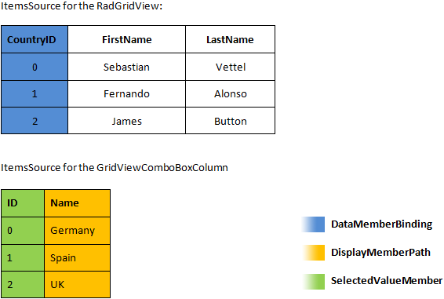
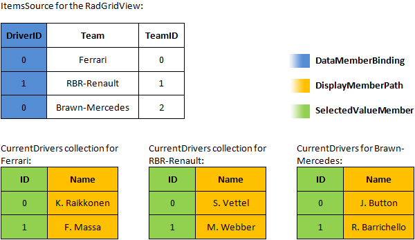
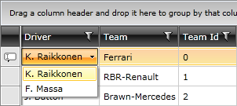
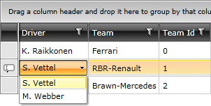
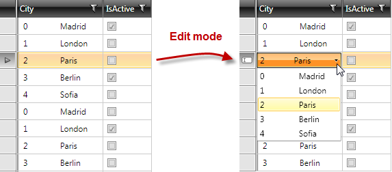

# ComboBox Column

The __GridViewComboBoxColumn__ derives from the __GridViewBoundColumnBase__, which means that it inherits all of the functionality too. In addition, GridViewComboBoxColumn provides a __ComboBox__ editor for editing cell values. It also takes care to translate the __DataMember__ value of the column to the corresponding __DisplayMember__ value of the __ComboBox__. 

Here is a list of the most important properties.

* __ItemsSource__ - specifies the data source for the __ComboBox__ editor. It also takes part when translating the __DataMember__ to the __Display__ member.

* __ItemsSourceBinding__ - allows you to bind the __ItemsSource__ of the __ComboBox__ to a property of the data source item.

* __DisplayMemberPath__ - used to translate a value to cell content(e.g. the ID of a country to the Name of the country). It points to a field in the __GridViewComboBoxColumn.ItemsSource__.

* __SelectedValueMemberPath__ - used in conjunction with the __DisplayMemberPath__ in the process of translation of a value to display content. It also tells the __ComboBox__ editor which property to use as a value when the user makes selection. Here you can see how to define a column of this type.

* __IsComboBoxEditable__ - allows you to set the whether the __ComboBox__ is editable.

>After Telerik shipped __Q3 2012 Service Pack__ typing a letter in a __GridViewComboBoxColumn__ will point to the first ComboBox item that starts with the same letter.
        

The following example assumes that you have the data shown in __Figure 1__:

__Figure 1__

Define a __GridViewComboBoxColumn__.

#### __XAML__

{{region radgridview-columns-column-types-combobox-column_0}}

	<telerik:RadGridView x:Name="radGridView"
	                         AutoGenerateColumns="False">
	    <telerik:RadGridView.Columns>
	        <telerik:GridViewComboBoxColumn />
	    </telerik:RadGridView.Columns>
	</telerik:RadGridView>
{{endregion}}

>You’ll find the columns in the same namespace as the __RadGridView__ control.

#### __C#__

{{region radgridview-columns-column-types-combobox-column_1}}

	GridViewComboBoxColumn column = new GridViewComboBoxColumn();
	this.radGridView.Columns.Add( column );
{{endregion}}

#### __VB.NET__

{{region radgridview-columns-column-types-combobox-column_2}}

	Dim column As New GridViewComboBoxColumn()
	Me.radGridView.Columns.Add( column )
{{endregion}}

Define the __DataMemberBinding__ and give the column an __UniqueName__.

#### __XAML__

{{region radgridview-columns-column-types-combobox-column_3}}

	<telerik:RadGridView x:Name="radGridView"
	                     AutoGenerateColumns="False">
	    <telerik:RadGridView.Columns>
	        <telerik:GridViewComboBoxColumn DataMemberBinding="{Binding CountryId}"
	                                        UniqueName="Country" />
	    </telerik:RadGridView.Columns>
	</telerik:RadGridView>
{{endregion}}

#### __C#__

{{region radgridview-columns-column-types-combobox-column_4}}

	column.DataMemberBinding = new Binding( "CountryId" );
	column.UniqueName = "Country";
{{endregion}}

#### __VB.NET__

{{region radgridview-columns-column-types-combobox-column_5}}

	column.DataMemberBinding = New Binding("CountryId")
	column.UniqueName = "Country"
{{endregion}}

Set the __ItemsSource__ property.

#### __C#__

{{region radgridview-columns-column-types-combobox-column_6}}

	((GridViewComboBoxColumn)this.radGridView.Columns["Country"]).ItemsSource = RadGridViewSampleData.GetCountries();
{{endregion}}

#### __VB.NET__

{{region radgridview-columns-column-types-combobox-column_7}}

	DirectCast(Me.radGridView.Columns("Country"), GridViewComboBoxColumn).ItemsSource = RadGridViewSampleData.GetCountries()
{{endregion}}

Set the __DisplayMemberPath__ and the __SelectedValuePath__ properties.

#### __XAML__

{{region radgridview-columns-column-types-combobox-column_8}}

	<telerik:GridViewComboBoxColumn DataMemberBinding="{Binding CountryId}"
                                    UniqueName="Country"
                                    SelectedValueMemberPath="Id"
                                    DisplayMemberPath="Name" />
	{{endregion}}

#### __C#__

{{region radgridview-columns-column-types-combobox-column_9}}

	column.SelectedValueMemberPath = "Id";
	column.DisplayMemberPath = "Name";
{{endregion}}

#### __VB.NET__

{{region radgridview-columns-column-types-combobox-column_10}}

	column.SelectedValueMemberPath = "Id"
	column.DisplayMemberPath = "Name"
{{endregion}}

Now run the application. The application result should be similar to __Figure 2__

__Figure 2__

You can see in __Figure 2__ that via the __DisplayMemberPath__ property of the __GridViewComboBoxColumn__ you have mapped the __CountryId__ property of the business object to the respective value in the Countries collection.
      

You can download a runnable project of the previous example from our online SDK repository [here](https://github.com/telerik/xaml-sdk/), the example is listed as __GridView__ / __ComboboxColumn__  .
      

The next example shows how to use the __ItemsSourceBinding__ property. It allows you to bind the __ItemsSource__ of the __ComboBox__ editor to a collection that is held by the data item. In this way, you are able to specify different sets of items for the editors that depend on the entire content of the respective row. The example assumes that you have the data shown in __Figure 3__:

__Figure 3__

The __RadGridView__ binds to a collection of objects representing the teams. The team object exposes a collection containing the current drivers, which is used as source for the __ComboBoxEditor__. As in the previous example, it also exposes a __DriverID__ property that the __ComboBox__ column will later translate to an appropriate display value. 

Define the __GridViewComboBoxColumn__ with the following properties set.

#### __XAML__

{{region radgridview-columns-column-types-combobox-column_11}}

	<telerik:GridViewComboBoxColumn Header="Driver"
                                    DataMemberBinding="{Binding DriverID}"
                                    UniqueName="Driver"
                                    ItemsSourceBinding="{Binding CurrentDrivers}"
                                    SelectedValueMemberPath="ID"
                                    DisplayMemberPath="Name" />
{{endregion}}

__Figure 4__ and __Figure 5__ show the result of using the __ItemsSourceBinding__ property.

__Figure 4__

and

__Figure 5__

>When using the __ItemsSourceBinding__ property, the values displayed in the column’s filtering control will be the values corresponding to the __DataMemberBinding__ (0, 1, 2). If you want to be the displayed ones (S.Vettel, K. Raikkonen, M. Webber), then you need to set [FilterMemberPath]() to a property containing the values used as __DisplayMemberPath__ in the __GridViewComboBoxColumn__.
        

>tipYou can download a runnable project of the previous example from our online SDK repository [here](https://github.com/telerik/xaml-sdk/), the example is listed as __GridView__ / __ComboboxColumnItemsSourceBinding__  .
        

>If you are using GridViewComboBoxColumn's __ItemsSource__ property you should specify a valid __Source__ for it. Please refer to this [help article]().
        

## Templating the ComboBox Column

As of __Q1 2010 SP2__, the GridViewComboBoxColumn provides a new property - __ItemTemplate,__which applies to the column in read-only mode and in edit mode (actually it applies to the RadComboBox that is the default editor of that column).

The following example shows how to implement a multi-column __ComboBox__ column.

Start by defining the __GridViewComboBox__ column and its __ItemTemplate__:

#### __XAML__

{{region radgridview-columns-column-types-combobox-column_12}}

	<telerik:GridViewComboBoxColumn Header="City"
	                                DisplayMemberPath="Name"
	                                SelectedValueMemberPath="ID"
	                                ItemsSource="{Binding Path=Cities, Source={StaticResource mainPageViewModel}}"
	                                Width="*"
	                                DataMemberBinding="{Binding CityID}">
	    <telerik:GridViewComboBoxColumn.ItemTemplate>
	        <DataTemplate>
	            <Grid>
	                <Grid.ColumnDefinitions>
	                    <ColumnDefinition />
	                    <ColumnDefinition Width="*"></ColumnDefinition>
	                </Grid.ColumnDefinitions>
	                <TextBlock Text="{Binding ID}"></TextBlock>
	                <TextBlock Text="{Binding Name}"  Grid.Column="1"></TextBlock>
	            </Grid>
	        </DataTemplate>
	    </telerik:GridViewComboBoxColumn.ItemTemplate>
	</telerik:GridViewComboBoxColumn>
{{endregion}}

The multi-column ComboBox in this example will have two columns showing the ID and Name of the City respectively. When you run the example, Figure 6 shows what happens when the customer tries to edit in a column.

__Figure 6__

# See Also

 * [Empty Cells in Combobox column]()
