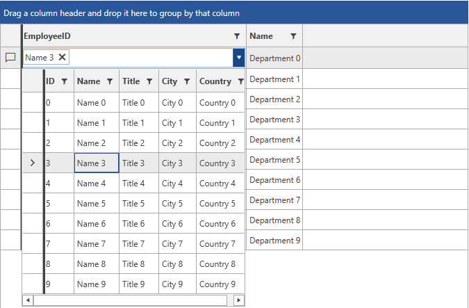

# MultiColumnComboBox Column

__GridViewMultiColumnComboBoxColumn__ derives from [GridViewBoundColumnBase](). In view mode it is represented by a standard TextBlock, whereas in edit mode the [RadMultiColumnComboBox]() component is used. Here is a list of its most important properties:

* __DataMemberBinding__: Allows you to specify the binding to the property, whose value you want to display in the column. 

* __ItemsSource__: Specifies the data source for the __RadMultiColumnComboBox__ editor.

* __ItemsSourceBinding__: Allows binding editor's __ItemsSource__ to a member of the bound data item.

* __DisplayMemberPath__: Member path to display. It points to a field in the assigned __ItemsSource__.

* __SelectedValuePath__: Used in conjunction with __DisplayMemberPath__ in the process of translation of a value to display as content. It also tells the __RadMultiColumnComboBox__ editor which property to use as a Value when the user makes selection. 

* __NullText__: Allows you to set a string which will be displayed in both view mode and edit mode when the __RadMultiColumnComboBox__ editor does not have a selected item.

* __HighlightMatches__: Gets or sets a value that indicates whether matched items will be highlighted.

* __AutoCompleteMode__: Gets or sets the [AutoCompleteMode]() of the __RadMultiColumnComboBox__ editor.

* __MatchCase__: Gets or sets value that indicates whether text matching is case sensitive.

* __KeepDropDownOpen__: Gets or sets the [KeepDropDownOpen](#keep-the-dropdown-open) of the __RadMultiColumnComboBox__ editor.

* __OpenDropDownOnInput__: Gets or sets the [OpenDropDownOnInput](#open-the-dropdown-on-input) of the __RadMultiColumnComboBox__ editor.

* __DropDownHeight__: Gets or sets the [DropDownHeight](#height-of-the-dropdown) of the __RadMultiColumnComboBox__ editor.

* __DropDownWidth__: Gets or sets the [DropDownWidth](#width-of-the-dropdown) of the __RadMultiColumnComboBox__ editor.

* __DropDownMinHeight__: Gets or sets the [DropDownMinHeight](#set-min-and-max-height-or-width-of-the-dropdown) of the __RadMultiColumnComboBox__ editor.

* __DropDownMinWidth__: Gets or sets the [DropDownMinWidth](#set-min-and-max-height-or-width-of-the-dropdown) of the __RadMultiColumnComboBox__ editor.

* __DropDownMaxHeight__: Gets or sets the [DropDownMaxHeight](#set-min-and-max-height-or-width-of-the-dropdown) of the __RadMultiColumnComboBox__ editor.

* __DropDownMaxWidth__: Gets or sets the [DropDownMaxWidth](#set-min-and-max-height-or-width-of-the-dropdown) of the __RadMultiColumnComboBox__ editor.

* __DropDownPlacement__: Gets or sets the [DropDownPlacement](#position-of-the-dropdown) of the __RadMultiColumnComboBox__ editor.

* __CloseDropDownAfterSelectionInput__: Get or sets the [CloseDropDownAfterSelectionInput](#closing-the-dropdown-when-selecting) of the __RadMultiColumnComboBox__ editor.

## Setting up GridViewMultiColumnComboBoxColumn

__Examples 1 and 2__ demonstrate how you can define some dummy data and set up a GridViewMultiColumnComboBoxColumn. The RadGridView is populated with a collection of Departments, each of which holds a collection of Employees. The Employees collection is set as the ItemsSource of the GridViewMultiColumnComboBoxColumn.

#### __[C#] Example 1: Defining the models and viewmodel__
{{region cs-radmulticolumncombobox-dropdown-properties-0}}
    public class Employee
    {
        public int ID { get; set; }
        public string Name { get; set; }
        public string Title { get; set; }
        public string City { get; set; }
        public string Country { get; set; }
    }

    public class Department
    {
        public int ID { get; set; }
        public int EmployeeID { get; set; }
        public string Name { get; set; }

        public ObservableCollection<Employee> Employees
        {
            get
            {
                var countries = new ObservableCollection<Employee>();
                for (int i = 0; i < 10; i++)
                {
                    Employee employee = new Employee();
                    employee.ID = i;
                    employee.Name = "Name " + i;
                    employee.Title = "Title "+ i;
                    employee.City = "City " + i;
                    employee.Country = "Country " + i;

                    countries.Add(employee);
                }

                return countries;
            }
        }
    }

    public class MyViewModel : ViewModelBase
    {
        public ObservableCollection<Department> Departments
        {
            get
            {
                var locations = new ObservableCollection<Department>();
                for (int i = 0; i < 10; i++)
                {
                    Department department = new Department();
                    department.ID = i;
                    department.EmployeeID = i;
                    department.Name = "Department " + i;
                    locations.Add(department);
                }

                return locations;
            }
        }
    }
{{endregion}}

#### __[VB.NET] Example 1: Defining the models and viewmodel__
{{region vb-radmulticolumncombobox-dropdown-properties-1}}
    Public Class Employee
		Public Property ID() As Integer
		Public Property Name() As String
		Public Property Title() As String
		Public Property City() As String
		Public Property Country() As String
    End Class

    Public Class Department
		Public Property ID() As Integer
		Public Property EmployeeID() As Integer
		Public Property Name() As String

		Public ReadOnly Property Employees() As ObservableCollection(Of Employee)
			Get
				Dim countries = New ObservableCollection(Of Employee)()
				For i As Integer = 0 To 9
					Dim employee As New Employee()
					employee.ID = i
					employee.Name = "Name " & i
					employee.Title = "Title " & i
					employee.City = "City " & i
					employee.Country = "Country " & i

					countries.Add(employee)
				Next i

				Return countries
			End Get
		End Property
    End Class

    Public Class MyViewModel
	Inherits ViewModelBase

		Public ReadOnly Property Departments() As ObservableCollection(Of Department)
			Get
				Dim locations = New ObservableCollection(Of Department)()
				For i As Integer = 0 To 9
					Dim department As New Department()
					department.ID = i
					department.EmployeeID = i
					department.Name = "Department " & i
					locations.Add(department)
				Next i

				Return locations
			End Get
		End Property
    End Class
{{endregion}}

#### __[XAML] Example 2: Defining the xaml__
{{region xaml-radmulticolumncombobox-dropdown-properties-2}}
    <Window.Resources>
		<my:MyViewModel x:Key="MyViewModel"/>
	</Window.Resources>
    <Grid DataContext="{StaticResource MyViewModel}">
        <telerik:RadGridView Grid.Row="0" 
                             Name="DepartmentsGrid" 
                             ItemsSource="{Binding Departments}"
                             AutoGenerateColumns="False"
                             GroupRenderMode="Flat"
                             Margin="5">
            <telerik:RadGridView.Columns>
                <telerik:GridViewMultiColumnComboBoxColumn DataMemberBinding="{Binding EmployeeID}" ItemsSourceBinding="{Binding Employees}" DisplayMemberPath="Name" SelectedValuePath="ID" Width="325" />
                <telerik:GridViewDataColumn DataMemberBinding="{Binding Name}" />
            </telerik:RadGridView.Columns>
        </telerik:RadGridView>
    </Grid>
{{endregion}}

#### __Figure 1: Result from Example 2 in the Office2016 theme__

## See Also

* [GridViewComboBoxColumn]()
