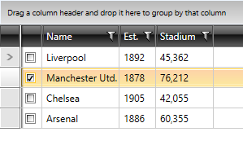
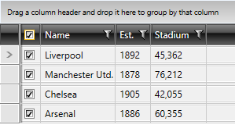
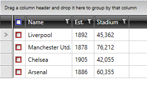

# Select Column

The __GridViewSelectColumn__ derives from [GridViewColumn]() and its content is represented by a **CheckBox** for each row. It differs from the __GridViewCheckBoxColumn__ as it **does not bind to data**. Instead, it allows you to select a given row via a checkbox, in other words - each CheckBox's **IsChecked** property is bound to the **IsSelected** property of the corresponding row.

#### __[XAML] Example 1: Defining GridViewSelectColumn in XAML__

	{{region radgridview-columns-column-types-select-column_0}}
	<telerik:RadGridView x:Name="radGridView"
	                     AutoGenerateColumns="False">
	    <telerik:RadGridView.Columns>
	        <telerik:GridViewSelectColumn />
	        <telerik:GridViewDataColumn DataMemberBinding="{Binding Name}" />
	    </telerik:RadGridView.Columns>
	</telerik:RadGridView>
	{{endregion}}

#### __Figure 1: The GridViewSelectColumn__

If you set RadGridView's [**SelectionMode**]() property to either __Extended__ or __Multiple__, you will be able to select more than one row by clicking on the desired checkbox or to select all the rows by clicking on the checkbox in the header.

#### __[XAML] Example 2: Define GridViewDataColumn with Extended SelectionMode__

	{{region radgridview-columns-column-types-select-column_1}}
	<telerik:RadGridView x:Name="radGridView"
	                     AutoGenerateColumns="False"
	                     SelectionMode="Extended">
	    <telerik:RadGridView.Columns>
	        <telerik:GridViewSelectColumn />
	        <telerik:GridViewDataColumn DataMemberBinding="{Binding Name}" />
	    </telerik:RadGridView.Columns>
	</telerik:RadGridView>
	{{endregion}}

#### __Figure 2: The GridViewSelectColumn with Extended SelectionMode__

## CheckBoxStyle and HeaderCheckBoxStyle

GridViewSelectColumn exposes two properties of type style: **CheckBoxStyle** and **HeaderCheckBoxStyle**. You can use them to style the respective checkboxes.

#### __[XAML] Example 3: Creating appropriate styles__

	{{region radgridview-columns-column-types-select-column_2}}
    
    
	{{endregion}}

#### __[XAML] Example 4: Setting RadGridView's CheckBoxStyle and HeaderCheckBoxStyle__

	{{region radgridview-columns-column-types-select-column_3}}
	<telerik:GridViewSelectColumn CheckBoxStyle="{StaticResource CheckBoxStyle}" 
                                              HeaderCheckBoxStyle="{StaticResource HeaderCheckBoxStyle}"/>
	{{endregion}}

**Figure 3** shows the final result:

#### __Figure 3: The styled GridViewSelectColumn__

# See Also

 * [CheckBox Column]()

 * [Multiple Selection]()

