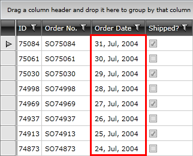

# Data Formatting

__GridViewDataColumn__ and __GridViewComboBoxColumn__ allow you to format the displayed data by specifying an appropriate format string and assigning it to the __DataFormatString__ property for the column.

#### __[XAML] Example 1: Set DataFormatString property of DateTime column__

{{region xaml-gridview-columns-data-formatting_0}}
	<telerik:GridViewDataColumn DataMemberBinding="{Binding OrderDate}"
	                Header="Order Date"
	                UniqueName="OrderDate"
	                DataFormatString="{} {0:dd, MMM, yyyy}" />
{{endregion}}

>__{}__ is the XAML escape sequence which allows subsequent values in the attribute to be interpreted as a literal.. You can find more information in the MSDN [Escape Sequence](http://msdn.microsoft.com/en-us/library/ms744986.aspx) article.

#### __[C#] Example 1: Set DataFormatString property of DateTime column__

{{region cs-gridview-columns-data-formatting_1}}
	((GridViewDataColumn)this.radGridView.Columns["OrderDate"]).DataFormatString = "{0:dd, MMM, yyyy}";
	// or
	((GridViewDataColumn)this.radGridView.Columns["OrderDate"]).DataFormatString = "dd, MMM, yyyy";
{{endregion}}

#### __[VB.NET] Example 1: Set DataFormatString property of DateTime column__

{{region vb-gridview-columns-data-formatting_2}}
	DirectCast(Me.radGridView.Columns("OrderDate"), GridViewDataColumn).DataFormatString = "{0:dd, MMM, yyyy}"
	' or
	DirectCast(Me.radGridView.Columns("OrderDate"), GridViewDataColumn).DataFormatString = "dd, MMM, yyyy"
{{endregion}}

#### __Figure 1: DateTime column with custom DataFormatString__

>The DataFormatString property uses the __string.Format__ method. To learn more, check the [string.Format](http://msdn.microsoft.com/en-us/library/system.string.format.aspx) MSDN article.

To learn more about formatting visit the [Formatting Overview](http://msdn.microsoft.com/en-us/library/26etazsy.aspx) chapter in MSDN.

## See Also

 * [Column Headers]()
 * [Column Footers]()
 * [Custom Format]()
