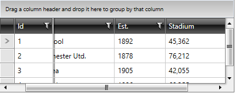
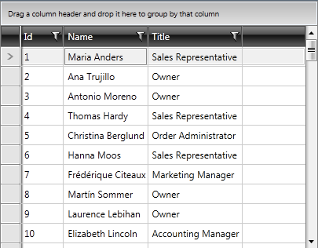

# Frozen Columns

__RadGridView__ provides an easy way to select one or more columns and exclude them from the horizontal scrolling. The frozen columns stay static on top of the horizontal scrolling. To freeze a column the user has to drag the frozen columns separator.

Once there is a frozen column you can freeze other columns by dragging their headers behind the frozen columns separator.

Similarly, you can unfreeze columns by dragging their headers outside the frozen columns separator.

A frozen column always stays on top of horizontal scrolling.

## Freezing Columns

You can freeze your columns programmatic using the __FrozenColumnCount__ property of the __RadGridView__ control. The property is numeric and you have to set it to the number of columns you wish to freeze.

In this sample, the first two columns are frozen starting from left to right.

#### __XAML__

{{region gridview-columns-frozen-columns_0}}

	<telerik:RadGridView FrozenColumnCount="2" />
{{endregion}}

#### __C#__

{{region gridview-columns-frozen-columns_1}}

	this.radGridView.FrozenColumnCount = 2;
{{endregion}}

#### __VB.NET__

{{region gridview-columns-frozen-columns_2}}

	Me.radGridView.FrozenColumnCount = 2
{{endregion}}

## Disabling Frozen Columns

To disable the freezing of a column just set the __CanUserFreeze to False__ and the frozen columns separator will disappear.

#### __XAML__

{{region gridview-columns-frozen-columns_3}}

	<telerik:RadGridView x:Name="radGridView"
	                     CanUserFreezeColumns="False">
	    ...
	</telerik:RadGridView>
{{endregion}}

# See Also

 * [RadGridView Overview]()

 * [Bound/Unbound Columns]()

 * [Customizing Columns]()
 
 * [Column Groups]()
