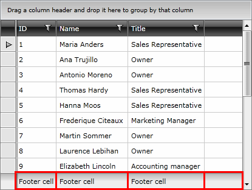

# Column Footers

Usually the bottom cell of a column is called footer. Its purpose is to display some additional information that applies to the whole column.

To set the value of the footer use the __Footer__ property of the column.

#### __XAML__

{{region gridview-columns-column-footers_0}}
	<telerik:GridViewDataColumn Header="ID"
	                                DataMemberBinding="{Binding EmployeeID}"
	                                Footer="Footer cell">
	{{endregion}}

Because it is of type object, you are not limited to just using plain text. For example, you can add a corresponding picture to the footer text.

#### __XAML__

{{region gridview-columns-column-footers_1}}
	<telerik:GridViewDataColumn Header="ID"
	                                DataMemberBinding="{Binding EmployeeID}">
					<telerik:GridViewDataColumn.Footer>
	
	        <Grid>
	            <Grid.ColumnDefinitions>
	                <ColumnDefinition Width="Auto" />
	                <ColumnDefinition />
	            </Grid.ColumnDefinitions>
	            <Image Stretch="None"
	                   Source="../../Images/User.png"
	                   Margin="0,0,5,0" />
	            <TextBlock Text="The Id of the employee"
	                       VerticalAlignment="Center"
	                       TextWrapping="Wrap"
	                       Grid.Column="1" />
	
	        </Grid>
					</telerik:GridViewDataColumn.Footer>
	</telerik:GridViewDataColumn>
	{{endregion}}

____

## Showing the Column Footers

By default the column footers are hidden, so in order to make them visible you have to set the __ShowColumnFooters__property of the __RadGridView__ to __True__.

#### __XAML__

{{region gridview-columns-column-footers_2}}
	<telerikGrid:RadGridView x:Name="radGridView"
	                                 ShowColumnFooters="True">
	    ...
	</telerik:Grid:RadGridView>
	{{endregion}}

## Aggregates

The column footers are also used to display aggregated information about the data in the column via aggregate functions.

To learn how to do that take a look at the [Aggregate Functions]() topic.

# See Also

 * [Aggregate Functions]()

 * [Resizing Columns]()

 * [Reordering Columns]()
