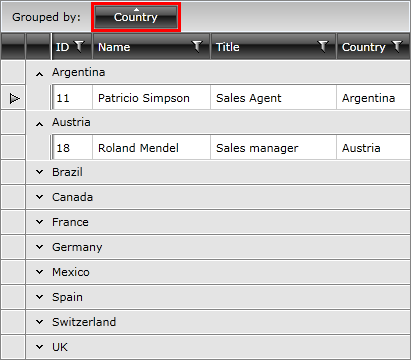
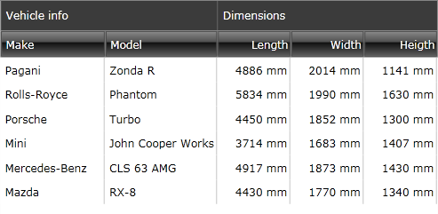

# Column Headers

Usually the top cell of a column is called header. Its purpose is to set a caption for the column, which describes the category of the data displayed in it.

To set the value of the header use the __Header__ property of the column. 

#### __XAML__

{{region gridview-columns-column-headers_0}}
	<telerik:GridViewDataColumn DataMemberBinding="{Binding EmployeeID}"
	                                Header="ID" />
	{{endregion}}

Because it is of type __object__, you are not limited to just using plain text. For example, you can add a corresponding picture to the header text.

#### __XAML__

{{region gridview-columns-column-headers_1}}
	<telerik:GridViewDataColumn DataMemberBinding="{Binding EmployeeID}">
				<telerik:GridViewDataColumn.Header>
	        <StackPanel Orientation="Horizontal">
	            <Image Stretch="None"
	                   Source="../../Images/User.png"
	                   Margin="0,0,5,0" />
	            <TextBlock Text="ID"
	                       VerticalAlignment="Center" />
	        </StackPanel>
				</telerik:GridViewDataColumn.Header>
	</telerik:GridViewDataColumn>
	{{endregion}}

## Customizing the Headers

There are two things about the headers that can be customized - the header row and the header cells. The header row is modified by setting an appropriate style to the __HeaderRowStyle__ property of the __RadGridView__. To learn exactly how the style is defined take a look at the [Styling the Header Row]() topic. The header cell is styled by setting the __HeaderCellStyle__ property of the column, which means that for each column you can have a differently styled header. To learn more about how to style the header cell take a look at the [Styling the Column Headers]() topic.

## Hiding the Headers

The column headers can only be hidden by setting the __ShowColumnHeaders__ property of the __RadGridView__ to __False__.

#### __XAML__

{{region gridview-columns-column-headers_2}}
	<telerik:RadGridView x:Name="radGridView"
	                         ShowColumnHeaders="False">
	    ...
	</telerik:RadGridView>
	{{endregion}}

____

## Sorting

The header of the column plays the main role when we want to sort it. It also hosts all the visual logic around this functionality. When the data is sorted by a column, its header changes its appearance and shows the sort direction via an indicator.

To learn more about the sorting functionality take a look at the [Basic Sorting]() topic in the Sorting chapter.

## Filtering

The header of the column hosts the built-in filtering mechanism, which allows you to filter the data in your __RadGridView__ by the columns' values.

To learn more about the filtering functionality take a look at the [Basic Filtering]() topic in the Filtering chapter.

## Grouping

The header is also used when you want to group the data in your __RadGridView__. It has to be dragged into the group panel at the top of the __RadGridView__ in order to get the data grouped by that column.

To learn more about the grouping functionality take a look at the [Basic Grouping]() topic in the Grouping chapter.

## Merging the headers

Columns in RadGridView may be grouped in __column groups__(added with __Q3 2011__). Column groups are visually presented by __common column headers__.
        

#### __XAML__

{{region gridview-columns-column-headers_3}}
	<telerik:RadGridView x:Name="RadGridView1" GridLinesVisibility="Vertical" Width="450" CanUserFreezeColumns="False" AutoGenerateColumns="False" IsFilteringAllowed="False"  ShowGroupPanel="False" RowIndicatorVisibility="Collapsed">
				<telerik:RadGridView.ColumnGroups>
					<telerik:GridViewColumnGroup  Name="VehicleInfo" Header="Vehicle info" />
					<telerik:GridViewColumnGroup  Name="Dimensions" Header="Dimensions" />
				</telerik:RadGridView.ColumnGroups>
				<telerik:RadGridView.Columns>
					<telerik:GridViewDataColumn DataMemberBinding="{Binding Make}" ColumnGroupName="VehicleInfo" />
					<telerik:GridViewDataColumn DataMemberBinding="{Binding Model}" ColumnGroupName="VehicleInfo" />
					<telerik:GridViewDataColumn  DataMemberBinding="{Binding Length}" ColumnGroupName="Dimensions" />
					<telerik:GridViewDataColumn  DataMemberBinding="{Binding Width}"  ColumnGroupName="Dimensions" />
					<telerik:GridViewDataColumn  DataMemberBinding="{Binding Heigth}" ColumnGroupName="Dimensions" />
				</telerik:RadGridView.Columns>
	</telerik:RadGridView>
	{{endregion}}

To enable __column grouping__ you need to define Column groups using the __ColumnGroups__ property of __RadGridView__ as shown above.
          Each __GridViewColumnGroup__ has a __Header__ property which defines the content to be shown inside the common header. It may be a simple string or a visual element.
          To tell that a specific column belongs to a specific group, you need to set the __ColumnGroupName__ property of the column to match the value of the __Name__ property of the relevant __GridViewColumnGroup__.
          For example :
        

#### __XAML__

{{region gridview-columns-column-headers_4}}
	<telerik:GridViewColumnGroup  Name="VehicleInfo" Header="Vehicle info" />
	 ...
	<telerik:GridViewDataColumn DataMemberBinding="{Binding Make}" ColumnGroupName="VehicleInfo" />
	{{endregion}}

Column __groups__ can be __nested__. This could be done like so:
        

#### __XAML__

{{region gridview-columns-column-headers_5}}
	<telerik:RadGridView.ColumnGroups>
		<telerik:GridViewColumnGroup  Name="Data" Header="Data">
			<telerik:GridViewColumnGroup  Name="VehicleInfo" Header="Vehicle info" />
			<telerik:GridViewColumnGroup  Name="Dimensions" Header="Dimensions" />
		</telerik:GridViewColumnGroup>
	</telerik:RadGridView.ColumnGroups>
	{{endregion}}

You can define a __custom header__ for the __GridViewColumnGroup__ through its HeaderTemplate:
        

#### __XAML__

{{region gridview-columns-column-headers_6}}
	<telerik:GridViewColumnGroup Name="Data">
	    <telerik:GridViewColumnGroup.HeaderTemplate>
	        <DataTemplate>
	            <TextBox Text="Data"/>
	        </DataTemplate>
	    </telerik:GridViewColumnGroup.HeaderTemplate>
	</telerik:GridViewColumnGroup>
	
	{{endregion}}

To learn more about the customizing of the headers please refer to the 
          [Customizing the Headers](#Customizing_the_Headers)
          section above.
        

# See Also

 * [Column Footers]()

 * [Aggregate Functions]()

 * [Resizing Columns]()
