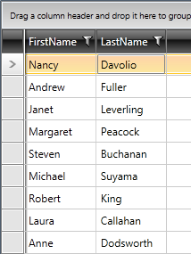

# Defining Columns

You can define columns for __RadGridView__ in two ways. First, you can let __RadGridView__ automatically generate the columns based on the underlying data source. Second, you can describe columns manually in the XAML or code-behind. This help article will describe how to do both with code examples in the two sections below.

## Automatic Columns Generation

By default, the __RadGridView__ control will generate its columns automatically based on the underlying data source. When, for example, you set the __ItemsSource__ of the __RadGridView__ control to a collection of employees (see code in __Example 1__ and the result in __Figure 1__), __RadGridView__ will created a separate column for each one of the public properties of your __Employee__ object.

__Example 1: RadGridView__ can automatically generate columns.
		

However, if you wish to explicitly specify the column name for certain property of your data class or to prevent the creation of a column for it, use the __System.ComponentModel.DataAnnotations.DisplayAttribute__, as it is shown in the sample below.

#### __C#__

{{region gridview-columns-defining-columns_0}}
	public class Employee
	{
	    [DisplayAttribute( AutoGenerateField = false )]
	    public int EmployeeId
	    {
	        get;
	        set;
	    }
	    [DisplayAttribute( Name = "First Name" )]
	    public string FirstName
	    {
	        get;
	        set;
	    }
		[DisplayAttribute( Name = "Last Name" )]
	    public string LastName
	    {
	        get;
	        set;
	    }
	}
	{{endregion}}

#### __VB__

{{region gridview-columns-defining-columns_1}}
	Public Class Employee
			<DisplayAttribute(AutoGenerateField:=False)> _
			Public Property EmployeeId() As Integer
				Get
					Return m_EmployeeId
				End Get
				Set(value As Integer)
					m_EmployeeId = Value
				End Set
			End Property
			Private m_EmployeeId As Integer
			<DisplayAttribute(Name:="First Name")> _
			Public Property FirstName() As String
				Get
					Return m_FirstName
				End Get
				Set(value As String)
					m_FirstName = Value
				End Set
			End Property
			Private m_FirstName As String
			<DisplayAttribute(Name:="Last Name")> _
			Public Property LastName() As String
				Get
					Return m_LastName
				End Get
				Set(value As String)
					m_LastName = Value
				End Set
			End Property
			Private m_LastName As String
		End Class
	{{endregion}}

__Figure 1:__ The result of letting __RadGridView__ automatically generate two columns.
		  

## Manual Columns Definition

Using the built-in auto generation of columns does not fit all scenarios of using __RadGridView__. In such cases you have to manually define columns for the fields you want to be displayed in your grid. When defining a column you are able to choose between several column types - __GridViewColumn__, __GridViewDataColumn__, __GridViewComboBoxColumn__, __GridViewHyperLinkColumn__, __GridViewImageColumn__, __GridViewSelectColumn__, etc. You must add the defined columns to the __Columns__ collection of the __RadGridView__. Later on in the application lifecycle, you can easily access them via the __UniqueName__ property or by column index. To see this sequence unfold, look at the following step-by-step example.

1. Define a column of type __GridViewDataColumn__.

#### __XAML__

{{region gridview-columns-defining-columns_2}}
	<telerik:GridViewDataColumn/>
	{{endregion}}

>You will find the column types in the same namespace (__Telerik.Windows.Controls__) and assembly (__Telerik.Windows.Controls.GridView.dll__) as the __RadGridView__ control.

#### __C#__

{{region gridview-columns-defining-columns_3}}
	GridViewDataColumn column = new GridViewDataColumn();
	{{endregion}}

#### __VB__

{{region gridview-columns-defining-columns_4}}
	Dim column As New GridViewDataColumn()
	{{endregion}}

1. Set the __Header__ and the __UniqueName__ properties and add the column to the __Columns__ collection of the __RadGridView__.
		  

>importantYou can set and work with the __UniqueName__ of a column only when you have also set the __DataMemberBinding__. Otherwise, please use the __Header__ instead of __UniqueName__.
			  

#### __XAML__

{{region gridview-columns-defining-columns_5}}
	<telerik:RadGridView x:Name="radGridView"
	                         AutoGenerateColumns="False">
				<telerik:RadGridView.Columns>
					<telerik:GridViewDataColumn DataMemberBinding="{Binding FirstName}" Header="First Name" UniqueName="FirstName" />
				</telerik:RadGridView.Columns>
	</telerik:RadGridView>
	{{endregion}}

#### __C#__

{{region gridview-columns-defining-columns_6}}
	GridViewDataColumn column = new GridViewDataColumn();
	column.DataMemberBinding = new Binding( "FirstName" );
	column.Header = "My Column";
	column.UniqueName = "MyColumn";
	this.radGridView.AutoGenerateColumns = false;
	this.radGridView.Columns.Add( column );
	{{endregion}}

#### __VB__

{{region gridview-columns-defining-columns_7}}
	Dim column As New GridViewDataColumn()
	column.DataMemberBinding = New Binding("FirstName")
	column.Header = "My Column"
	column.UniqueName = "MyColumn"
	Me.radGridView.AutoGenerateColumns = False
	Me.radGridView.Columns.Add(column)
	{{endregion}}

1. To access the column later, use the __UniqueName__ value or its __column index__ as a key for the __Columns__ collection.
		  

#### __C#__

{{region gridview-columns-defining-columns_8}}
	GridViewDataColumn myColumn = this.radGridView.Columns[ "FirstColumn" ];
	myColumn = this.radGridView.Columns[ 0 ];
	{{endregion}}

#### __VB__

{{region gridview-columns-defining-columns_9}}
	Dim myColumn As GridViewDataColumn = Me.radGridView.Columns("MyColumn")
	myColumn = Me.radGridView.Columns(0)
	{{endregion}}

1. In order to set a __CellTemplate__ of __GridViewDataColumn__ in code-behind you can store a defined __DataTemplate__ within WindowUserControl's __ResourceCollection__ as follows:
	   

#### __XAML__

{{region gridview-columns-defining-columns_11}}
	<Window.Resources>
	    <DataTemplate x:Key="dataTemplate1">
	        <TextBlock Text="Text"/>
	     </DataTemplate>
	</Window.Resources>
	{{endregion}}



#### __XAML__

{{region gridview-columns-defining-columns_10}}
	<UserControl.Resources>
	    <DataTemplate x:Key="dataTemplate1">
	        <TextBlock Text="Text"/>
	     </DataTemplate>
	</UserControl.Resources>
	{{endregion}}

And then reference it in code-behind as demonstrated below:
        

#### __C#__

{{region gridview-columns-defining-columns_12}}
	GridViewDataColumn column = new GridViewDataColumn();
	column.CellTemplate = (DataTemplate)this.Resources["dataTemplate1"];
	radGridView.Columns.Add(column );
	{{endregion}}

#### __VB__

{{region gridview-columns-defining-columns_13}}
		Dim column As New GridViewDataColumn()
	column.CellTemplate = DirectCast(Me.Resources("dataTemplate1"), DataTemplate)
	Me.radGridView.Columns.Add(column)
	{{endregion}}

# See Also

 * [Basic Column]()

 * [Customizing Columns]()

 * [Data Formatting]()
