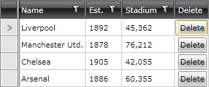

# Add a button column

This article illustrates how to add a column with a delete button. We will benefit from [RadGridViewCommands]() to automatically delete the corresponding row upon clicking on the button.

There are several ways to achieve this. Let's look at some of them.

## Creating a custom column

This approach involves inheriting __GridViewColumn__ and overriding __CreateCellElement__ method. In this method we create the button, if not already created, and set its properties:

>important In order to automatically export a custom column, it should implement the **IExportableColumn** interface

#### __C#__

{{region cs-gridview-add-button-column_0}}
	public class MyButtonColumn : Telerik.Windows.Controls.GridViewColumn
	{
	    public override FrameworkElement CreateCellElement(GridViewCell cell, object dataItem)
	    {
	        RadButton button = cell.Content as RadButton;
	        if (button == null)
	        {
	            button = new RadButton();
	            button.Content = "Delete";
	            button.Command = RadGridViewCommands.Delete;
	        }
	
	        button.CommandParameter = dataItem;
	
	        return button;
	    }
	}
{{endregion}}

Now we need to add this custom column to RadGridView.Columns. We can do it either in XAML:

#### __XAML__

{{region xaml-gridview-add-button-column_1}}
	<telerik:RadGridView.Columns>
	    <!-- ... -->
	    <my:MyButtonColumn Header="Delete" />
	</telerik:RadGridView.Columns>
{{endregion}}

or in code (subscribing for RadGridView.DataLoaded event):

#### __C#__

{{region cs-gridview-add-button-column_2}}
	private void clubsGrid_DataLoaded(object sender, EventArgs e)
	{
	    this.clubsGrid.Columns.Add(new MyButtonColumn()
	    {
	        Header = "Delete"
	    });
	}
{{endregion}}

## Using the CellTemplate of GridViewColumn

With this approach we are re-defining the template of the cells for that column. It is a simple DataTemplate which contains our button:

#### __XAML__

{{region xaml-gridview-add-button-column_3}}
	<telerik:RadGridView.Columns>
	    <!-- ... -->
	    <telerik:GridViewColumn Header="Delete" >
	        <telerik:GridViewColumn.CellTemplate>
	            <DataTemplate>
	                <telerik:RadButton Content="Delete" 
	                        Command="telerik:RadGridViewCommands.Delete"
	                        CommandParameter="{Binding}" />
	            </DataTemplate>
	        </telerik:GridViewColumn.CellTemplate>
	    </telerik:GridViewColumn>
	</telerik:RadGridView.Columns>
{{endregion}}

# See Also

 * [CellTemplate and CellEditTemplate]()

 * [Create Custom Column Editor]()

 * [Create Custom Editor with RadGridView]()
