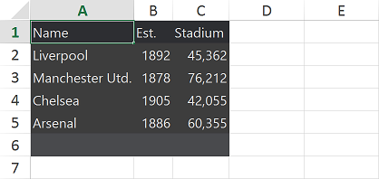

# SpreadsheetStreamingExport

The __GridViewSpreadStreamExport__ uses the [RadSpreadStreamProcessing](https://docs.telerik.com/devtools/document-processing/libraries/radspreadstreamprocessing/overview) library which allows you to create big documents (without loading the entire document in the memory) and export them to the XLSX and CSV formats. 

## Assembly References

The __Export with SpreadsheetStreamingExport__ functionality uses additional libraries so you need to add references to the following assemblies:

* Telerik.Windows.Controls.dll
* Telerik.Windows.Controls.Data.dll
* Telerik.Windows.Controls.Input.dll
* Telerik.Windows.Controls.GridView.dll
* Telerik.Windows.Controls.GridView.SpreadsheetStreamingExport.dll
* Telerik.Documents.SpreadsheetStreaming.dll
* Telerik.Windows.Zip.dll

> __Telerik.Windows.Controls.GridView.SpreadsheetStreamingExport.dll__ is a new binary introduced in __R1 2019__. 

## GridViewSpreadStreamExport

In order to export RadGridView, you need to define an instance of the __GridViewSpreadStreamExport__ class. You must then pass the instance of the __RadGridView__ control that you want to be exported as a parameter. You can also specify the name of the sheet that will be exported as well as the ExportFormat - **XLSX** or **CSV**. 

#### __[C#] Example 1: Exporting RadGridView with GridViewSpreadStreamExport__
{{region cs-gridview-export-spreadsheetstreamingexport_0}}
	GridViewSpreadStreamExport spreadStreamExport = new GridViewSpreadStreamExport(this.GridView);
    spreadStreamExport.SheetName = "Sheet1";
    spreadStreamExport.ExportFormat = SpreadStreamExportFormat.Xlsx;
{{endregion}}

## RunExport

Once you've correctly initialized the GridViewSpreadStreamExport, you can call the __RunExport__ method to trigger the export mechanism. The method itself has 4 different overloads:

- **RunExport(string fileName, SpreadStreamExportRenderer exportRenderer)**
- **RunExport(string fileName, SpreadStreamExportRenderer exportRenderer, GridViewSpreadStreamExportOptions options)**
- **RunExport(Stream exportStream, SpreadStreamExportRenderer exportRenderer)**
- **RunExport(Stream exportStream, SpreadStreamExportRenderer exportRenderer, GridViewSpreadStreamExportOptions options)**

As you can observe, you must either specify a file name or provide a stream for the GridViewSpreadStreamExport to work with and must create an instance of the **SpreadStreamExportRenderer** class which exposes the methods needed to export using RadSpreadStreamProcessing. Optionally, you can also pass in [GridViewSpreadStreamExportOptions](#gridviewspreadstreamexportoptions) to customize the export to your needs.

#### __[C#] Example 1: Exporting RadGridView with GridViewSpreadStreamExport__
{{region cs-gridview-export-spreadsheetstreamingexport_0}}
	GridViewSpreadStreamExport spreadStreamExport = new GridViewSpreadStreamExport(this.GridView);
	spreadStreamExport.RunExport(dialog.FileName.ToString(), new SpreadStreamExportRenderer());
{{endregion}}

When the exporting operation is completed, the __ExportCompleted__ event of __GridViewSpreadStreamExport__ is raised.

## RunExportAsync

You can also export __RadGridView__ asynchronously by utilizing the __RunExportAsync__ method of the __GridViewSpreadStreamExport__ class. The method has the same overloads as its synchroneous counterpart:

- **RunExportAsync(string fileName, SpreadStreamExportRenderer exportRenderer)**
- **RunExportAsync(string fileName, SpreadStreamExportRenderer exportRenderer, GridViewSpreadStreamExportOptions options)**
- **RunExportAsync(Stream exportStream, SpreadStreamExportRenderer exportRenderer)**
- **RunExportAsync(Stream exportStream, SpreadStreamExportRenderer exportRenderer, GridViewSpreadStreamExportOptions options)**

#### __[C#] Example 2: Exporting RadGridView Asynchronously__
{{region cs-gridview-export-spreadsheetstreamingexport_1}}
	GridViewSpreadStreamExport spreadStreamExport = new GridViewSpreadStreamExport(this.GridView);
	spreadStreamExport.RunExportAsync(dialog.FileName.ToString(), new SpreadStreamExportRenderer());
{{endregion}}

When the progress of the asynchronous export changes, the __AsyncExportProgressChanged__ event of __GridViewSpreadStreamExport__ is triggered. Finally, when the export operation is over, the __AsyncExportCompleted__ event is raised.

When using the RunExportAsync method you can also set the **ShowLoadingIndicatorWhileAsyncExport** property to **True** to display a [RadBusyIndicator]() to the user and indicate that a time-consuming operation is taking place without blocking the UI. You can control the content of the indicator via RadGridView's **BusyContent** and **BusyContentTemplate** properties.

If you wish to cancel the export operation, you can also invoke the **CancelExportAsync** method.

## GridViewSpreadStreamExportOptions

Via the GridViewSpreadStreamExportOptions you can customize how the RadGridView control is exported. The class exposes the following properties:

- **ExportDefaultStyles**: Specifies whether the GridViewDataControl will be exported with its default styles.
- **ShowColumnFooters**: Specifies whether column footers should be included on export.
- **ShowGroupFooters**: Specifies whether group footers should be included on export.
- **ShowColumnGroups**: Specifies whether common column headers should be included on export.
- **ShowGroupHeaderRowAggregates**: Specifies whether group header aggregates should be included on export.
- **HiddenColumnExportOption**: Gets or sets a value indicating how hidden columns are exported. The **HiddenColumnExportOptions** enumeration provides three possible options: **ExportAlways**, **DoNotExport** and **ExportAsHidden**.
- **Items**: The collection of items to be exported.

#### __[C#] Example 3: Export RadGridView with headers, footers and default styles__

{{region gridview-export-spreadsheetstreamingexport_2}}
	GridViewSpreadStreamExport spreadStreamExport = new GridViewSpreadStreamExport(this.GridView);
                               spreadStreamExport.RunExport(dialog.FileName.ToString(), 
    							 							new SpreadStreamExportRenderer(), 
    							 							new GridViewSpreadStreamExportOptions() 
								 							{ 
																ShowColumnHeaders = true, 
																ShowColumnFooters = true, 
																ExportDefaultStyles=true 
								 							});
{{endregion}}

#### __Figure 1: Exporting with ExportDefaultStyles set to True__

## Events

Apart from the previously discussed __ExportCompleted__, __AsyncExportProgressChanged__ and __AsyncExportCompleted__ events, __GridViewSpreadStreamExport__ also exposes the **ElementExportingToDocument** and **ElementExportedToDocument** events which allow you to style and format the exported elements.

### ElementExportingToDocument

The **ElementExportingToDocument** when an element is about to be exported. Via its **GridViewSpreadStreamElementExportingEventArgs** you can access the following properties:

- **Element**: The type of the currently exported element. This can be any of the following types: **HeaderCell**, **FooterCell**, **GroupHeaderCell**, **GroupFooterCell**, **Cell** or **CommonColumnHeader**.
- **Value**: The value that is about to be exported.
- **Cancel**: A boolean value that indicates whether the event should be canceled or not.
- **Column**: The column of the exported cell.
- **Style**: The style for the exported cell. It is of type **SpreadStreamCellStyle** and provides a number of options for styling the exported element.

### ElementExportedToDocument

The **ElementExportedEvent** on the other hand is fired each time an element is exported. Its **GridViewSpreadStreamElementExportedEventArgs** have a single property - **Element**, which holds the type of the exported element (**HeaderCell**, **FooterCell**, **GroupHeaderCell**, **GroupFooterCell**, **Cell** or **CommonColumnHeader**).

## See Also

* [ExportToXlsx]()
* [ExportToPdf]()
* [RadBusyIndicator]()