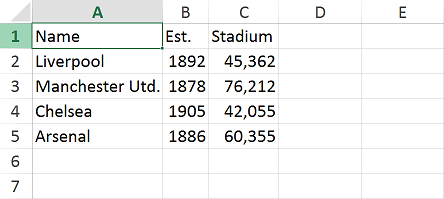

# ExportToXlsx

The __ExportToXlsx__ method allows exporting to "Xlsx" format without the need to integrate RadGridView with *RadSpreadProcessing*. The method was introduced in __Q1 2015__.

__Assembly References__

ExportFormat.Xlsx method uses additional libraries so you need to add references to the following assemblies:

* Telerik.Windows.Documents.Core.dll
* Telerik.Windows.Documents.SpreadSheet.dll 
* Telerik.Windows.Documents.SpreadSheet.FormatProviders.OpenXml.dll
* Telerik.Windows.Zip.dll
* Telerik.Windows.Controls.GridView.Export.dll

>  __Telerik.Windows.Controls.GridView.Export.dll__ is a new binary introduced in __Q1 SP of 2015__. It delimits the exporting to __Xlsx__ functionality from __Telerik.Windows.Controls.GridView.dll__, so in order to use __ExportToXlsx__ method, the new dll should also be added.

The method has two overloads:

1. __ExportToXlsx(Stream stream)__ - Expects the specified stream to which you are exporting data to.

2. __ExportToXlsx(Stream stream, GridViewDocumentExportOptions options)__ - Expects the specified stream to which you are exporting data to and parameter of type GridViewDocumentExportOptions. The latter is used to set the following export options:

* Culture
* Items
* ShowColumnFooters
* ShowGroupFooters
* ShowColumnHeaders
* ExportDefaultStyles  
* ExcludedColumns

The following example shows how to use the method on a button click:

#### __[C#] Example 1: Use of ExportToXlsx method__
	private void btnExport_Click(object sender, RoutedEventArgs e)
	{
	    string extension = "xlsx";
	
	    SaveFileDialog dialog = new SaveFileDialog()
	    {
	        DefaultExt = extension,
	        Filter = String.Format("{1} files (*.{0})|*.{0}|All files (*.*)|*.*", extension, "Excel"),
	        FilterIndex = 1
	    };
	
	    if (dialog.ShowDialog() == true)
	    {
	        using (Stream stream = dialog.OpenFile())
	        {
	            gridViewExport.ExportToXlsx(stream,
	                new GridViewDocumentExportOptions()
	                {
	                    ShowColumnFooters = true,
	                    ShowColumnHeaders = true,
	                    ShowGroupFooters = true
	                });
	        }
	    }
	}

## Export Default Styles

>To export the Default Styles of RadGridView in grouped state, at least one row must be expanded, so that the exporting engine can get the styles.

RadGridView can be exported with its default styles by setting the __ExportDefaultStyles__ property to “true”

By default the ExportDefaultStyles property is set to false. You can see the result (Figure 1).

#### __Figure 1__: Exporting with ExportDefaultStyles set to “false” (default)

You can set the __ExportDefaultStyles__ value to __“true”__ and see the result (Figure 2).

#### __[C#] Example 2: Configuring ExportDefaultStyles setting__

	gridViewExport.ExportToXlsx(stream,
	    new GridViewDocumentExportOptions()
		{
	    ShowColumnHeaders = true,
	    ShowColumnFooters = true,
	    ShowGroupFooters = true,
	    ExportDefaultStyles = true
		});   

#### __Figure 2__: Exporting with ExportDefaultStyles set to “true”

## Events

There are two events related to the exporting of RadGridView with the ExportToXlsx method: *ElementExportingToDocument* and *ElementExportedToDocument*. You can find more information regarding them in the [Export Events]() section.

## How to

* __[Get the Column of the Corresponding Cell]()__

* __[Disable the Export of a Particular Column]()__

## See Also

 * [RadGridView Overview]()

 * [Export]()

 * [Export Async]()

 * [Export Events]()
