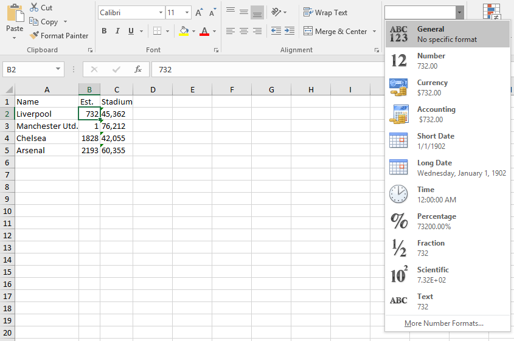
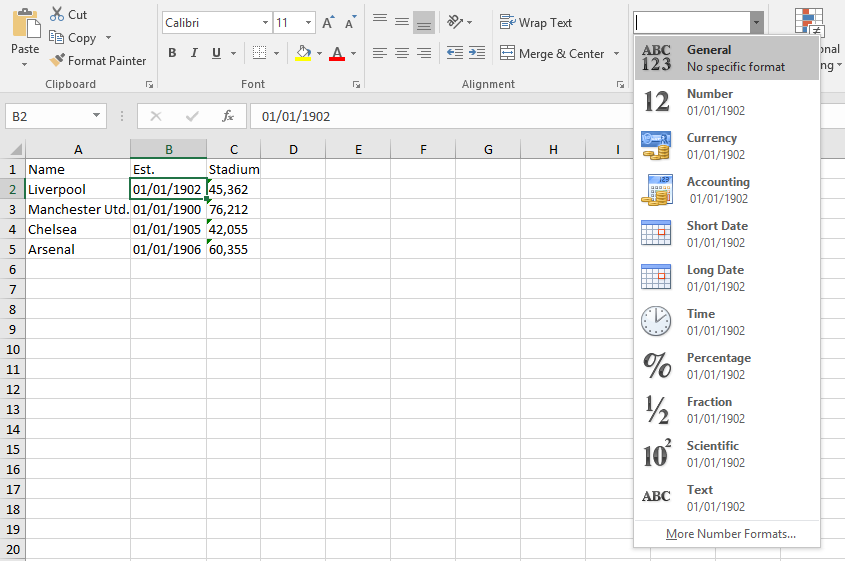
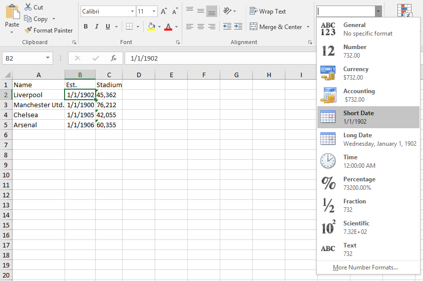

# Export DateTime Value

__PROBLEM__

1) When exporting DateTime values without a specified **DataFormatString** to Excel, the values appear as numbers as shown in **Figure 1**:

#### __Figure 1: Exporting DateTime values without specified DataFormatString__

2) When exporting DateTime values with specified **DataFormatString** to Excel, the values appear as strings as shown in **Figure 2**:

#### __Figure 2: Exporting DateTime values with specified DataFormatString__

__CAUSE__

1) In most modern programming environments, dates are stored as real numbers. The integer part of the number is the number of days since some agreed-upon date in the past, called the epoch. In Excel, June 16, 2006, for example, is stored as 38884, counting days where January 1st, 1900 is 1.

2) When a DataFormatString has been specified for a given column, RadGridView exports the string representation of the values in that column.

__SOLUTION__

When an element is exported through the __ExportToXlsx__ or __ExportToPdf__ methods, the arguments of the __ElementExportingToDocument__ event can be used to modify the visual appearance of the exported values and specify how they should be formatted in Excel. This is achieved through the  **VisualParameters** property of the **GridViewCellExportingEventArgs**.

**Example 1** illustrates the approach:

#### __[C#] Example 1: Exporting DateTime Values to Excel__

	{{region gridview-export-how-to-export-datetime-1}}
	this.gridViewExport.ElementExportingToDocument += (s, e) =>
	{
	    if (e.Element == ExportElement.Cell)
        {
            var cellExportingArgs = e as GridViewCellExportingEventArgs;
            if ((cellExportingArgs.Column as GridViewDataColumn) == this.clubsGrid.Columns[1])
            {
                var parameters = cellExportingArgs.VisualParameters as GridViewDocumentVisualExportParameters;
                parameters.Style = new CellSelectionStyle()
                {
                    Format = new CellValueFormat("m/d/yyyy")
                };
            }
        }
	};
	{{endregion}}

#### __[VB.NET] Example 1: Exporting DateTime Values to Excel__

	{{region gridview-export-how-to-export-datetime-2}}
	Me.gridViewExport.ElementExportingToDocument += Function(s, e) 
		If e.Element = ExportElement.Cell Then
			Dim cellExportingArgs = TryCast(e, GridViewCellExportingEventArgs)
			If TryCast(cellExportingArgs.Column, GridViewDataColumn) = Me.clubsGrid.Columns(1) Then
				Dim parameters = TryCast(cellExportingArgs.VisualParameters, GridViewDocumentVisualExportParameters)
				parameters.Style = New CellSelectionStyle() With { _
					Key .Format = New CellValueFormat("m/d/yyyy") _
				}
			End If
		End If
	End Function
	{{endregion}}

**Figure 3** shows the final result in Excel:

#### __Figure 3: Exporting DateTime values with ElementExportingToDocument__

## See Also

* [Export String Value]()

* [Export Numeric Value]()

* [Format Codes](http://docs.telerik.com/devtools/document-processing/libraries/radspreadprocessing/features/format-codes)

* [Number Formatting](http://docs.telerik.com/devtools/document-processing/libraries/radspreadprocessing/features/number-formats)
