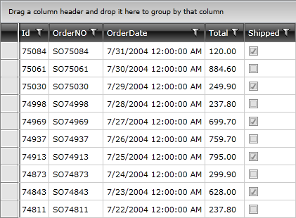
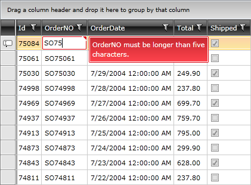

# Validating

One of the most important features provided by the __RadGridView__is the __data validation__. Data Validation enables you to take a complete control of the data entered in your grid's cells.
      

The purpose of this tutorial is to show you how to validate data using __RadGridView__. The following cases will be discussed:
      

* [Validating data on a cell level](5ABDC52A-CFB2-476C-918E-AC20683EA7AB#validating-data-on-a-cell-level)

* [Validating data on a property level](5ABDC52A-CFB2-476C-918E-AC20683EA7AB#validating-data-on-a-property-level)

* [Validating data on a row level](5ABDC52A-CFB2-476C-918E-AC20683EA7AB#validating-data-on-a-row-level)

* [Validating data through Data Annotations](5ABDC52A-CFB2-476C-918E-AC20683EA7AB#validating-data-through-data-annotations)

>The Data Validation is controllable through events. Be sure you are familiar with all [validation events]() exposed by the __RadGridView__.
        

For the purpose of this tutorial the following __RadGridView__ declaration will be used. The __RadGridView__ is [populated]() with some sample data.
      

#### __XAML__

{{region gridview-managing-data-validation_0}}
	<telerik:RadGridView x:Name="radGridView"/>
	{{endregion}}

## Setting the mode for the validation 

RadGridView exposes a property - ValidatesOnDataErrors that controls the way the data validation, provided by IDataErrorInfo and INotifyDataErrorInfo Interfaces, is performed. It may be set to one of the following values:

* None - denotes that RadGridView will not perform any validation.
            

* InViewMode - denotes that RadGridView will perform validation only in view mode.
            

* InEditMode - denotes that RadGridView will perform validation only in edit mode, i.e when the cell is leaving edit mode. In case the RadGridView is initially loaded with incorrect value, no error messages will be displayed.
          

* Default - this is the default value. It combines the two previous ones - InViewMode | InEditMode. 
            

>Setting the ValidateOnDataErrors property will not affect the UI validation provided by the CellValidating and RowValidating events.
          

>Telerik.Windows.Data.INotifyDataErrorInfo interface was created for WPF 4.0. version since System.ComponentModel.INotifyDataErrorInfo was available for Silverlight only. If using WPF 4.5, please reference System.ComponentModel.INotifyDataErrorInfo instead.
            

## Validating Data on a Cell Level

The cell validation occurs when a __GridViewCell__ is edited and its new data is about to be committed. At this moment a __CellValidating__ event is fired and since the new value is not committed yet to the underlying data object, here is the perfect place for applying a custom UI validation.
        

Below is an example that validates the __OrderNo__property of the __Order__ object to be longer than 5 characters.
        

Attach to the __CellValidating__ event, which is exposed by the __RadGridView__.
        

#### __XAML__

{{region gridview-managing-data-validation_1}}
	<telerik:RadGridView x:Name="radGridView" CellValidating="radGridView_CellValidating"/>
	{{endregion}}

Switch to the code-behind and add your custom validation logic in the event handler.

#### __C#__

{{region gridview-managing-data-validation_2}}
	private void radGridView_CellValidating( object sender, Telerik.Windows.Controls.GridViewCellValidatingEventArgs e )
	{
	    if ( e.Cell.Column.UniqueName == "OrderNO" )
	    {
	        if ( e.NewValue.ToString().Length < 5 )
	        {
	            e.IsValid = false;
	            e.ErrorMessage = "OrderNO must be longer than five characters.";
	        }
	    }
	}
	{{endregion}}

#### __VB.NET__

{{region gridview-managing-data-validation_3}}
	Private Sub radGridView_CellValidating(ByVal sender As Object, ByVal e As Telerik.Windows.Controls.GridViewCellValidatingEventArgs)
	    If e.Cell.Column.UniqueName = "OrderNO" Then
	        If e.NewValue.ToString().Length < 5 Then
	            e.IsValid = False
	            e.ErrorMessage = "OrderNO must be longer than five characters."
	        End If
	    End If
	End Sub
	{{endregion}}

When you try to enter an order number less than five characters the result should be similar to snapshot below.

When you set the __e.IsValid__ property to __False__, this will cancel the editing process and will return focus to the invalid __GridViewCell__. After this UI layer validation is successful (__e.IsValid__ is __True__, which is the default value). Then the Data layer validation occurs. This is the validation which is built-in the business object implementation.
        

## Validating Data on a Property Level

An alternative approach is to use validation on a __property level__. In this case you need to throw an exception when an incorrect value is about to be set. This results into a binding validation error and __GridViewBoundColumnBase__ editor will enter into invalid state.
        

#### __C#__

{{region gridview-managing-data-validation_4}}
	public class Order
	{
	    private string orderNo;
	    public string OrderNO
	    {
	        get
	        {
	            return this.orderNo;
	        }
	        set
	        {
	            if ( value.Length < 5 )
	            {
	                throw new Exception( "OrderNo should be longer than 5 characters." );
	            }
	            this.orderNo = value;
	        }
	    }
	}
	{{endregion}}

#### __VB.NET__

{{region gridview-managing-data-validation_5}}
	Public Class Order
	    Private m_orderNo As String
	
	    Public Property OrderNO() As String
	        Get
	            Return Me.m_orderNo
	        End Get
	        Set(ByVal value As String)
	            If value.Length < 5 Then
	                Throw New Exception("OrderNo should be longer than 5 characters.")
	            End If
	            Me.m_orderNo = value
	        End Set
	    End Property
	End Class
	{{endregion}}

>An exception of any kind will result as a validation error, and an exception message will appear as an error tooltip.

## Validating Data on a Row Level

In the previous examples the data was validated per cell, using the __CellValidating__ event or property validation. You can do the same thing per row, using the __RowValidating__ event. The __RowValidating__ event is a very similar to the __CellValidating__ event. However, instead of getting an individual cell, you are getting an entire row.
        

Below is an example that validates the __OrderNO__ and __Total__ properties of the __Order__ object.
        

Attach to the __RowValidating__ event, which is exposed by the __RadGridView__.
        

#### __XAML__

{{region gridview-managing-data-validation_6}}
	<telerik:RadGridView RowValidating="radGridView_RowValidating"/>
	{{endregion}}

Switch to the code-behind and add your custom validation logic in the event handler.

#### __C#__

{{region gridview-managing-data-validation_7}}
	private void radGridView_RowValidating( object sender, Telerik.Windows.Controls.GridViewRowValidatingEventArgs e )
	{
	
	    Order order = e.Row.DataContext as Order;
	    if ( String.IsNullOrEmpty( order.OrderNO ) || order.OrderNO.Length < 5 )
	    {
	        GridViewCellValidationResult validationResult = new GridViewCellValidationResult();
	        validationResult.PropertyName = "OrderNO";
	        validationResult.ErrorMessage = "OrderNO is required and must be at least five characters";
	        e.ValidationResults.Add( validationResult );
	        e.IsValid = false;
	    }
	
	    if ( order.Total < 0 )
	    {
	        GridViewCellValidationResult validationResult = new GridViewCellValidationResult();
	        validationResult.PropertyName = "Total";
	        validationResult.ErrorMessage = "Total must be positive";
	        e.ValidationResults.Add( validationResult );
	        e.IsValid = false;
	    }
	}
	{{endregion}}

#### __VB.NET__

{{region gridview-managing-data-validation_8}}
	Private Sub radGridView_RowValidating(ByVal sender As Object, ByVal e As Telerik.Windows.Controls.GridViewRowValidatingEventArgs)
	    Dim order As Order = TryCast(e.Row.DataContext, Order)
	    If [String].IsNullOrEmpty(order.OrderNO) OrElse order.OrderNO.Length < 5 Then
	        Dim validationResult As New GridViewCellValidationResult()
	        validationResult.PropertyName = "OrderNO"
	        validationResult.ErrorMessage = "OrderNO is required and must be at least five characters"
	        e.ValidationResults.Add(validationResult)
	        e.IsValid = False
	    End If
	    If order.Total < 0 Then
	        Dim validationResult As New GridViewCellValidationResult()
	        validationResult.PropertyName = "Total"
	        validationResult.ErrorMessage = "Total must be positive"
	        e.ValidationResults.Add(validationResult)
	        e.IsValid = False
	    End If
	End Sub
	{{endregion}}

Two things worth mentioning here:

* In order to access the new values, you should grab the row's __DataContext__ (in this case it is an __Order__). For the old values, use the __OldValues__ property.
          

* The __GridViewCellValidationResult__ object is used for displaying error messages when the user enters wrong data.
            

The result from a failed validation can be seen on the next figure.

Once you have added such errors, you will have to explicitly clear them when needed. Please check this [help article]() on how to clear user defined errors.
        

>tipYou can check this [troubleshooting article]() on how to clear user defined errors.
          

## Validating Data Through Data Annotations

With the Silverlight platform you can take advantage of the __System.ComponentModel.DataAnnotations__ assembly. The following code snippet demonstrates how to use data annotation attributes to validate a property value (again within the property setter). It is even better when you use __RIA services__, since this code will be automatically added for you by the __RIA Service's__ code generator.
          

The code snippet below shows you how to use __DataAnnotations__ in order to validate the __OrderNO__ property of the __Order__ object.
          

#### __C#__

{{region gridview-managing-data-validation_9}}
	[Required]
	public string OrderNO
	{
	    get
	    {
	        return this.orderNo;
	    }
	    set
	    {
	        ValidationContext validationContext = new ValidationContext( this, null, null );
	        validationContext.MemberName = "OrderNO";
	        Validator.ValidateProperty( value, validationContext );
	        this.orderNo = value;
	    }
	}
	{{endregion}}

#### __VB.NET__

{{region gridview-managing-data-validation_10}}
	<Required()> _
	Public Property OrderNO() As String
	    Get
	        Return Me.orderNo
	    End Get
	    Set(ByVal value As String)
	        Dim validationContext As New ValidationContext(Me, Nothing, Nothing)
	        validationContext.MemberName = "OrderNO"
	        Validator.ValidateProperty(value, validationContext)
	        Me.orderNo = value
	    End Set
	End Property
	{{endregion}}

>In order to use DataAnnotations you should add a reference to the __System.ComponentModel.DataAnnotations__ assembly.
          

>tipThe following __Validation Attributes__ are available for usage:
          

* __RequiredAttribute__ - specifies that a value must be provided for a property.
            

* __RegularExpressionAttribute__ - designates a regular expression to be used for validation of the associated member.
            

* __StringLengthAttribute__ - specifies the maximum and minimum number of characters that are allowed for an entity member.
            

* __RangeAttribute__ - designates the minimum and maximum constraints for the associated member.
            

* __DateTypeAttribute__ - specifies the name of an additional type to associate with an entity member.
            

* __CustomValidationAttribute__ - designates a customized method to execute to validate the entity member.
            

The result can be seen on the next figure.

>tip
          Once the UI and Data validation passed (i.e. the Binding tried to update the value for the bound property), the __CellValidated__ event is raised. The ValidationResult can be valid or not. Here you can also add a custom logic like changing the visual state of the editor (through the e.EditorElement).
        

## Examples

For a general example on how to validate the data, you can check our Validation
          [ WPF Demos.](http://demos.telerik.com/wpf/)[online demos.](http://demos.telerik.com/silverlight/#GridView/Validation)

You can also download runnable projects from our online SDK repository
          [here](https://github.com/telerik/xaml-sdk/), the examples are listed under __GridView__.
        

* __GridView/ValidationIDataErrorInfo__.
            

* __GridView/ValidationINotifyDataErrorInfo__.
            

Although GitHub is a very well-known platform we saw a better and easier approach for reviewing our examples we have developed our brand new SDK Samples Browser. The
          [SDK Samples Browser](http://demos.telerik.com/wpf-sdkbrowser/)
           is an application that automatically connects to GitHub and downloads the XAML SDK repository locally to a location that could be set by the user. After download is complete the application gives a very convenient navigation between all the available examples and a search functionality which doesn’t simply search by control’s names but also through the example’s names and descriptions.

# See Also

 * [Validation errors not cleared]()

 * [Validation Events]()>
    
