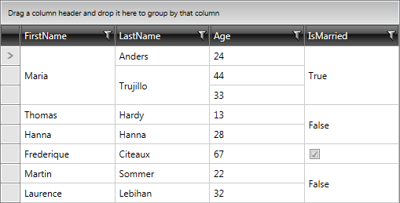
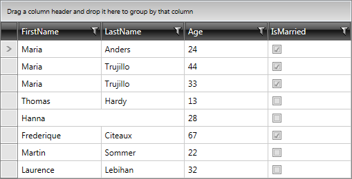
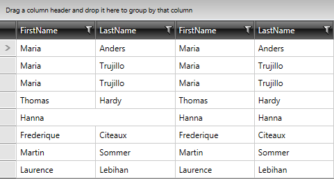
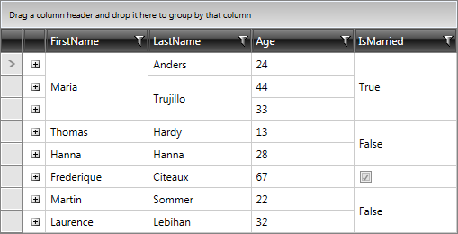

# Merged Cells

As of __Q3 2014 we have introduced support for merged cells in RadGridView__ control. As a result the serial cells with equal values can be merged vertically or horizontally.
    
>Merging the cells is only available with __GridViewDataColumn__.
          

To get started, you can find some code snippets below.

For the purpose of this example, the data in RadGridView is populated similarly to as explained in [Getting Started with RadGridView]() article.
        

Then, you can configure RadGridView to display the merged cells by specifying a proper value for the __MergedCellsDirection__ property.
        

The __three possible options__ are:
        

* None
            

* Vertical
            

* Horizontal
            

>importantMerged Cells are only supported with __GroupRenderMode=”Flat”__. You can check the [Rendering Modes]() article for further details on it.
          

>Currently, frozen columns are not supported while having merged cells enabled. An exception will be thrown: "Cell merging is not supported when frozen columns are enabled.”.
          

__Example 1:__ Configure RadGridView to merge cells vertically
        

#### __XAML__

{{region gridview-merged-cells_2}}

	<telerik:RadGridView
	  ColumnWidth="*"
	  MergedCellsDirection="Vertical"
	  CanUserFreezeColumns="False"
	  GroupRenderMode="Flat"/>
{{endregion}}

__Figure 1:__ RadGridView with vertically merged cells

Similarly, you can set the cells to be merged horizontally configuring RadGridView with __MergedCellsDirection.Horizontal__.
        

__Example 2:__ Configure RadGridView to merge cells horizontally
        

#### __XAML__

{{region gridview-merged-cells_3}}

	<telerik:RadGridView
	  ColumnWidth="*"
	  MergedCellsDirection="Horizontal"
	  CanUserFreezeColumns="False”"
	  GroupRenderMode="Flat"/>
{{endregion}}

__Figure 2:__ RadGridView with horizontally merged cells

You can also configure merging for GridViewDataColumn through setting its __IsCellMergingEnabled__ property. For example:
        

__Example 3:__ Configure cell merging per column
        

#### __XAML__

{{region gridview-merged-cells_4}}

	<telerik:RadGridView
	  ColumnWidth="*"
	  MergedCellsDirection="Vertical"
	  CanUserFreezeColumns="False"
	  GroupRenderMode="Flat">
	  <telerik:RadGridView.Columns>
	    <telerik:GridViewDataColumn IsCellMergingEnabled="False"/>
	  </telerik:RadGridView.Columns>
	</telerik:RadGridView>
{{endregion}}

Merged cells are also supported when there is [RowDetails]()/[Hierarchy]() defined for RadGridView.
        

__Example 4:__ Define RowDetailsTemplate
        

#### __XAML__

{{region gridview-merged-cells_5}}

	<DataTemplate x:Key="RowDetailsTemplate">
	  <StackPanel>
	    <TextBlock Text="First Name: " FontWeight="Bold"/>
	    <TextBlock Text="{Binding FirstName}" />
	    <TextBlock Text="Last Name: " FontWeight="Bold"/>
	    <TextBlock Text="{Binding LastName}" />
	  </StackPanel>
	</DataTemplate>
{{endregion}}

__Example 5:__ Specify RowDetailsTemplate for RadGridView
        

#### __XAML__

{{region gridview-merged-cells_6}}

	<telerik:RadGridView
	  Name="radGridView"
	  ColumnWidth="100"
	  MergedCellsDirection="Vertical"
	  GroupRenderMode="Flat"
	  CanUserFreezeColumns="False"
	  RowDetailsTemplate="{StaticResource RowDetailsTemplate}">
	  <telerik:RadGridView.Columns>
	    <telerik:GridViewToggleRowDetailsColumn/>
	  </telerik:RadGridView.Columns>
	</telerik:RadGridView>
{{endregion}}

__Figure 3:__ RadGridView with merged cells and RowDetails defined

__Figure 4:__ RadGridView with merged cells and RowDetails expanded

>Once the row details are expanded, the merged cell will be separated into two different subsets. The particular cell that is part of the expanded row will be considered as a single one instead.
          
__Known limitations:__

* Selection is currently not supported for the merged cells. When selecting a row, all the cells except for the merged one will show as selected.
            

* Validation is currently not supported for merged cells
            

## Styling

You can change the default settings by applying a style targeting the __GridViewMergedCell__ visual element.
        
By default the merged content will be centered vertically and left aligned horizontally.You can also set values for different properties like Background, Foreground, etc. For further details and an example, you can check the [Styling a MergedCell]() topic in the documentation.
For more information on styling RadGridView and its elements, you can refer to the [Styles and Templates]() section.
        
