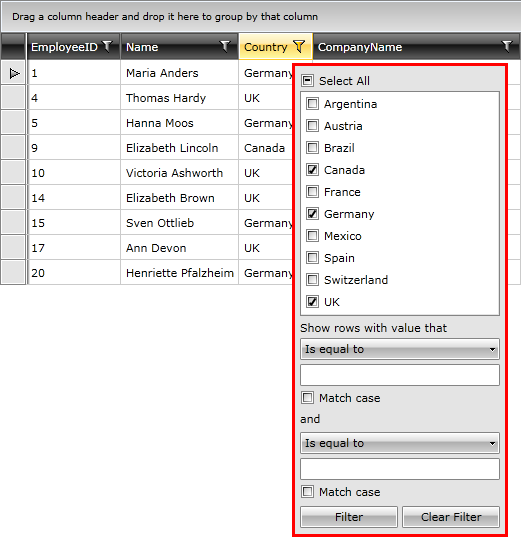

# Filtering

__RadGridView__ provides you with a built-in filtering functionality, which allows the user to easily filter the data by one or more columns, just by clicking on the filtering icon next to the header text.

You can define filtering either in the XAML or in the code-behind.

#### __XAML__

{{region xaml-gridview-overview-filtering_0}}
	<telerik:RadGridView x:Name="radGridView">
	    <telerik:RadGridView.FilterDescriptors>
	        <telerik:FilterDescriptor Member="Country"
	                             Operator="IsEqualTo"
	                             Value="Germany"/>
	    </telerik:RadGridView.FilterDescriptors>
	</telerik:RadGridView>
{{endregion}}

You can achieve the same result if you define your filtering in your code-behind like this.

#### __C#__

{{region cs-gridview-overview-filtering_2}}
	FilterDescriptor descriptor = new FilterDescriptor();
	descriptor.Member = "Country";
	descriptor.Operator = FilterOperator.IsEqualTo;
	descriptor.Value = "Germany";
	this.radGridView.FilterDescriptors.Add(descriptor);
{{endregion}}

#### __VB.NET__

{{region vb-gridview-overview-filtering_3}}
	Dim descriptor As New FilterDescriptor()
	descriptor.Member = "Country"
	descriptor.Operator = FilterOperator.IsEqualTo
	descriptor.Value = "Germany"
	Me.radGridView.FilterDescriptors.Add(descriptor)
{{endregion}}

>Note that since __FilterDescriptors__ property is a collection, you can add more than one __FilterDescriptor__ to a __RadGridView__.

The __Operator__ property allows you to define the type of filter operator you wish to use. The possible values are defined in the __FilterOperator__ enumeration: 

* __Contains__ - dataField __LIKE__ '%value%'

* __EndsWith__ - dataField __LIKE__ '%value'

* __IsEqualTo__ - dataField __=__ value

* __IsGreaterThan__ - dataField __>__ value

* __IsGreaterThanOrEqualTo__ - dataField __>=__ value

* __IsLessThan__ - dataField __<__ value

* __IsLessThanOrEqualTo__ - dataField __<=__ value

* __IsNotEqualTo__ - dataField __!=__ value

* __StartsWith__ - dataField __LIKE__ 'value%'

* __IsNull__ - dataField __=__ null
          

* __IsNotNull__ - dataField __!=__ null
          

* __IsEmpty__ - dataField __=__ string.Empty
          

* __IsNotEmpty__ - dataField __!=__ string.Empty
          

You could localize those strings. For the complete list of the localization strings please check this [how to topic]().      
        

>The list of filter operations depends on the __DataType__ property of the column. For example, the filter operations "__StartsWith__", "__EndsWith__, "__IsEmpty__, "__IsNotEmpty__... " will not be available for columns of __Integer__ or __DateTime__ types.

>tipConsider using the code-behind approach only when changing the filtering criteria __run-time__.

Check out the chapters entirely dedicated to the filtering functionality of __RadGridView__ and find the answers to many questions like:

* How does the [basic filtering]() work.

* How to [style the column header]() of the filtered column.

## See Also

 * [Data Selection]()

 * [UI Virtualization]()

 * [Mouse Support]()
