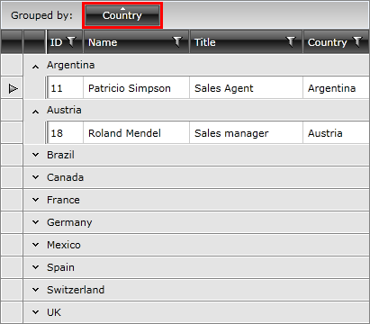

# Grouping

__RadGridView__ provides you with a built-in grouping functionality, which allows the user to easily group the data by one or more columns. To do so the user has to just drag the desired column to the __GridViewGroupPanel__, located at the top of the __RadGridView__. If __RadGridView__ is not grouped, the __GridViewGroupPanel__ shows a customizable hint.

#### **Figure 1: Grouped RadGridView**

You can define grouping either in the XAML or in the code-behind.

#### __[XAML] Example 1: Grouping applied through XAML__

{{region xaml-gridview-overview-grouping_0}}
	<telerik:RadGridView x:Name="radGridView"
	                AutoGenerateColumns="False">
	    <telerik:RadGridView.GroupDescriptors>
	        <telerik:GroupDescriptor Member="Country"
	                            SortDirection="Ascending" />
	        <!--You can add more group descriptors here-->
	    </telerik:RadGridView.GroupDescriptors>
	</telerik:RadGridView>
{{endregion}}

You can achieve the same result if you define your grouping in the code-behind like this:

#### __[C#] Example 1: Grouping applied programmatically__

{{region cs-gridview-overview-grouping_2}}
	GroupDescriptor descriptor = new GroupDescriptor();
	descriptor.Member = "Country";
	descriptor.SortDirection = ListSortDirection.Ascending;
	descriptor.DisplayContent = "Country Group";
	this.radGridView.GroupDescriptors.Add(descriptor);
	//You can create and add more descriptors here
{{endregion}}

#### __[VB.NET] Example 1: Grouping applied programmatically__

{{region vb-gridview-overview-grouping_3}}
	Dim descriptor As New GroupDescriptor()
	descriptor.Member = "Country"
	descriptor.SortDirection = ListSortDirection.Ascending
	descriptor.DisplayContent = "Country Group"
	Me.radGridView.GroupDescriptors.Add(descriptor)
	'You can create and add more descriptors here
{{endregion}}

>Тhe __GroupDescriptors__ property of RadGridView is a __collection__ so you can add more than one __GroupDescriptor__ to a certain __RadGridView__.

>tipConsider using the code-behind approach only when changing the grouping criteria __run-time__.

Check out the chapters entirely dedicated to the grouping functionality of __RadGridView__ and find the answers to the following questions:

* How does the [basic grouping]() work.

* How to [define grouping]() using __GroupDescriptors__ in both XAML and code-behind.

* How to configure [Grouping Modes]().

* How to use the exposed [grouping events]().

* How to [disable]() the default grouping per column or for the whole __RadGridView__ control.

* How to [modify the group panel]().

* How to group your data by [multiple-columns]().

* How to [style the group rows]().

* How to define [aggregate functions]() to the group rows.

* How to use the [group footers]().

## See Also
 
 * [Filtering]()

 * [Data Selection]()

 * [UI Virtualization]()
