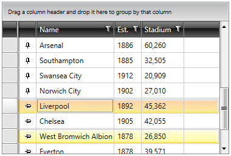

# Pinned Rows

With **R2 2016**, Telerik introduced **Pinned Rows**. Pinned Rows enable you to pin particular rows to the top or bottom of your **RadGridView** so that they do not participate in the vertical scrolling.

In this article we will discuss the following topics:

* [PinnedRowsPosition property](#pinnedrowsposition)

* [Grouping](#grouping)

* [Sorting](#sorting)

* [Paging](#paging)

* [Filtering](#filtering)

* [Commands](#commands)

## PinnedRowsPosition

RadGridView's **PinnedRowsPosition** property lets you determine where the pinned rows will appear. It has three possible values:

* **Top**: Display the pinned rows on top.

* **Bottom**: Display the pinned rows at the bottom after the last standard row.

* **None**: Do not display the pinned rows.

**Example 1** shows that you can set the property either declaratively or at runtime like this:

#### __[XAML] Example 1: Setting the PinnedRowsPosition property__

	<telerik:RadGridView PinnedRowsPosition="Top" />

#### __[C#] Example 1: Setting the PinnedRowsPosition property__

	this.RadGridView.PinnedRowsPosition = GridViewPinnedRowsPosition.Top;

#### __[VB.NET] Example 1: Setting the PinnedRowsPosition property__

	Me.RadGridView.PinnedRowsPosition = GridViewPinnedRowsPosition.Top

If the PinnedRowsPosition property is set, a pin button will appear on hovering over the [row indicator]().

Pressing the button will pin the respective row. Clicking on it again will remove it from the collection of the pinned rows.

#### __Figure 1: Pinning rows from the row indicator__

Another way to allow your users to pin rows with the click of a button is to define a **GridViewPinRowColumn** which enables pinning and unpinning of the rows.

#### __[XAML] Example 2: Defining a GridViewPinRowColumn__

	<telerik:RadGridView.Columns>
    	<telerik:GridViewPinRowColumn />
	</telerik:RadGridView.Columns>

#### __Figure 2: Pinning rows from the GridViewPinRowColumn__

## Grouping

Pinned Items do not participate in the groups. Once the user groups, the pinned items are placed back to the **Items** collection. On ungrouping, they reappear as pinned.

## Sorting

Sorting a column should result in sorting the items in the pinned panel as well - only compared to each other.

## Paging

When the user pins rows in a page and moves to another page, the pinned rows are removed, as they are not a part of the source of the second page. Navigating back to the previous page would bring back the pinned rows for that page.

## Filtering 

Filtering the grid displays all items (along with the pinned ones) in the filter descriptor. 

## Commands

**TogglePinnedRowState Command** toggles a row's IsPinned property. It takes as parameters the item to pin and the target RadGridView to pin that item to.

#### __[C#] Example 3: Using the TogglePinnedRowState Command__

	var togglePinnedStateCommand = RadGridViewCommands.TogglePinnedRowState as RoutedUICommand;
    togglePinnedStateCommand.Execute(this.RadGridView.Items[0], this.RadGridView); 

#### __[VB.NET] Example 3: Using the TogglePinnedRowState Command__

	Dim togglePinnedStateCommand = TryCast(RadGridViewCommands.TogglePinnedRowState, RoutedUICommand)
    togglePinnedStateCommand.Execute(Me.RadGridView.Items(0), Me.RadGridView)

## See Also

* [Defining Columns]()