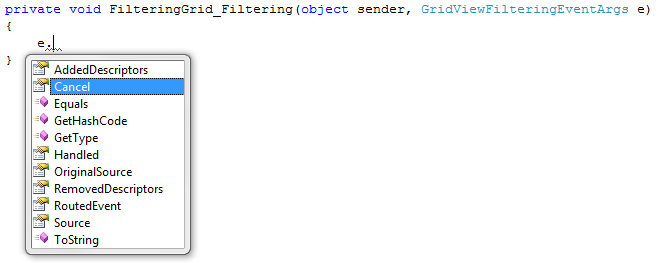
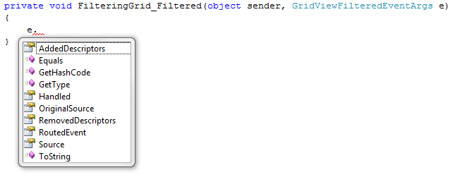
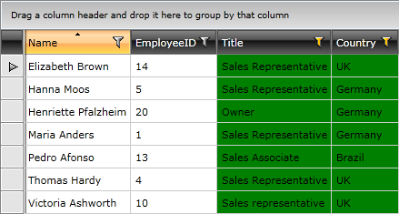
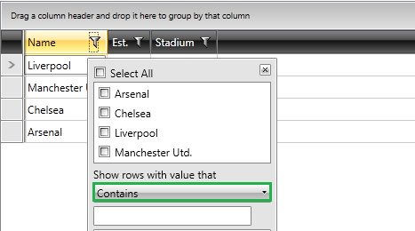

# Filtering Basics

>__Important!__ Please check the [filtering breaking changes]() introduced with __Q1 2012__.
        
The __RadGridView__ provides you with a built-in filtering functionality, which allows the user to easily filter the data by one or more columns.

Clicking the filtering icon in the column headers opens a menu with the distinct values for the current column and the user can select which of those values to be displayed.

The user can enter a filter criterion in the filter box. A drop-down list allows the user to select a filter expression that is applied to the criterion for the column. The case sensitivity can also be specified via a check box. When the user presses the filter button, the grid displays only the records matching the filter criteria specified using the filter boxes.

>tipProgrammatically you can also implement __"Match Case"__ functionality. To learn how read the [Programmatic Filtering]() topic.

>Please note that filtering is performed by building a LINQ Where query which is compiled and executed at runtime. Distinct values are retrieved by using another standard LINQ query called Distinct. These queries cannot use reflection, actual type that contains an actual property should be provided.
        

## Disabling Filtering

If you don't want your __RadGridView__ to be filterable, you just have to set the __IsFilteringAllowed__ to __False__:

#### __XAML__

{{region xaml-gridview-basic-filtering2_0}}
	<telerik:RadGridView IsFilteringAllowed="True">
	</telerik:RadGridView>
{{endregion}}

If you want to disable filtering only for a particular column, you can set its __IsFilterable__ property to __False__:

#### __XAML__

{{region xaml-gridview-basic-filtering2_1}}
	<telerik:GridViewDataColumn IsFilterable="False"/>
{{endregion}}

## Events

There are four events that are raised, when the data in the __RadGridView__ is filtered. 
The first one is the __Filtering__ event and is raised before the data is filtered. 
The second one is the __Filtered__ event and is raised when the data is filtered.
The third one is the __FieldFilterEditorCreated__ and the forth it the __FilterOperatorsLoading__.

* Via the __GridViewFilteringEventArgs__ of the __Filtering__ event you can get the added or removed filter descriptors.
            

#### __XAML__

{{region xaml-gridview-basic-filtering2_2}}
	<telerik:RadGridView Filtering="radGridView_Filtering" Filtered="radGridView_Filtered"/>
{{endregion}}

You are also able to cancel the filtering operation by setting the __Cancel__ property to __True__.
     

#### __C#__

{{region cs-gridview-basic-filtering2_3}}
	private void radGridView_Filtering(object sender, GridViewFilteringEventArgs e)
	{
	    e.Cancel = true;
	}
{{endregion}}

#### __VB.NET__

{{region vb-gridview-basic-filtering2_4}}
	Private Sub radGridView_Filtering(ByVal sender As Object, ByVal e As GridViewFilteringEventArgs)
	    e.Cancel = True
	End Sub
{{endregion}}

* Via the __GridViewFilteredEventArgs__ of the __Filtered__ event you can get the added or removed filter descriptors. Unlike the __Filtering__ event, you cannot cancel the filtering process from here.

In the event handler you can place some code that has to be executed when the data in the __RadGridView__ gets filtered. For example, try to change the background color of the filtered columns:
            

#### __C#__

{{region cs-gridview-basic-filtering2_5}}
	private void radGridView_Filtered(object sender, GridViewFilteredEventArgs e)
	{
	    foreach (FilterDescriptor descriptor in e.Added)
	    {
	        Telerik.Windows.Controls.GridViewColumn column = FilteringGrid.Columns[descriptor.Member];
	        column.Background = new SolidColorBrush(Colors.Green);
	    }
	    foreach (FilterDescriptor descriptor in e.Removed)
	    {
	        Telerik.Windows.Controls.GridViewColumn column = FilteringGrid.Columns[descriptor.Member];
	        column.Background = new SolidColorBrush(Colors.Transparent);
	    }
	}
{{endregion}}

#### __VB.NET__

{{region vb-gridview-basic-filtering2_6}}
	Private Sub radGridView_Filtered(ByVal sender As Object, ByVal e As GridViewFilteredEventArgs)
	    For Each descriptor As FilterDescriptor In e.Added
	        Dim column As Telerik.Windows.Controls.GridViewColumn = FilteringGrid.Columns(descriptor.Member)
	        column.Background = New SolidColorBrush(Colors.Green)
	    Next
	
	    For Each descriptor As FilterDescriptor In e.Removed
	        Dim column As Telerik.Windows.Controls.GridViewColumn = FilteringGrid.Columns(descriptor.Member)
	        column.Background = New SolidColorBrush(Colors.Transparent)
	    Next
	End Sub
{{endregion}}

Here is a snapshot of the final result.

* In the __FieldFilterEditorCreated__ event you could get the current editor from the event args and change it appropriately.
            

* The __FilterOperatorsLoading__ event (Added Q3 2011) allows you to both remove unwanted operators and define a defaultly selected operator in a proper way. 
            

#### __C#__

{{region cs-gridview-basic-filtering2_7}}
	private void clubsGrid_FilterOperatorsLoading(object sender, Telerik.Windows.Controls.GridView.FilterOperatorsLoadingEventArgs e)
	{
	    if (e.AvailableOperators.Contains(FilterOperator.Contains))
	    {
	        e.DefaultOperator1 = FilterOperator.Contains;
	    }
	}
{{endregion}}

#### __VB.NET__

{{region vb-gridview-basic-filtering2_8}}
	Private Sub clubsGrid_FilterOperatorsLoading(sender As Object, e As Telerik.Windows.Controls.GridView.FilterOperatorsLoadingEventArgs)
	    If e.AvailableOperators.Contains(FilterOperator.Contains) Then
	        e.DefaultOperator1 = FilterOperator.Contains
	    End If
	End Sub
{{endregion}}

Here is a snapshot of the changed filter operator:

## Styling the Filtered Header

By editing the template of the header cell you are able to change it's overall look and feel. To learn more about how to do that take a look at the [Templating the Column Headers]() topic.

## See Also

 * [Programmatic Filtering]()

 * [Basic Selection]()

 * [Multiple Selection]()
