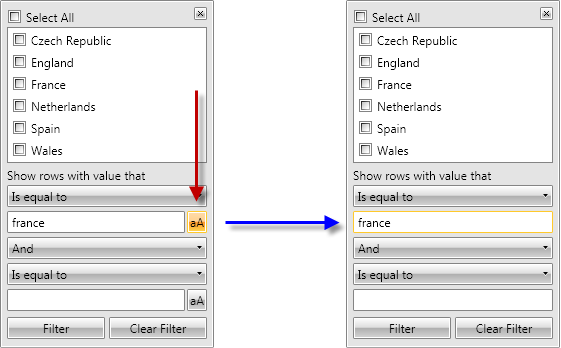

# Hide the Match Case option of the Filtering control

By default, the filtering control shows the Match Case option when the type of the data is string. This article shows how to hide this option (as some languages does not have a difference between lower and upper case letters).

This cannot be done by simply adding the XAML of the control template, because the proper filter editor is added in runtime depending on the type of the column.

So, we need to use some events and code behind:

1. Subscribe to the __FieldFilterEditorCreated__ event of RadGridView.
First approach (after Q3 2011)

Since __Q3 2011__ version of Telerik UI for SilverlightTelerik UI for WPF, a new property __MatchCaseVisibility__ had been added to the StringFilterEditor. So you could change its value directly.
            

2. In its event handler check if the editor is of type StringFilterEditor and if so - set the MatchCaseVisibility to Visibility.Hidden.
              

Here is the full code

#### __C#__

{{region gridview-how-to-hide-match-case_2}}

	void gridView_FieldFilterEditorCreated(object sender, Telerik.Windows.Controls.GridView.EditorCreatedEventArgs e)
	{
	 //get the StringFilterEditor in your RadGridView
	 var stringFilterEditor = e.Editor as StringFilterEditor;
	 if (stringFilterEditor != null)
	 {
	    stringFilterEditor.MatchCaseVisibility = Visibility.Hidden;
	 }
	}
{{endregion}}

#### __VB.NET__

{{region gridview-how-to-hide-match-case_3}}

    Private Sub gridView_FieldFilterEditorCreated(sender As Object, e As Telerik.Windows.Controls.GridView.EditorCreatedEventArgs)
        'get the StringFilterEditor in your RadGridView'
        Dim stringFilterEditor = TryCast(e.Editor, StringFilterEditor)
        If stringFilterEditor IsNot Nothing Then
            stringFilterEditor.MatchCaseVisibility = Visibility.Hidden
        End If
    End Sub
{{endregion}}

Second approach (before Q3 2011)

2. In its event handler check if the editor is of type StringFilterEditor and if so - find the match case toggle button and collapse it.

Here is the full code:

#### __C#__

{{region gridview-how-to-hide-match-case_0}}

	void gridView_FieldFilterEditorCreated(object sender, Telerik.Windows.Controls.GridView.EditorCreatedEventArgs e)
	{
	 //get the StringFilterEditor in your RadGridView
	 var stringFilterEditor = e.Editor as StringFilterEditor;
	 if (stringFilterEditor != null)
	 {
	  stringFilterEditor.Loaded += new RoutedEventHandler(stringFilterEditor_Loaded);
	 }
	}
	
	void stringFilterEditor_Loaded(object sender, RoutedEventArgs e)
	{
	 //Hide the Match case toogle button in its Loaded event
	 ((StringFilterEditor) sender).ChildrenOfType<ToggleButton>().FirstOrDefault().Visibility = Visibility.Collapsed;
	}
{{endregion}}

#### __VB.NET__

{{region gridview-how-to-hide-match-case_1}}

	Private Sub gridView_FieldFilterEditorCreated(sender As Object, e As Telerik.Windows.Controls.GridView.EditorCreatedEventArgs)
	 'get the StringFilterEditor in your RadGridView'
	 Dim stringFilterEditor = TryCast(e.Editor, StringFilterEditor)
	 If stringFilterEditor IsNot Nothing Then
	  stringFilterEditor.Loaded += New RoutedEventHandler(stringFilterEditor_Loaded)
	 End If
	End Sub
	Private Sub stringFilterEditor_Loaded(sender As Object, e As RoutedEventArgs)
	 'Hide the Match case toogle button in its Loaded event'
			DirectCast(sender, StringFilterEditor).ChildrenOfType(Of ToggleButton)().FirstOrDefault().Visibility = Visibility.Collapsed
	End Sub
{{endregion}}

